# Flowchart（フローチャート）

Mermaidのフローチャートは、処理の流れやワークフローを視覚化するための図です。

## 基本構文

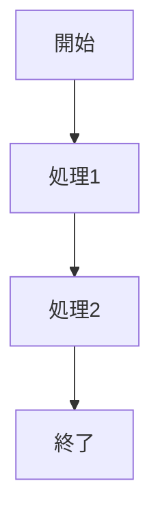

## 方向指定

| 指定 | 説明 |
|------|------|
| `TB` / `TD` | 上から下（Top to Bottom / Top Down） |
| `BT` | 下から上（Bottom to Top） |
| `LR` | 左から右（Left to Right） |
| `RL` | 右から左（Right to Left） |

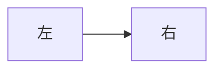

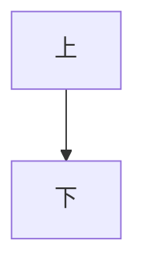

## ノードの形状


## リンク（矢印）の種類

### 基本のリンク

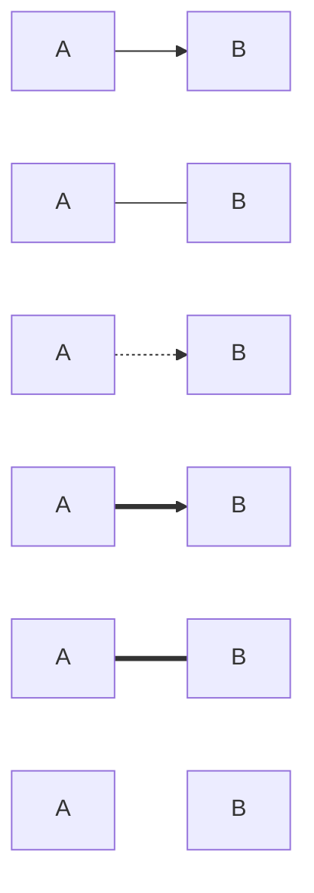

| 構文 | 説明 |
|------|------|
| `-->` | 実線 + 矢印 |
| `---` | 実線のみ |
| `-.->` | 点線 + 矢印 |
| `==>` | 太線 + 矢印 |
| `===` | 太線のみ |
| `~~~` | 非表示リンク |

### 双方向矢印

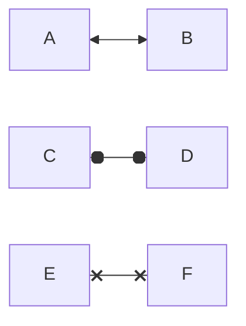

### 終端の形状

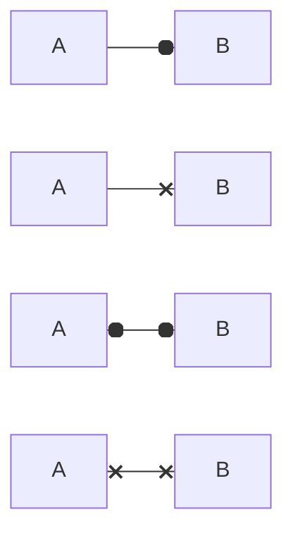

| 構文 | 説明 |
|------|------|
| `--o` | 円終端 |
| `--x` | X終端 |
| `o--o` | 両端円 |
| `x--x` | 両端X |
| `<-->` | 双方向矢印 |

## リンクにテキストを追加

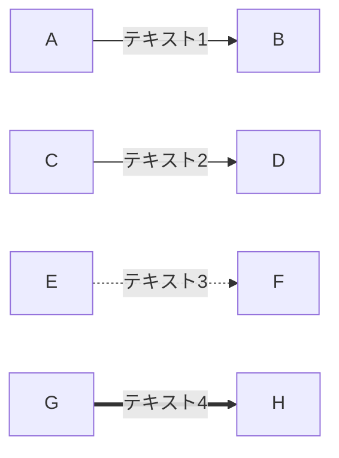

## リンクの長さ調整

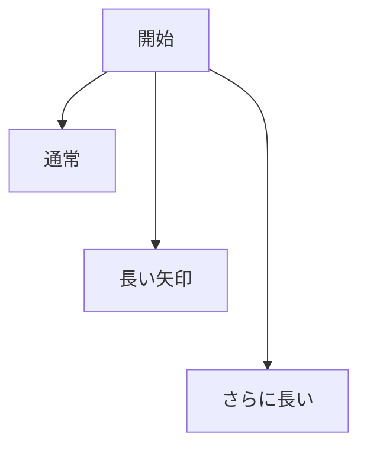

## サブグラフ（グループ化）

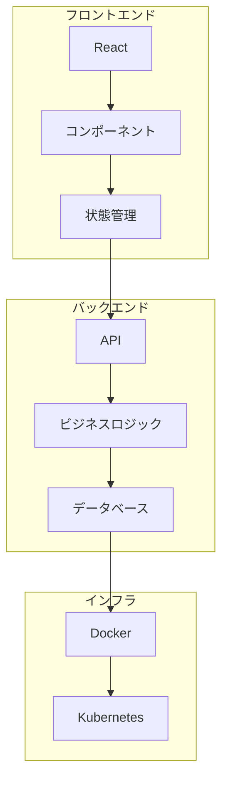

## サブグラフの方向指定

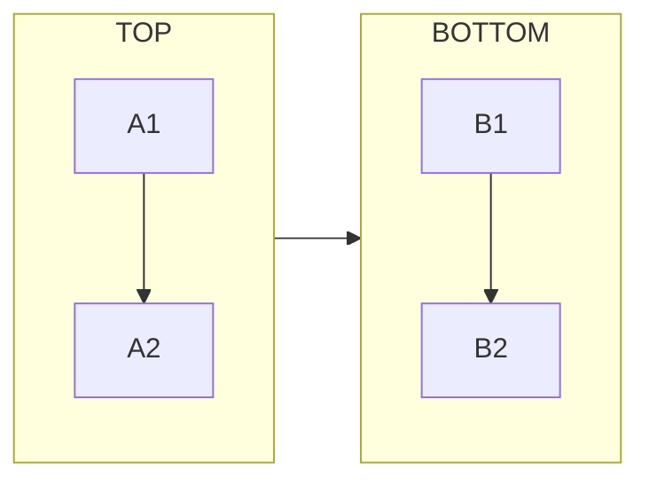

## 条件分岐の例

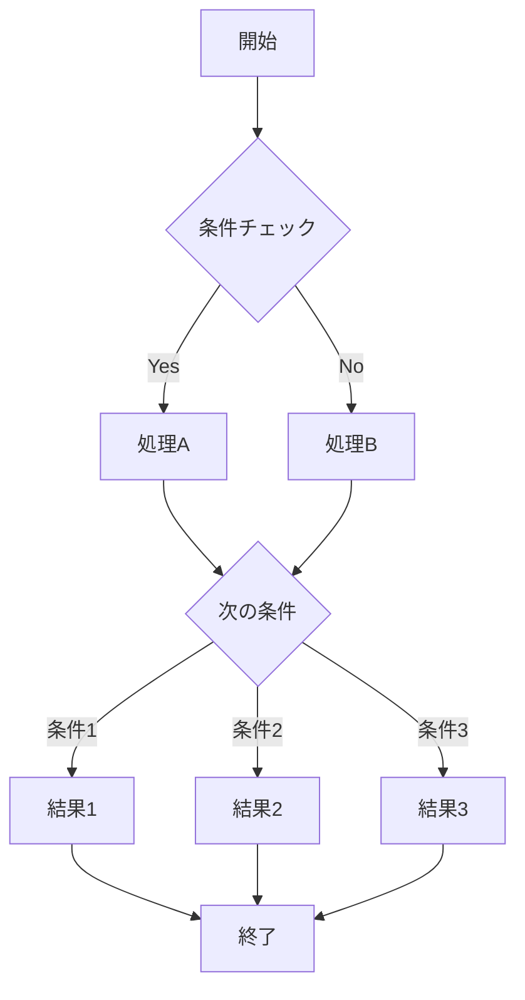

## スタイリング

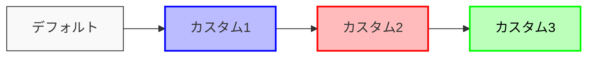

## リンクのスタイリング

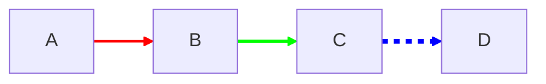

## 複数ノードへの一括接続

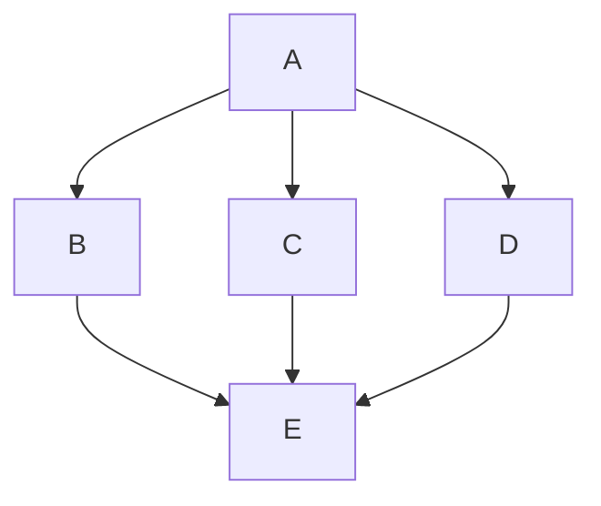

## 実践的な例：ユーザー認証フロー


## 特殊文字のエスケープ

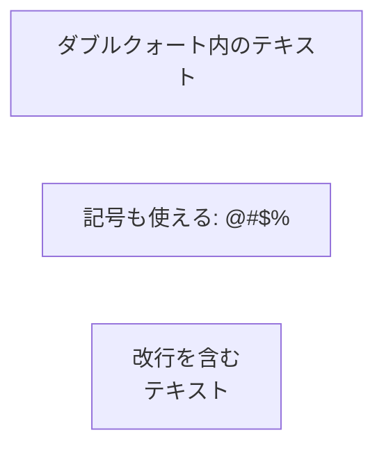

## クリックイベント（インタラクション）

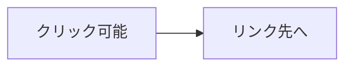

## FontAwesomeアイコンの使用

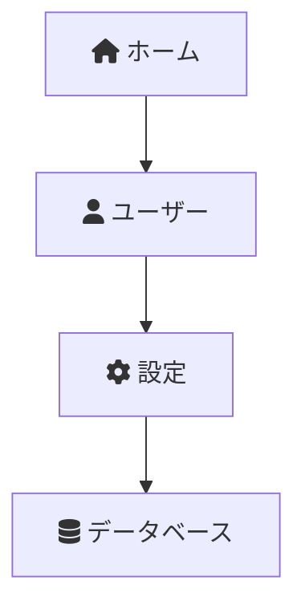

## 画像をノードとして使用（Mermaid v11+）

Mermaid v11以降では、任意の画像をノードとして使用できます。

### 基本構文

```mermaid
flowchart LR
    img1@{ img: "https://upload.wikimedia.org/wikipedia/commons/thumb/a/a7/React-icon.svg/120px-React-icon.svg.png", label: "React", pos: "b", w: 60, h: 60 }
    img2@{ img: "https://upload.wikimedia.org/wikipedia/commons/thumb/d/d9/Node.js_logo.svg/120px-Node.js_logo.svg.png", label: "Node.js", pos: "b", w: 60, h: 60 }
    img3@{ img: "https://upload.wikimedia.org/wikipedia/commons/thumb/9/93/MongoDB_Logo.svg/120px-MongoDB_Logo.svg.png", label: "MongoDB", pos: "b", w: 60, h: 60 }

    img1 --> img2 --> img3
```

### 画像ノードのプロパティ

| プロパティ | 説明 | 例 |
|-----------|------|-----|
| `img` | 画像のURL（必須） | `"https://example.com/image.png"` |
| `label` | ラベルテキスト | `"ノード名"` |
| `pos` | ラベル位置（`t`=上, `b`=下） | `"b"` |
| `w` | 画像の幅（ピクセル） | `60` |
| `h` | 画像の高さ（ピクセル） | `60` |

### アイコンノード

FontAwesomeやその他のアイコンライブラリを使用したアイコンノードも作成できます。

```mermaid
flowchart TD
    icon1@{ icon: "fa:server", form: "square", label: "サーバー" }
    icon2@{ icon: "fa:database", form: "circle", label: "データベース" }
    icon3@{ icon: "fa:cloud", form: "rounded", label: "クラウド" }

    icon1 --> icon2
    icon2 --> icon3
```

### アイコンノードのプロパティ

| プロパティ | 説明 | 例 |
|-----------|------|-----|
| `icon` | アイコン名（必須） | `"fa:database"` |
| `form` | 形状（`square`, `circle`, `rounded`） | `"square"` |
| `label` | ラベルテキスト | `"ノード名"` |

### 実践例：技術スタック図

```mermaid
flowchart TB
    subgraph Frontend
        react@{ img: "https://upload.wikimedia.org/wikipedia/commons/thumb/a/a7/React-icon.svg/100px-React-icon.svg.png", label: "React", pos: "b", w: 50, h: 50 }
        ts@{ img: "https://upload.wikimedia.org/wikipedia/commons/thumb/4/4c/Typescript_logo_2020.svg/100px-Typescript_logo_2020.svg.png", label: "TypeScript", pos: "b", w: 50, h: 50 }
    end

    subgraph Backend
        node@{ img: "https://upload.wikimedia.org/wikipedia/commons/thumb/d/d9/Node.js_logo.svg/100px-Node.js_logo.svg.png", label: "Node.js", pos: "b", w: 50, h: 50 }
        python@{ img: "https://upload.wikimedia.org/wikipedia/commons/thumb/c/c3/Python-logo-notext.svg/100px-Python-logo-notext.svg.png", label: "Python", pos: "b", w: 50, h: 50 }
    end

    subgraph Database
        postgres@{ img: "https://upload.wikimedia.org/wikipedia/commons/thumb/2/29/Postgresql_elephant.svg/100px-Postgresql_elephant.svg.png", label: "PostgreSQL", pos: "b", w: 50, h: 50 }
        redis@{ img: "https://upload.wikimedia.org/wikipedia/commons/thumb/6/64/Logo-redis.svg/100px-Logo-redis.svg.png", label: "Redis", pos: "b", w: 50, h: 50 }
    end

    react --> node
    ts --> node
    react --> python
    node --> postgres
    python --> postgres
    node --> redis
```

### 実践例：クラウドアーキテクチャ図

```mermaid
flowchart LR
    user@{ icon: "fa:users", form: "circle", label: "ユーザー" }
    cdn@{ icon: "fa:globe", form: "square", label: "CDN" }
    lb@{ icon: "fa:balance-scale", form: "square", label: "ロードバランサー" }

    subgraph Servers
        web1@{ icon: "fa:server", form: "rounded", label: "Web 1" }
        web2@{ icon: "fa:server", form: "rounded", label: "Web 2" }
    end

    db@{ icon: "fa:database", form: "circle", label: "データベース" }
    cache@{ icon: "fa:bolt", form: "square", label: "キャッシュ" }

    user --> cdn
    cdn --> lb
    lb --> web1
    lb --> web2
    web1 --> cache
    web2 --> cache
    cache --> db
```

### 画像とテキストノードの混在

通常のノードと画像ノードを自由に組み合わせることができます。

```mermaid
flowchart TD
    A[ユーザーリクエスト] --> B@{ icon: "fa:shield", form: "square", label: "認証" }
    B --> C{権限チェック}
    C -->|許可| D@{ icon: "fa:check-circle", form: "circle", label: "成功" }
    C -->|拒否| E@{ icon: "fa:times-circle", form: "circle", label: "失敗" }
    D --> F[処理実行]
    F --> G@{ icon: "fa:database", form: "rounded", label: "データ保存" }

    style D fill:#9f9,stroke:#393
    style E fill:#f99,stroke:#933
```
