# Flowchart（フローチャート）

Mermaidのフローチャートは、処理の流れやワークフローを視覚化するための図です。

## 基本構文

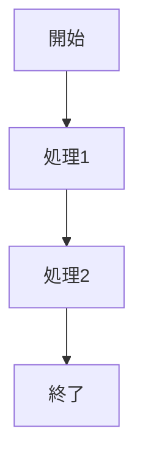

## 方向指定

| 指定 | 説明 |
|------|------|
| `TB` / `TD` | 上から下（Top to Bottom / Top Down） |
| `BT` | 下から上（Bottom to Top） |
| `LR` | 左から右（Left to Right） |
| `RL` | 右から左（Right to Left） |

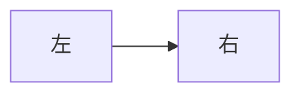

## ノードの形状

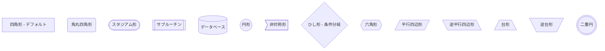

## リンク（矢印）の種類

```mermaid
flowchart LR
    A --> B
    A --- C
    A -.- D
    A -.-> E
    A ==> F
    A ~~~ G

    subgraph 矢印の説明
        H[-->: 矢印付き]
        I[---: 線のみ]
        J[-.-: 点線]
        K[-.->: 点線矢印]
        L[==>: 太線矢印]
        M[~~~: 非表示リンク]
    end
```

## リンクにテキストを追加

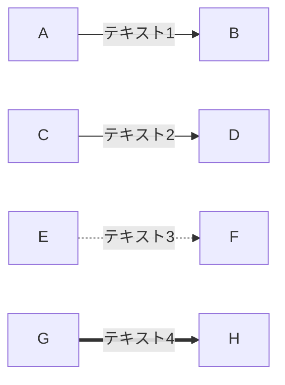

## リンクの長さ調整

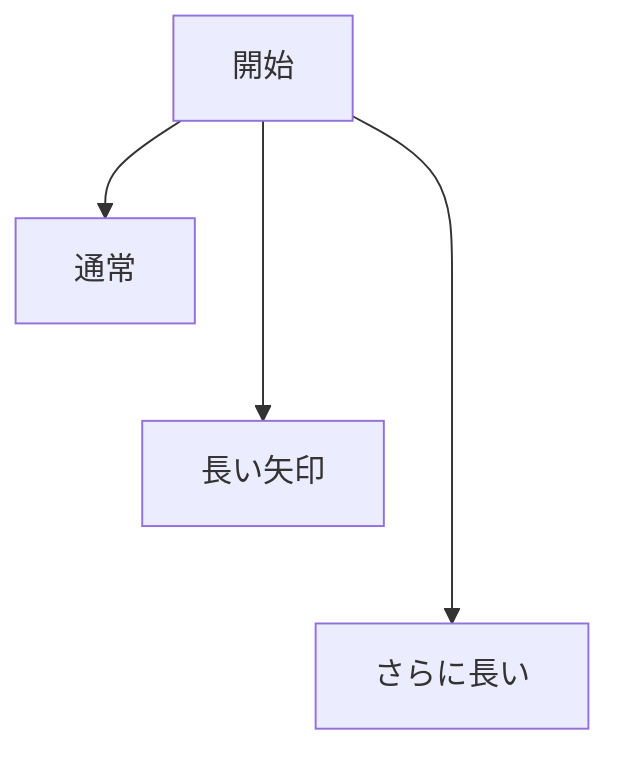

## サブグラフ（グループ化）

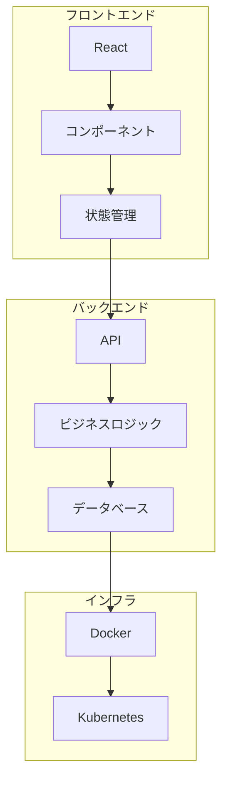

## サブグラフの方向指定

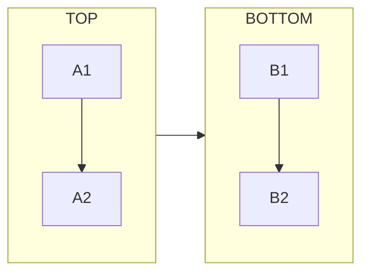

## 条件分岐の例

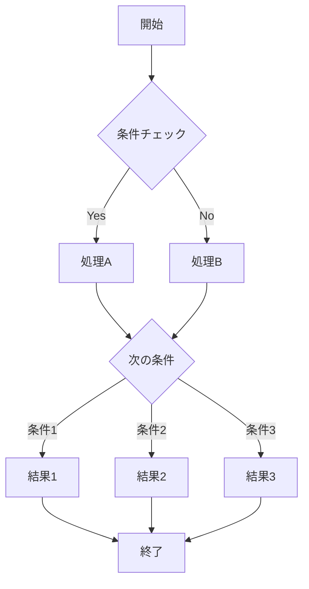

## スタイリング

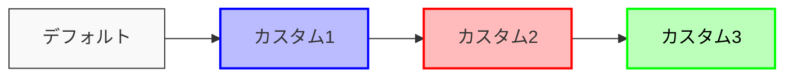

## リンクのスタイリング

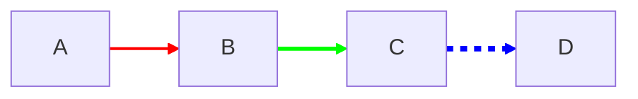

## 複数ノードへの一括接続

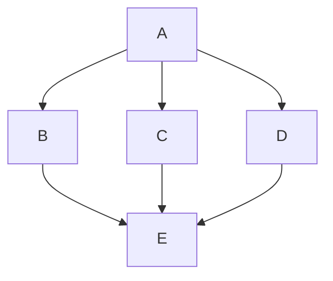

## 実践的な例：ユーザー認証フロー

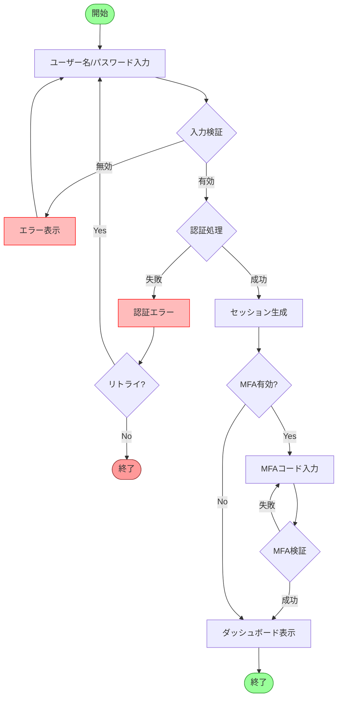

## 特殊文字のエスケープ

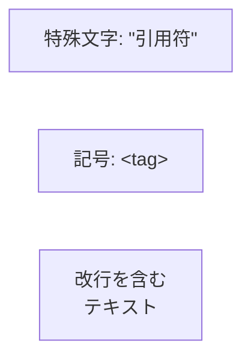

## クリックイベント（インタラクション）

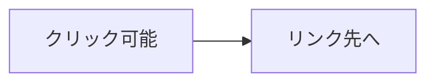

## FontAwesomeアイコンの使用

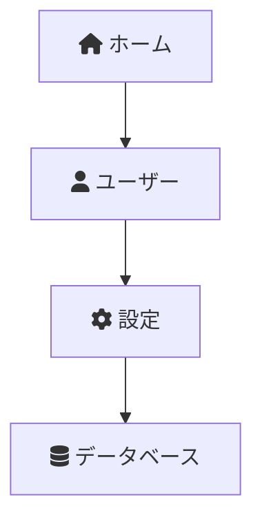
