# Sequence Diagram（シーケンス図）

オブジェクト間のやり取りを時系列で表現する図です。

## 基本構文

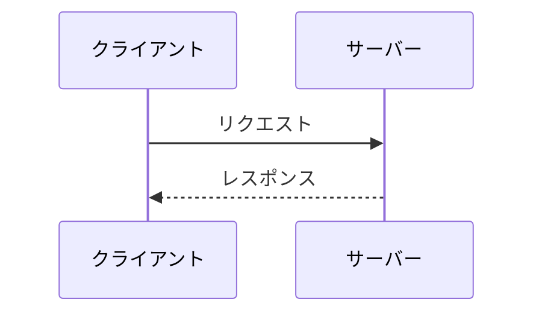
```mermaid
sequenceDiagram
    participant A as クライアント
    participant B as サーバー
    A->>B: リクエスト
    B-->>A: レスポンス
```

## 参加者の定義

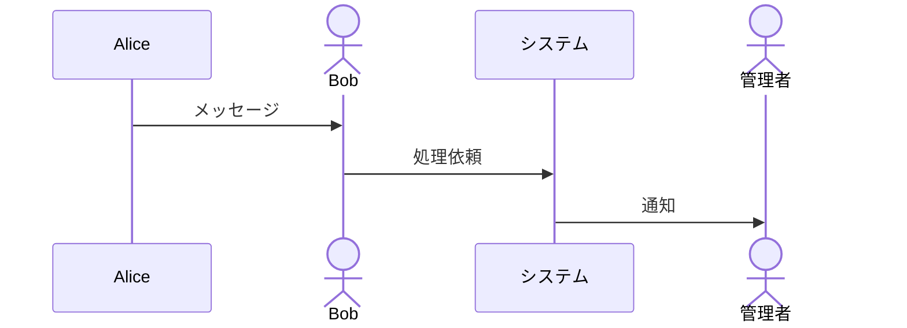
```mermaid
sequenceDiagram
    participant A as Alice
    actor B as Bob
    participant C as システム
    actor D as 管理者

    A->>B: メッセージ
    B->>C: 処理依頼
    C->>D: 通知
```

## 矢印の種類

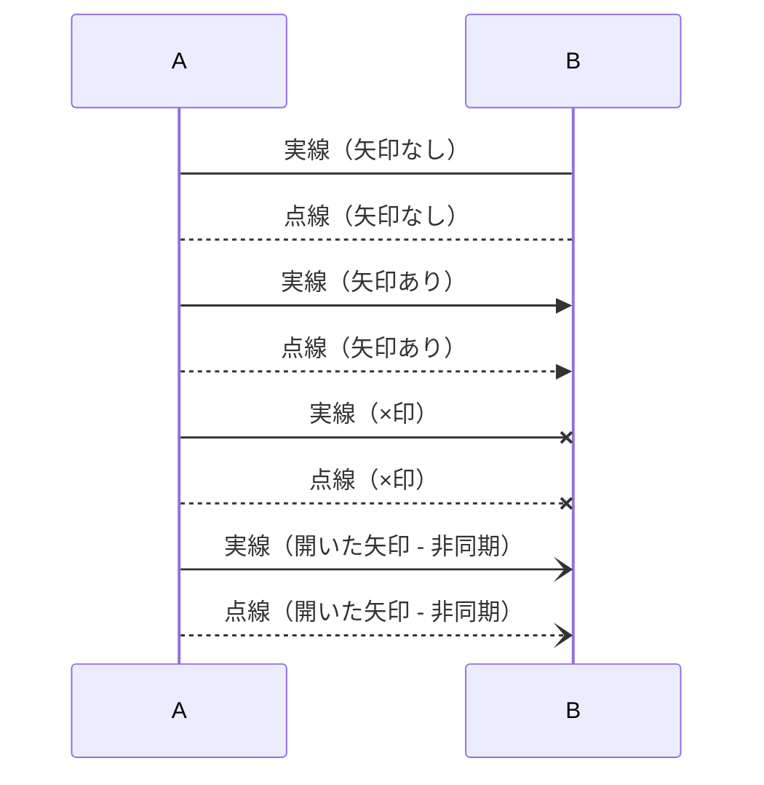
```mermaid
sequenceDiagram
    participant A
    participant B

    A->B: 実線（矢印なし）
    A-->B: 点線（矢印なし）
    A->>B: 実線（矢印あり）
    A-->>B: 点線（矢印あり）
    A-xB: 実線（×印）
    A--xB: 点線（×印）
    A-)B: 実線（開いた矢印 - 非同期）
    A--)B: 点線（開いた矢印 - 非同期）
```

## アクティベーション（活性化）

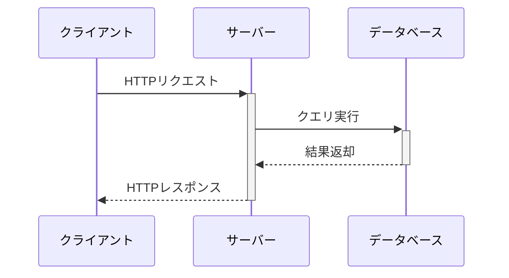
```mermaid
sequenceDiagram
    participant C as クライアント
    participant S as サーバー
    participant D as データベース

    C->>+S: HTTPリクエスト
    S->>+D: クエリ実行
    D-->>-S: 結果返却
    S-->>-C: HTTPレスポンス
```

## 明示的なアクティベーション

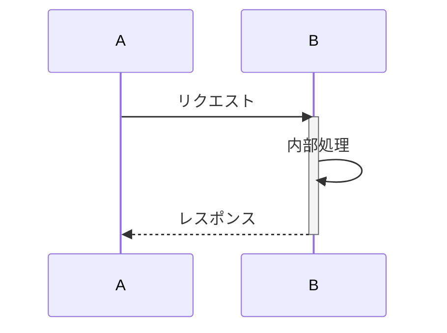
```mermaid
sequenceDiagram
    participant A
    participant B

    A->>B: リクエスト
    activate B
    B->>B: 内部処理
    B-->>A: レスポンス
    deactivate B
```

## ネストされたアクティベーション

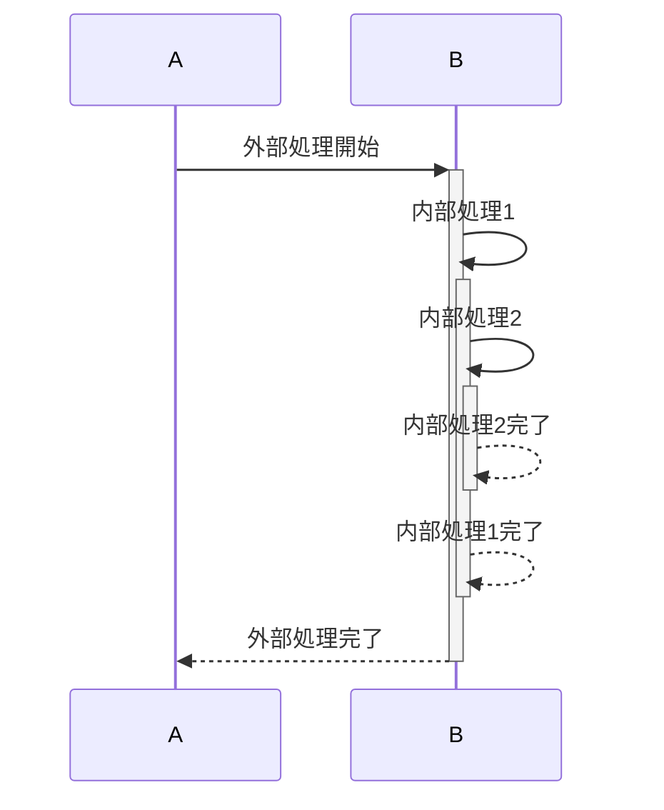
```mermaid
sequenceDiagram
    participant A
    participant B

    A->>+B: 外部処理開始
    B->>+B: 内部処理1
    B->>+B: 内部処理2
    B-->>-B: 内部処理2完了
    B-->>-B: 内部処理1完了
    B-->>-A: 外部処理完了
```

## ノート（注釈）

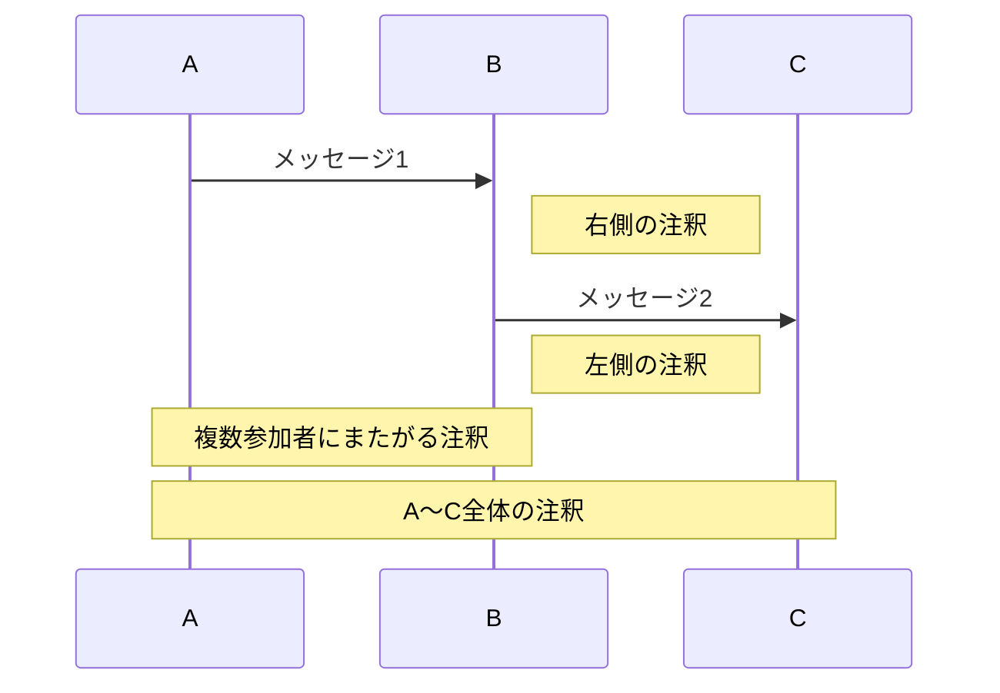
```mermaid
sequenceDiagram
    participant A
    participant B
    participant C

    A->>B: メッセージ1
    Note right of B: 右側の注釈
    B->>C: メッセージ2
    Note left of C: 左側の注釈
    Note over A,B: 複数参加者にまたがる注釈
    Note over A,C: A〜C全体の注釈
```

## ループ（繰り返し）

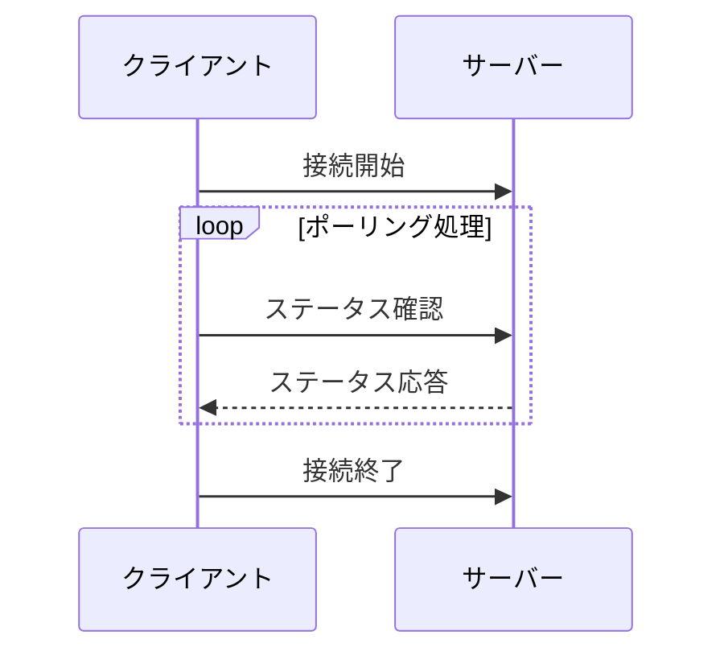
```mermaid
sequenceDiagram
    participant C as クライアント
    participant S as サーバー

    C->>S: 接続開始
    loop ポーリング処理
        C->>S: ステータス確認
        S-->>C: ステータス応答
    end
    C->>S: 接続終了
```

## 条件分岐（alt/else）

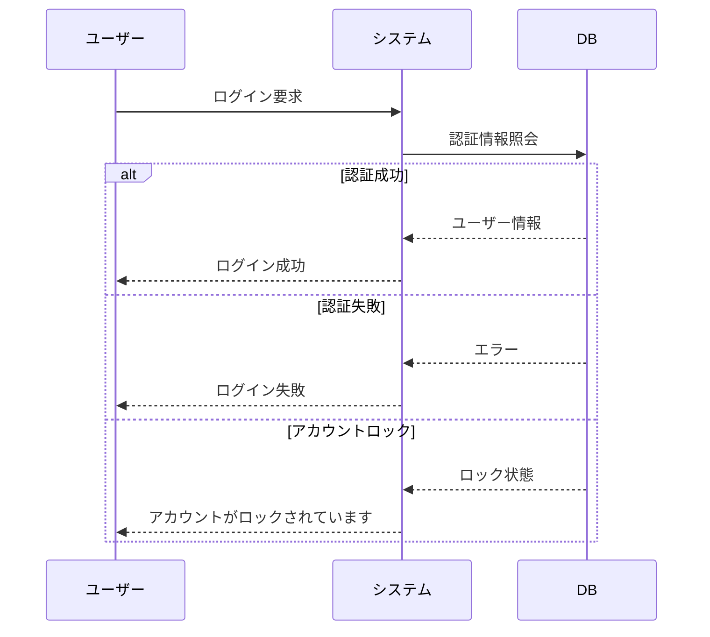
```mermaid
sequenceDiagram
    participant U as ユーザー
    participant S as システム
    participant D as DB

    U->>S: ログイン要求
    S->>D: 認証情報照会

    alt 認証成功
        D-->>S: ユーザー情報
        S-->>U: ログイン成功
    else 認証失敗
        D-->>S: エラー
        S-->>U: ログイン失敗
    else アカウントロック
        D-->>S: ロック状態
        S-->>U: アカウントがロックされています
    end
```

## オプション（opt）

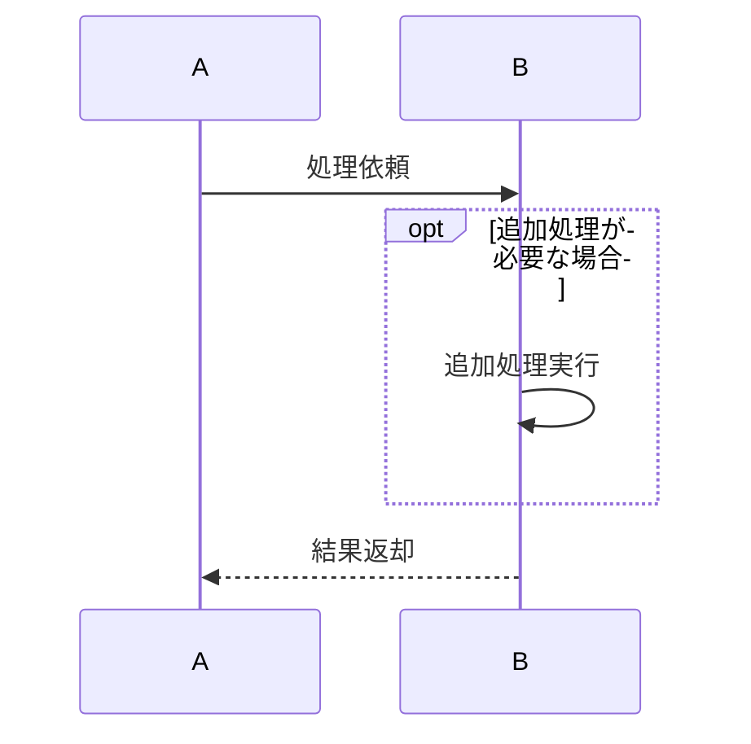
```mermaid
sequenceDiagram
    participant A
    participant B

    A->>B: 処理依頼
    opt 追加処理が必要な場合
        B->>B: 追加処理実行
    end
    B-->>A: 結果返却
```

## 並列処理（par）

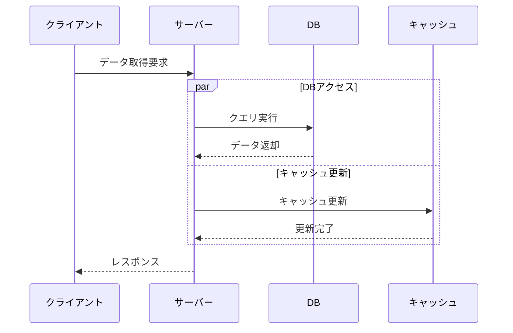
```mermaid
sequenceDiagram
    participant C as クライアント
    participant S as サーバー
    participant D as DB
    participant Ca as キャッシュ

    C->>S: データ取得要求

    par DBアクセス
        S->>D: クエリ実行
        D-->>S: データ返却
    and キャッシュ更新
        S->>Ca: キャッシュ更新
        Ca-->>S: 更新完了
    end

    S-->>C: レスポンス
```

## クリティカル領域（critical）

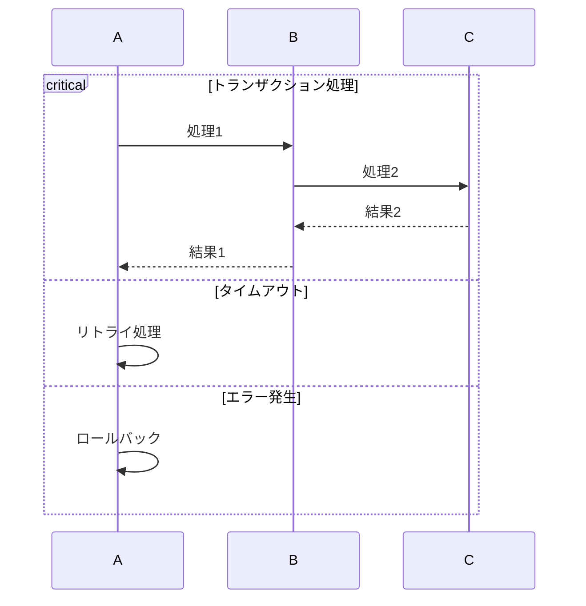
```mermaid
sequenceDiagram
    participant A
    participant B
    participant C

    critical トランザクション処理
        A->>B: 処理1
        B->>C: 処理2
        C-->>B: 結果2
        B-->>A: 結果1
    option タイムアウト
        A->>A: リトライ処理
    option エラー発生
        A->>A: ロールバック
    end
```

## ブレイク（break）

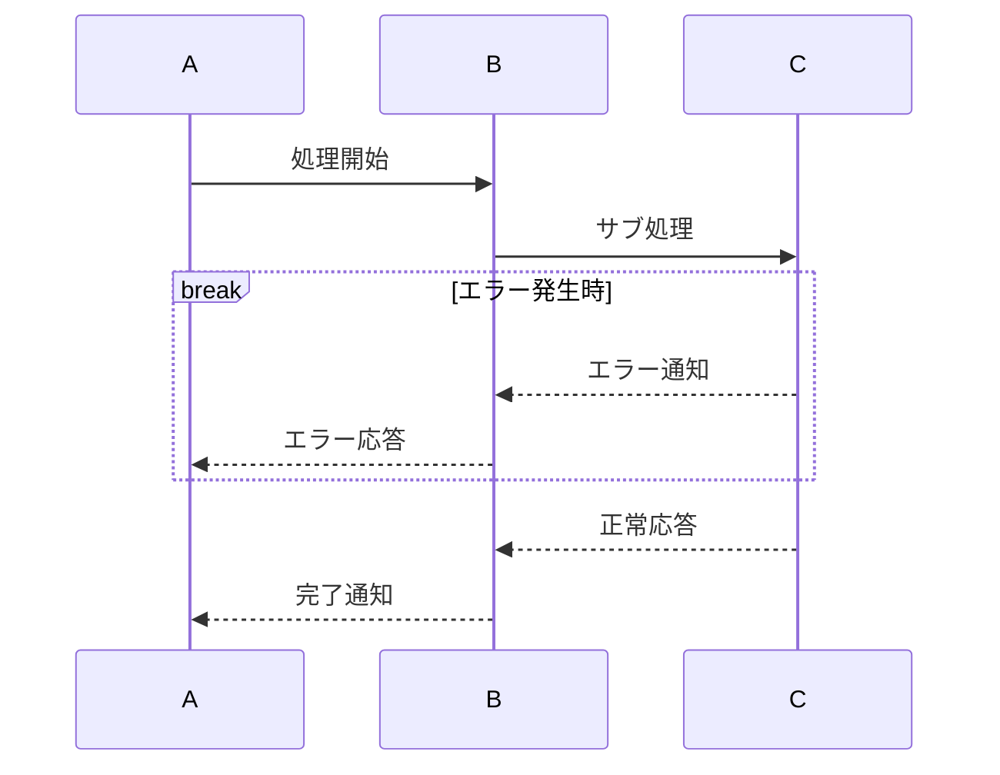
```mermaid
sequenceDiagram
    participant A
    participant B
    participant C

    A->>B: 処理開始
    B->>C: サブ処理

    break エラー発生時
        C-->>B: エラー通知
        B-->>A: エラー応答
    end

    C-->>B: 正常応答
    B-->>A: 完了通知
```

## 背景色のハイライト（rect）

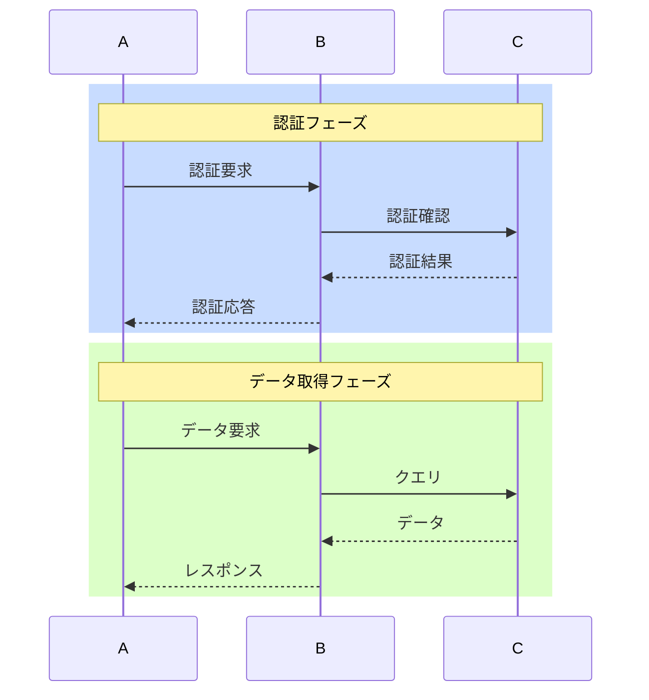
```mermaid
sequenceDiagram
    participant A
    participant B
    participant C

    rect rgb(200, 220, 255)
        Note over A,C: 認証フェーズ
        A->>B: 認証要求
        B->>C: 認証確認
        C-->>B: 認証結果
        B-->>A: 認証応答
    end

    rect rgb(220, 255, 200)
        Note over A,C: データ取得フェーズ
        A->>B: データ要求
        B->>C: クエリ
        C-->>B: データ
        B-->>A: レスポンス
    end
```

## 自動採番

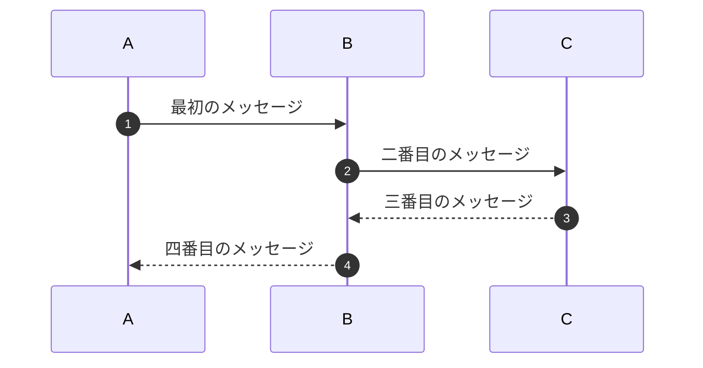
```mermaid
sequenceDiagram
    autonumber
    participant A
    participant B
    participant C

    A->>B: 最初のメッセージ
    B->>C: 二番目のメッセージ
    C-->>B: 三番目のメッセージ
    B-->>A: 四番目のメッセージ
```

## 参加者のエイリアスとリンク

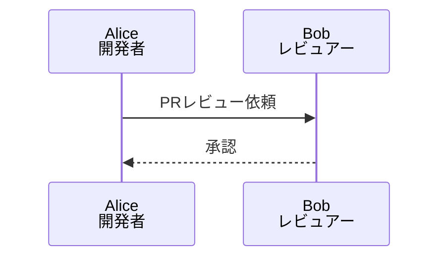
```mermaid
sequenceDiagram
    participant A as Alice<br/>開発者
    participant B as Bob<br/>レビュアー

    A->>B: PRレビュー依頼
    B-->>A: 承認
```

## 実践的な例：REST API呼び出し

```mermaid
sequenceDiagram
    autonumber

    actor User as ユーザー
    participant FE as フロントエンド
    participant API as APIサーバー
    participant Auth as 認証サービス
    participant DB as データベース
    participant Cache as キャッシュ

    User->>FE: ボタンクリック
    activate FE
    FE->>API: POST /api/data
    activate API

    API->>Auth: トークン検証
    activate Auth

    alt トークン有効
        Auth-->>API: 検証OK
        deactivate Auth

        API->>Cache: キャッシュ確認
        activate Cache

        alt キャッシュヒット
            Cache-->>API: キャッシュデータ
            deactivate Cache
        else キャッシュミス
            Cache-->>API: null
            deactivate Cache

            API->>DB: SELECT クエリ
            activate DB
            DB-->>API: データ
            deactivate DB

            API->>Cache: キャッシュ保存
            activate Cache
            Cache-->>API: 保存完了
            deactivate Cache
        end

        API-->>FE: 200 OK + データ
        deactivate API
        FE-->>User: データ表示

    else トークン無効
        Auth-->>API: 検証NG
        deactivate Auth
        API-->>FE: 401 Unauthorized
        deactivate API
        FE-->>User: ログイン画面へリダイレクト
    end

    deactivate FE
```

## アクターの種類

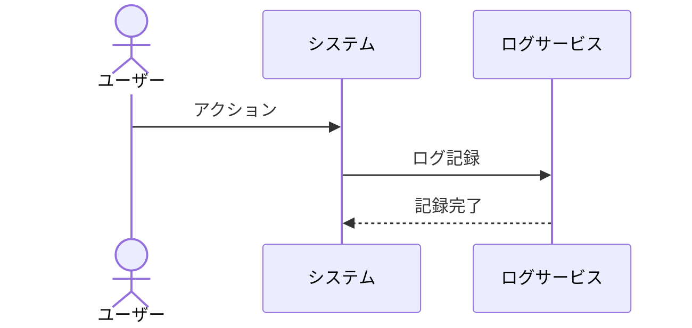
```mermaid
sequenceDiagram
    actor U as ユーザー
    participant S as システム
    participant L as ログサービス

    U->>S: アクション
    S->>L: ログ記録
    L-->>S: 記録完了
```

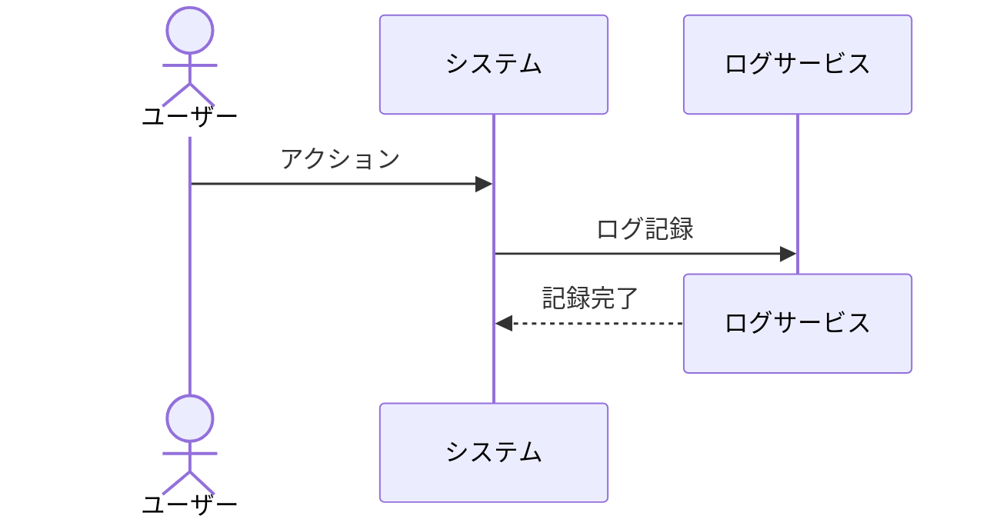
```mermaid
sequenceDiagram
    actor U as ユーザー
    participant S as システム
    participant L as ログサービス
    U->>S: アクション
    S->>L: ログ記録

    destroy L
    L-->>S: 記録完了
```

## ボックス（グループ化）

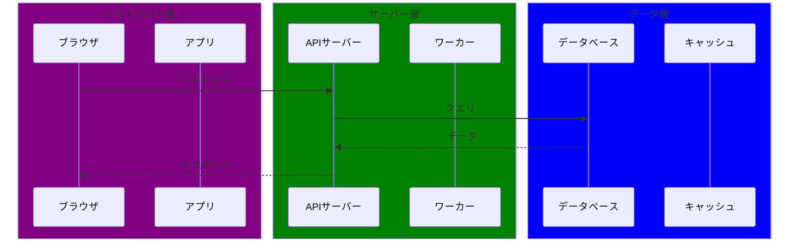
```mermaid
sequenceDiagram
    box Purple クライアント層
        participant Browser as ブラウザ
        participant App as アプリ
    end

    box Green サーバー層
        participant API as APIサーバー
        participant Worker as ワーカー
    end

    box Blue データ層
        participant DB as データベース
        participant Cache as キャッシュ
    end

    Browser->>API: リクエスト
    API->>DB: クエリ
    DB-->>API: データ
    API-->>Browser: レスポンス
```
