# Class Diagram（クラス図）

オブジェクト指向設計でクラス間の関係を表現する図です。

## 基本構文

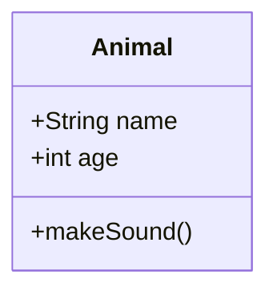

## アクセス修飾子

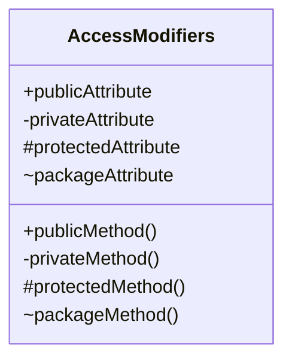

| 記号 | 意味 |
|------|------|
| `+` | public（公開） |
| `-` | private（非公開） |
| `#` | protected（保護） |
| `~` | package/internal |

## データ型と戻り値

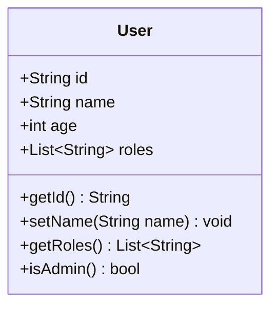

## 静的メンバーと抽象メンバー

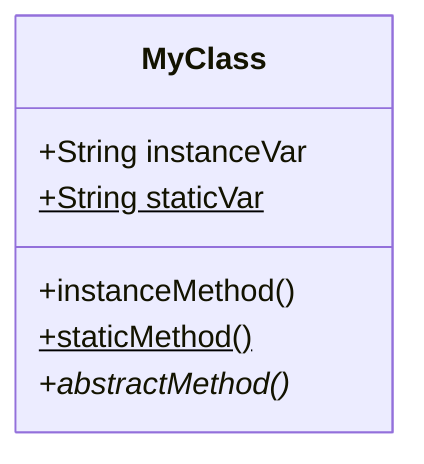

| 記号 | 意味 |
|------|------|
| `$` | 静的（static） |
| `*` | 抽象（abstract） |

## クラス間の関係

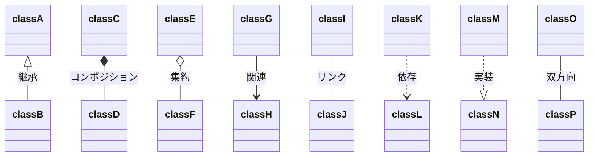

## 関係の種類一覧

| 記法 | 関係の種類 | 説明 |
|------|-----------|------|
| `<\|--` | 継承 | Inheritance |
| `*--` | コンポジション | Composition（強い所有） |
| `o--` | 集約 | Aggregation（弱い所有） |
| `-->` | 関連 | Association |
| `--` | リンク | Link（単純な関係） |
| `..>` | 依存 | Dependency |
| `..\|>` | 実装 | Realization |

## カーディナリティ（多重度）

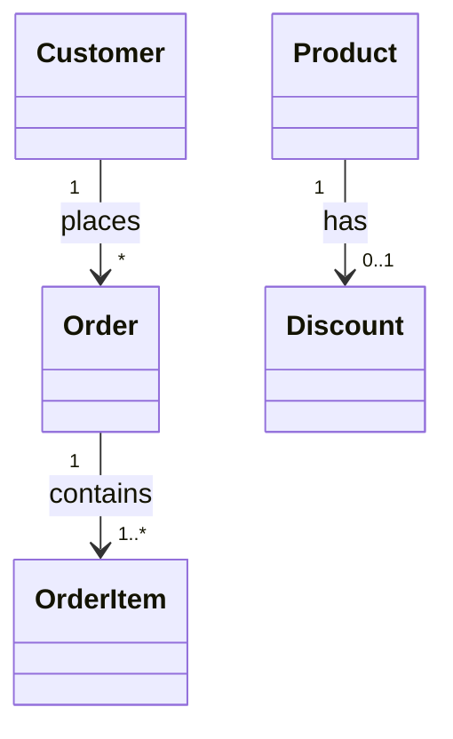

| 表記 | 意味 |
|------|------|
| `1` | 1つ |
| `0..1` | 0または1つ |
| `1..*` | 1つ以上 |
| `*` | 0以上（多数） |
| `n` | n個 |
| `0..n` | 0〜n個 |

## ジェネリクス（テンプレート）

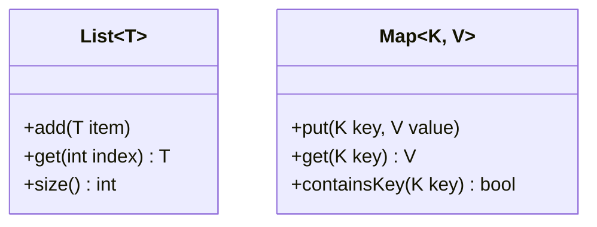

## インターフェース

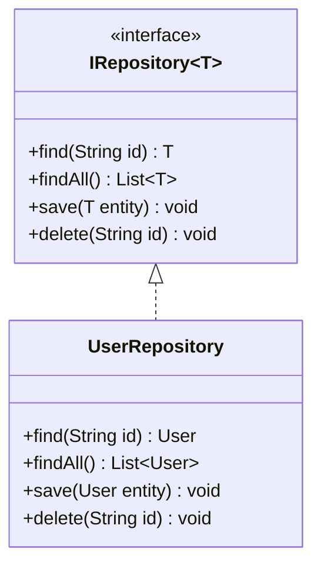

## 列挙型

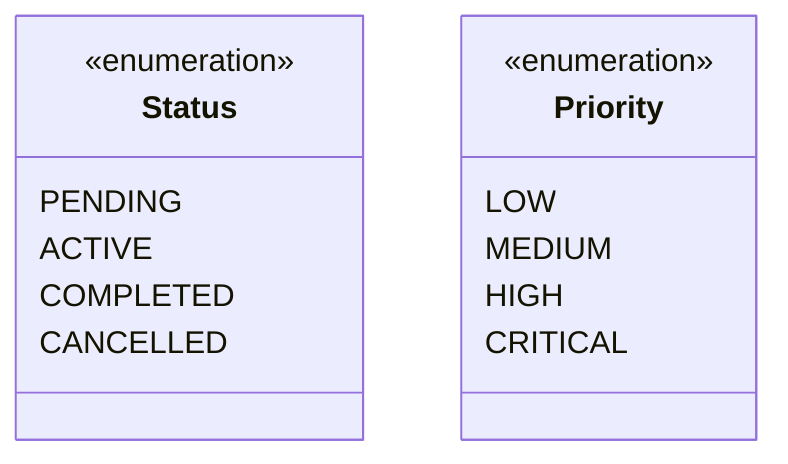

## 抽象クラス

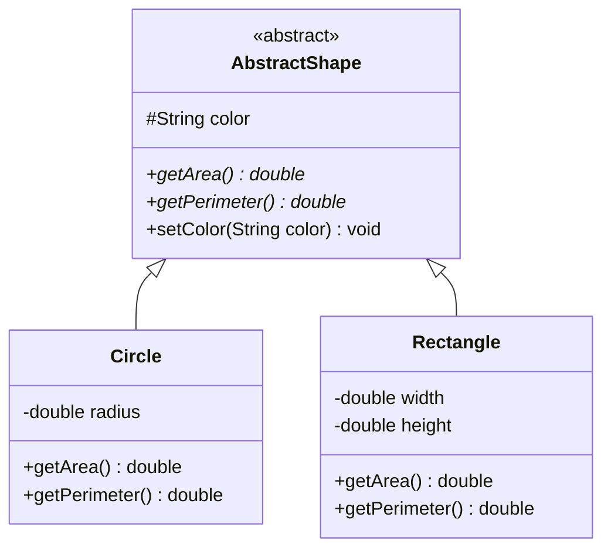

## サービスクラス

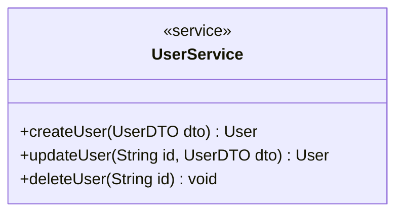

## 注釈（アノテーション）

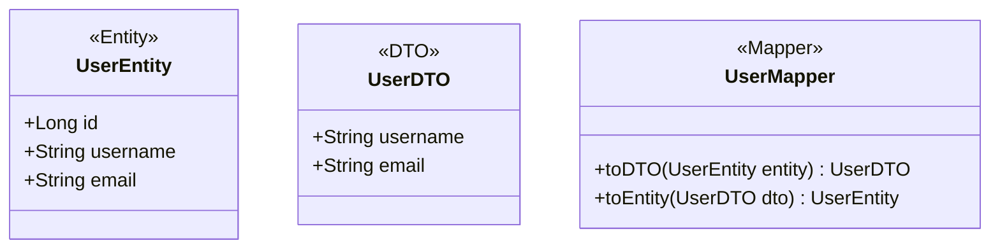

## 名前空間（namespace）

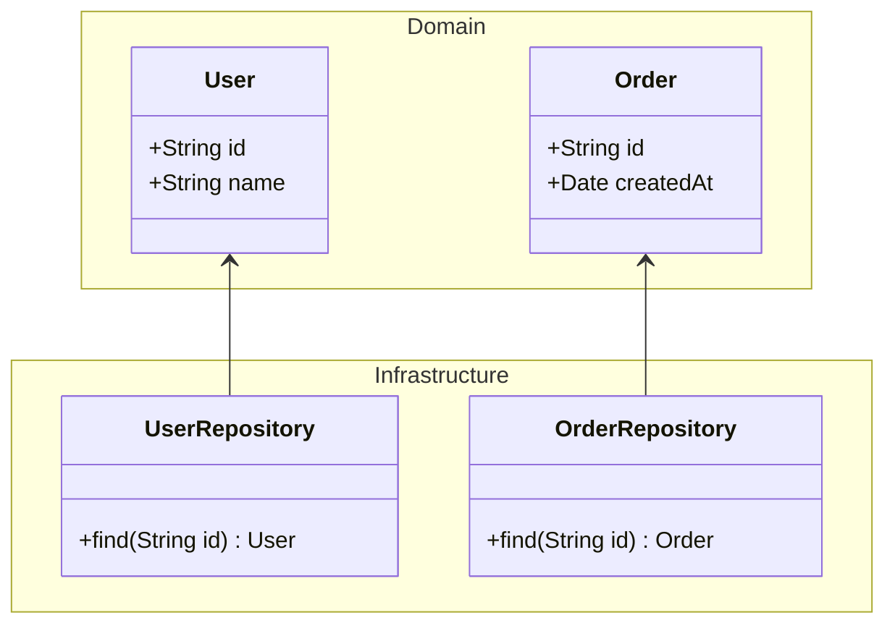

## スタイリング

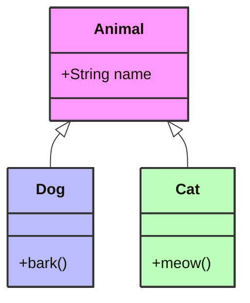

## 実践的な例：Eコマースシステム

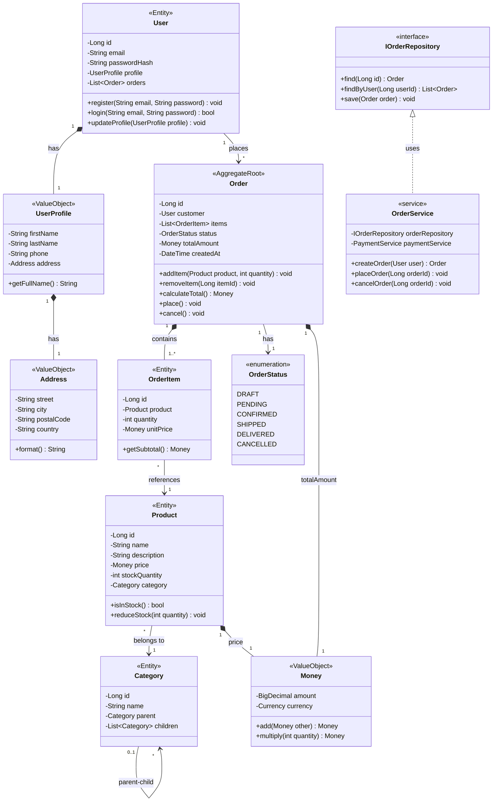

## クリックイベント

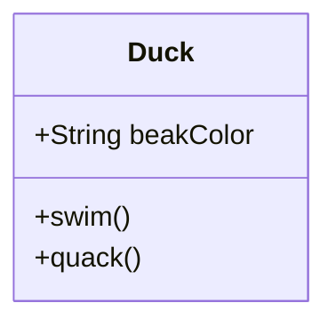

## 方向指定

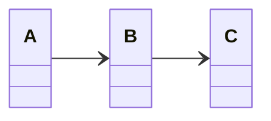
