# State Diagram（状態遷移図）

オブジェクトの状態変化とその遷移を表現する図です。

## 基本構文

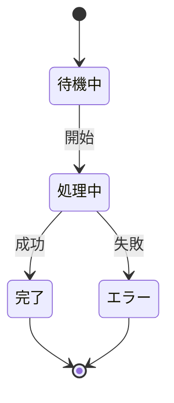

## 開始状態と終了状態

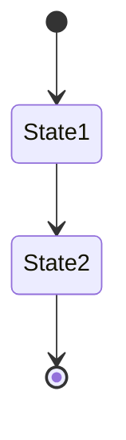

- `[*]` は開始状態（最初に出現）または終了状態（矢印の先）を表します

## 状態の説明

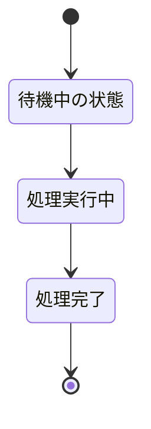

## 遷移ラベル

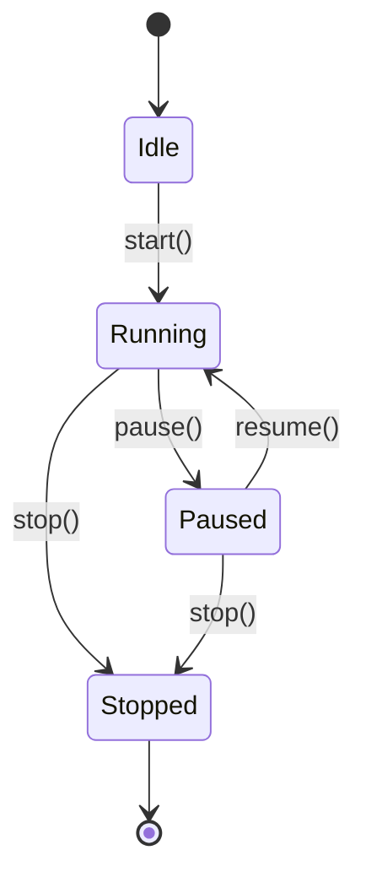

## 複合状態（入れ子状態）

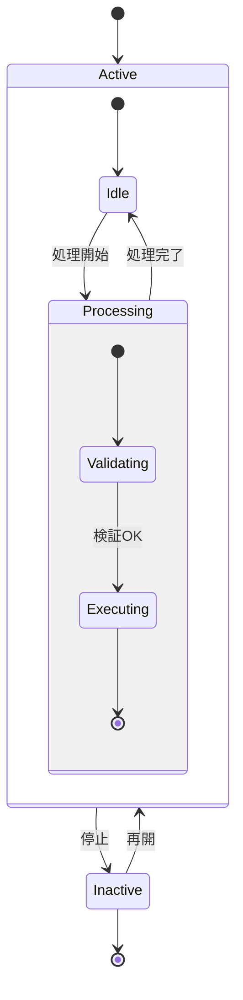

## 並行状態（Fork/Join）

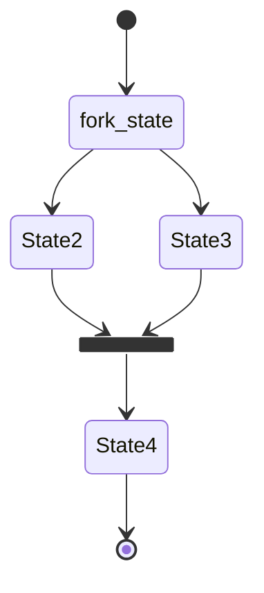

## 選択状態（Choice）

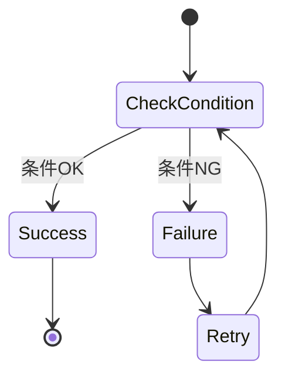

## ノート（注釈）

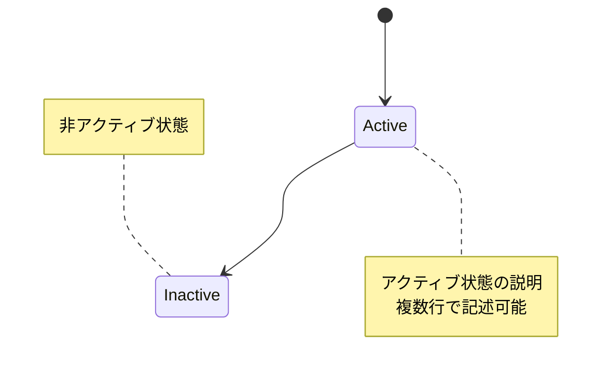

## 方向指定

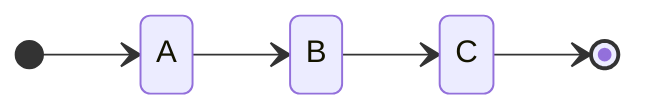

| 指定 | 説明 |
|------|------|
| `direction TB` | 上から下 |
| `direction BT` | 下から上 |
| `direction LR` | 左から右 |
| `direction RL` | 右から左 |

## 複合状態の方向指定

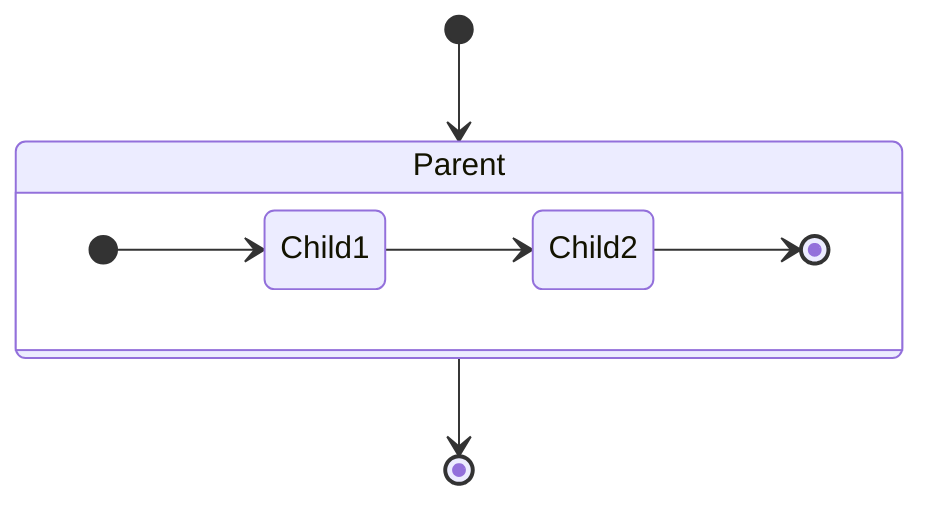

## 遷移の種類

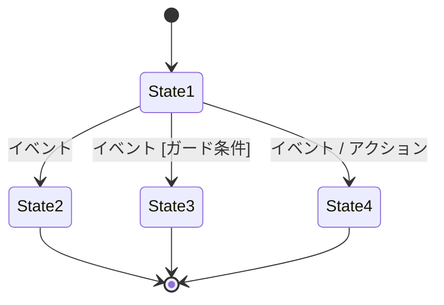

## 実践的な例：注文ステータス

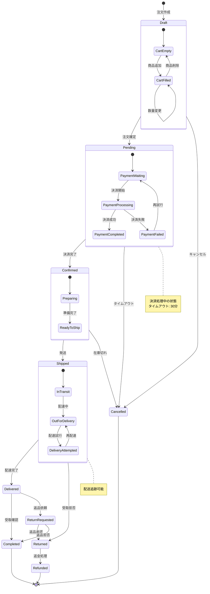

## 実践的な例：ユーザー認証状態

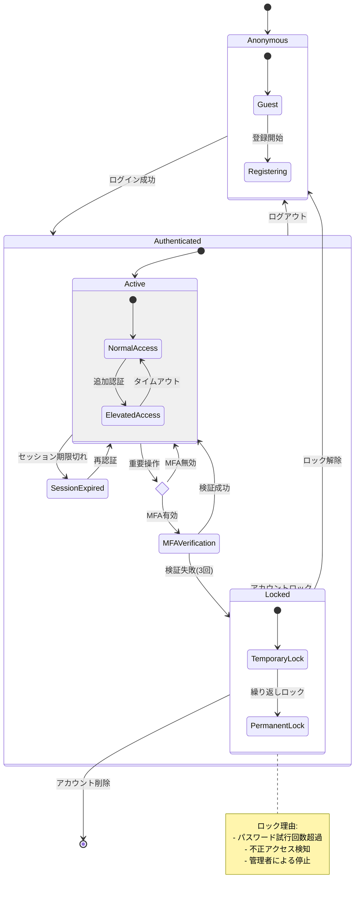

## スタイリング

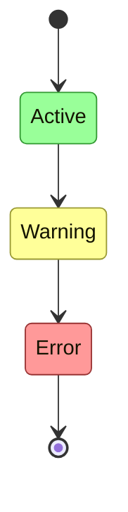

## 履歴状態（History State）

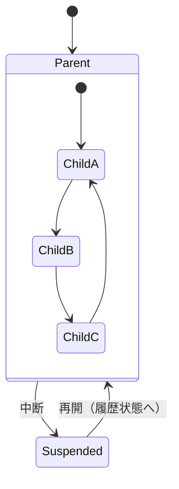
