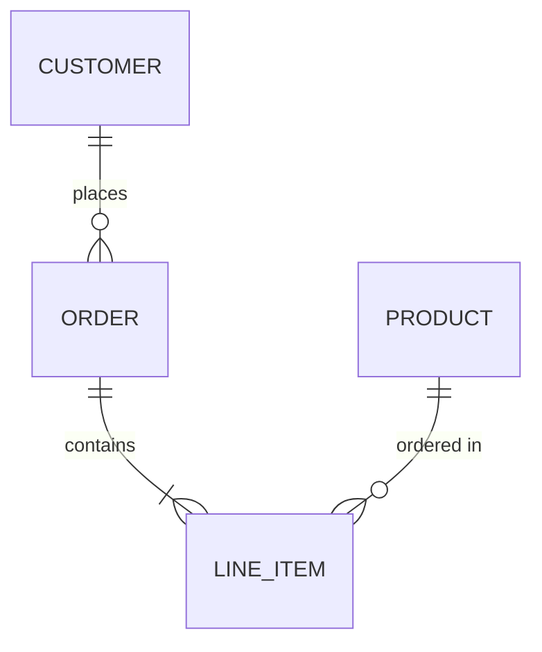
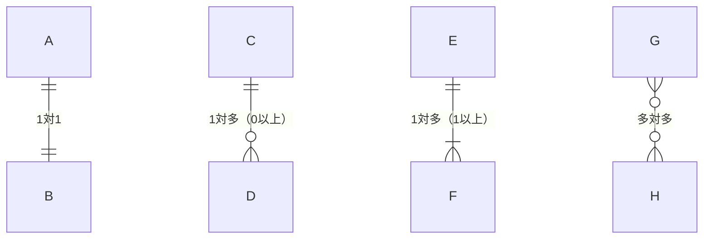
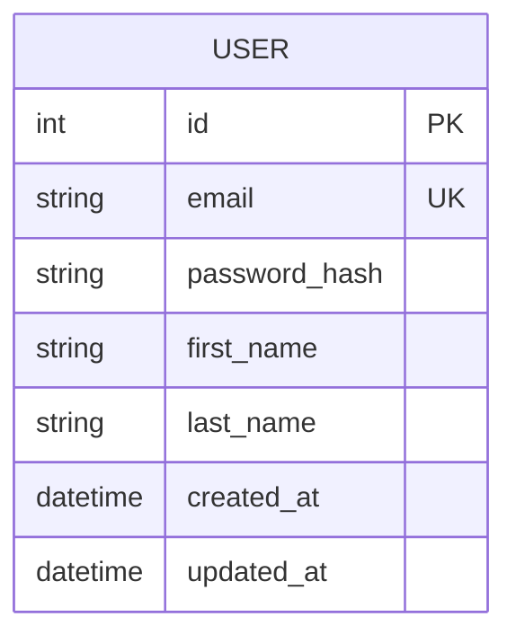
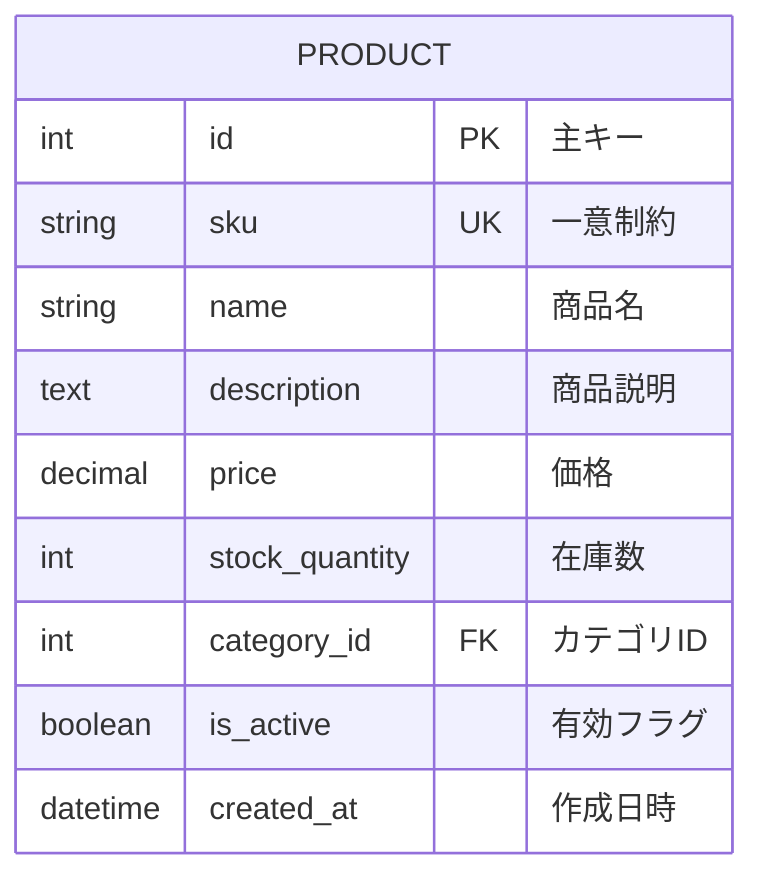
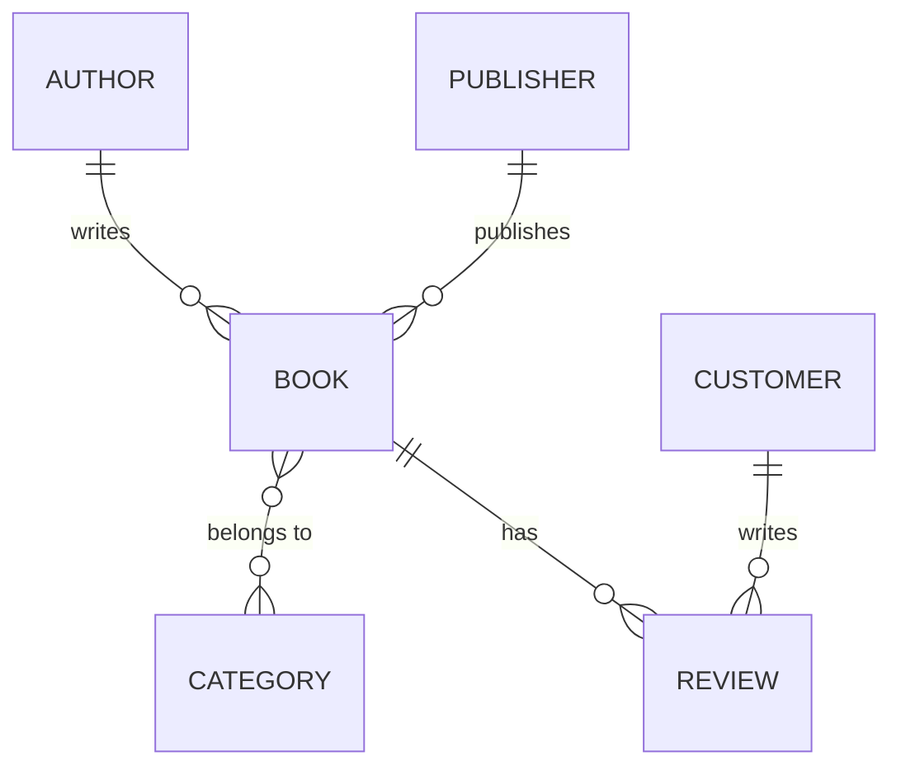
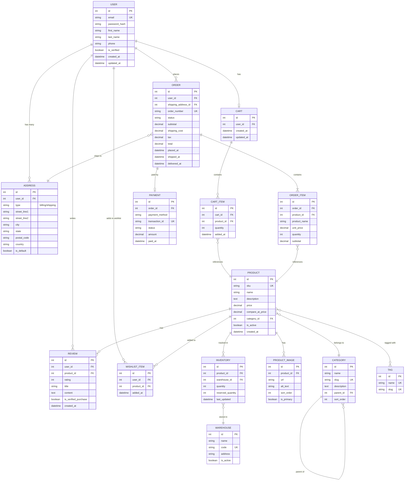
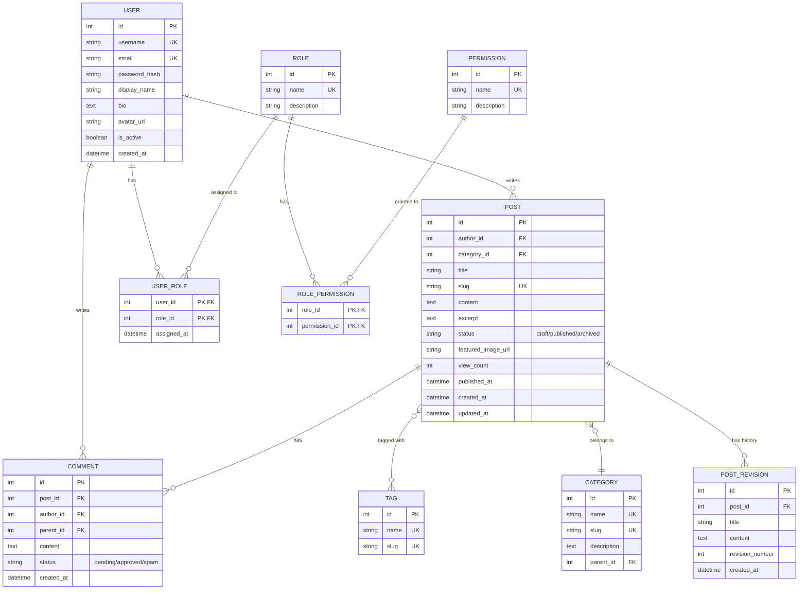
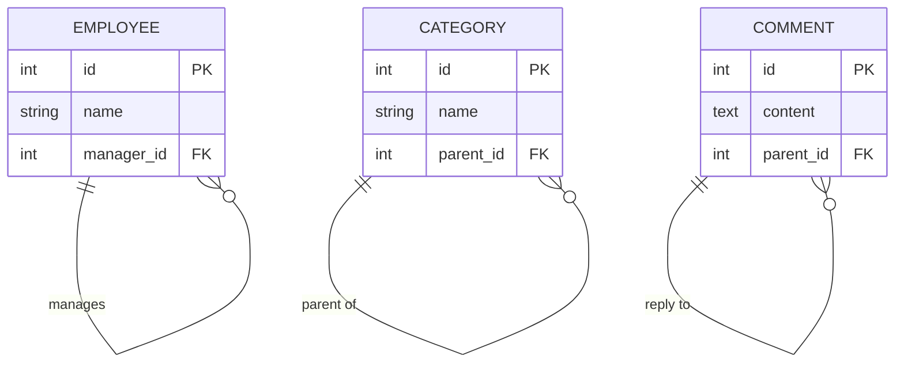
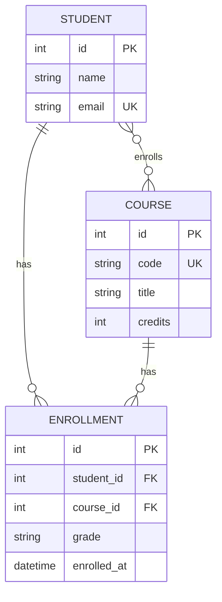

# Entity Relationship Diagram（ER図）

データベース設計におけるエンティティ（テーブル）間の関係を表現する図です。

## 基本構文

## カーディナリティ（多重度）

### カーディナリティ記号一覧

| 左側 | 右側 | 意味 |
|------|------|------|
| `\|o` | `o\|` | 0または1 |
| `\|\|` | `\|\|` | 必ず1 |
| `}o` | `o{` | 0以上（多） |
| `}\|` | `\|{` | 1以上（多） |

## 属性の定義

## 属性の型と制約

### 制約キーワード

| キーワード | 意味 |
|------------|------|
| `PK` | Primary Key（主キー） |
| `FK` | Foreign Key（外部キー） |
| `UK` | Unique Key（一意キー） |

## リレーションシップラベル

## 実践的な例：Eコマースデータベース

## 実践的な例：ブログシステム

## 自己参照リレーション

## 多対多の中間テーブル

