# Gantt Chart（ガントチャート）

プロジェクトのスケジュールとタスクの進捗を視覚化する図です。

## 基本構文

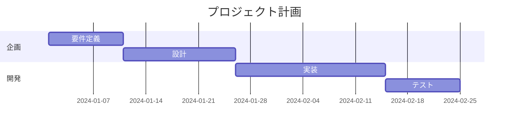

## 日付フォーマット

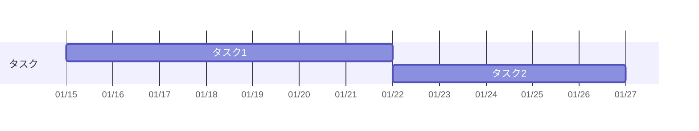

### 日付フォーマット一覧

| フォーマット | 例 |
|--------------|-----|
| `YYYY-MM-DD` | 2024-01-15 |
| `DD-MM-YYYY` | 15-01-2024 |
| `YYYY-MM-DD HH:mm` | 2024-01-15 09:00 |

### 軸フォーマット一覧

| フォーマット | 説明 |
|--------------|------|
| `%Y` | 4桁の年 |
| `%m` | 2桁の月 |
| `%d` | 2桁の日 |
| `%H` | 24時間制の時 |
| `%M` | 分 |
| `%W` | 週番号 |

## タスクの状態

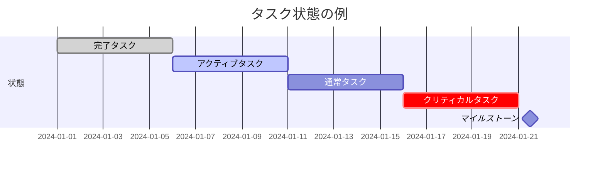

### タスク状態一覧

| 状態 | 説明 |
|------|------|
| `done` | 完了済み |
| `active` | 進行中 |
| `crit` | クリティカル（重要） |
| `milestone` | マイルストーン |

## タスクの依存関係

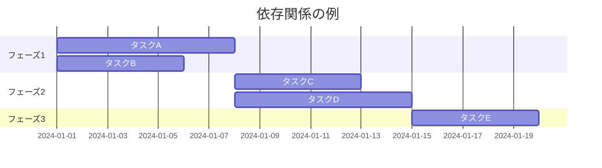

## 除外日（休日設定）

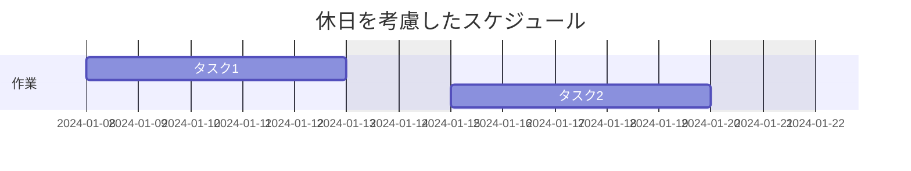

### 除外設定

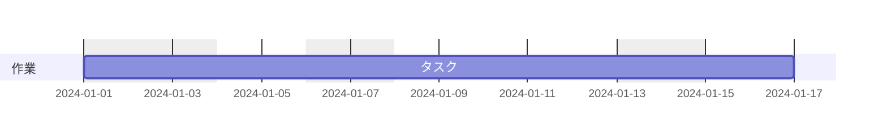

## シンプルなスケジュール

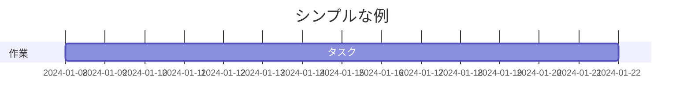

## 複合状態

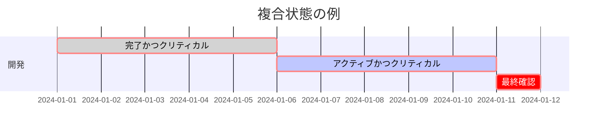

## セクション

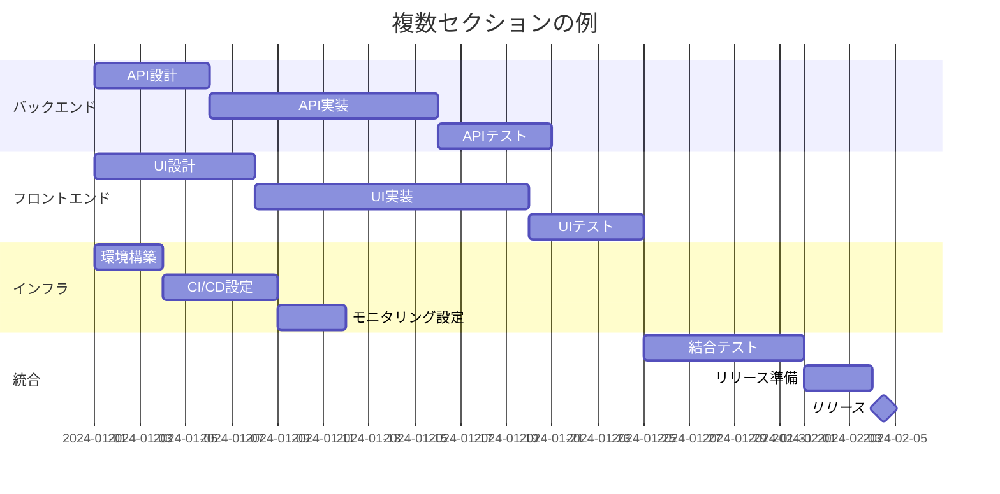

## クリックイベント

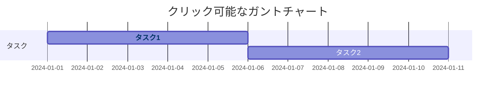

## 表示モード

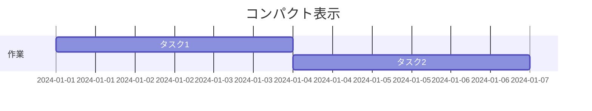

## 実践的な例：Webアプリ開発プロジェクト

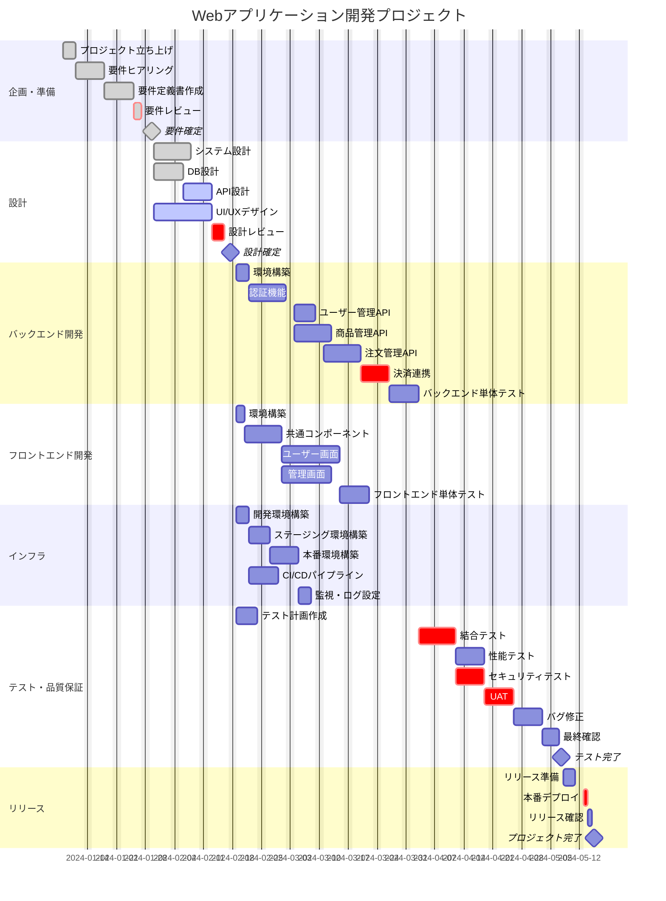

## 実践的な例：スプリント計画

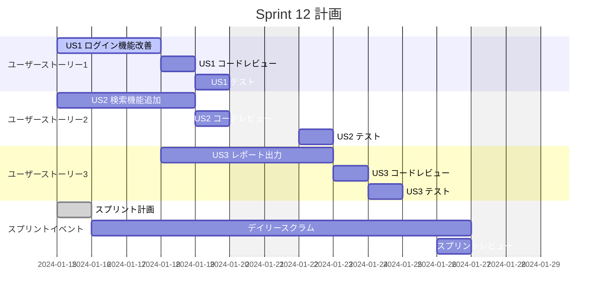
