# Pie Chart（円グラフ）

データの割合を視覚的に表現する円グラフです。

## 基本構文

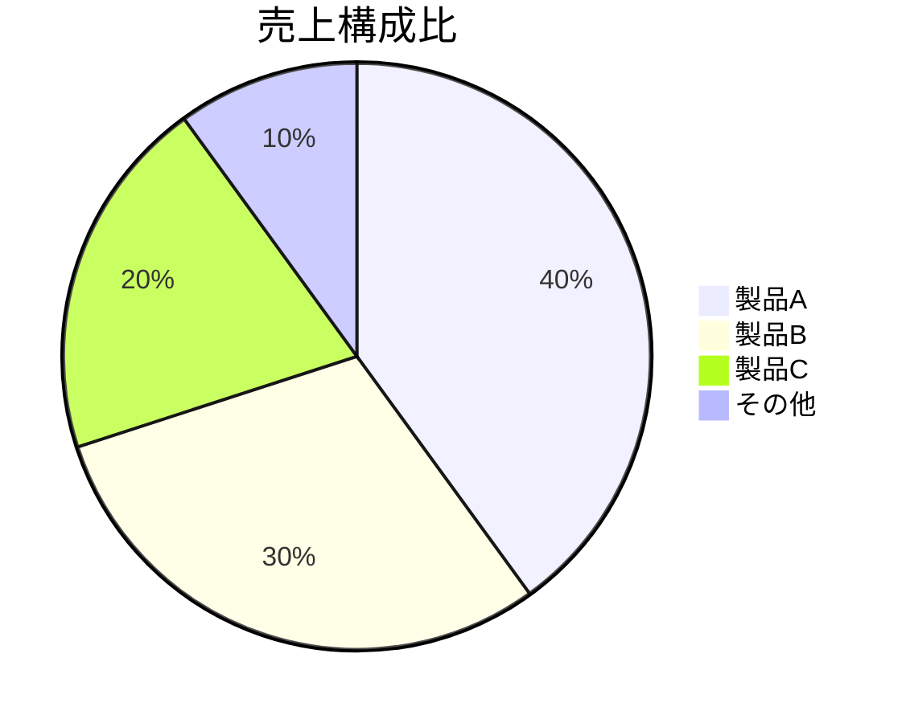

## タイトル設定

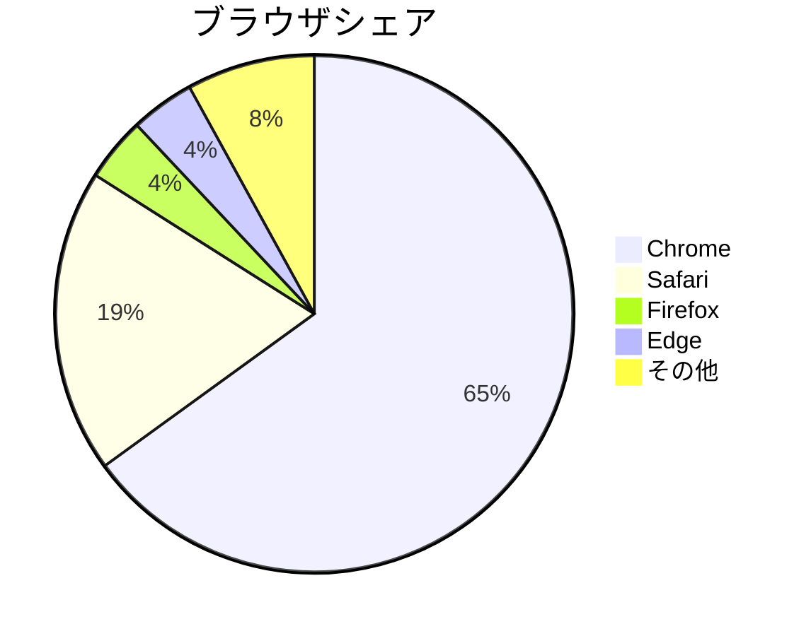

## showData オプション（数値表示）

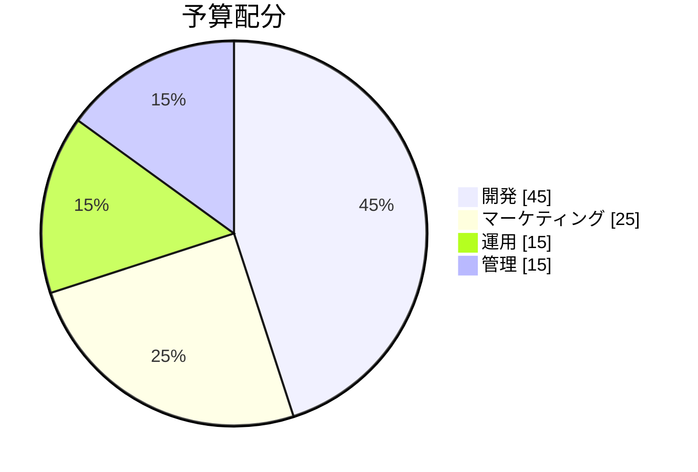

## 実践的な例：プロジェクト工数配分

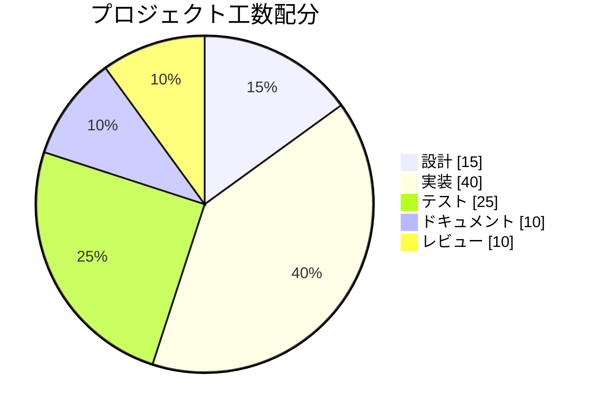

## 実践的な例：バグ分類

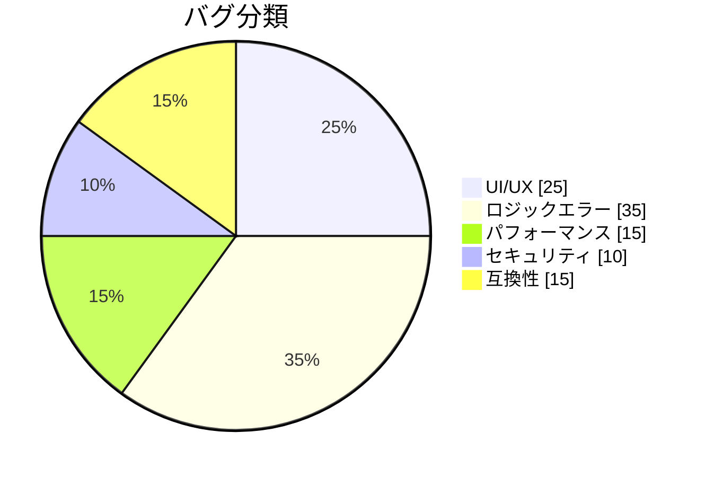

## 実践的な例：技術スタック

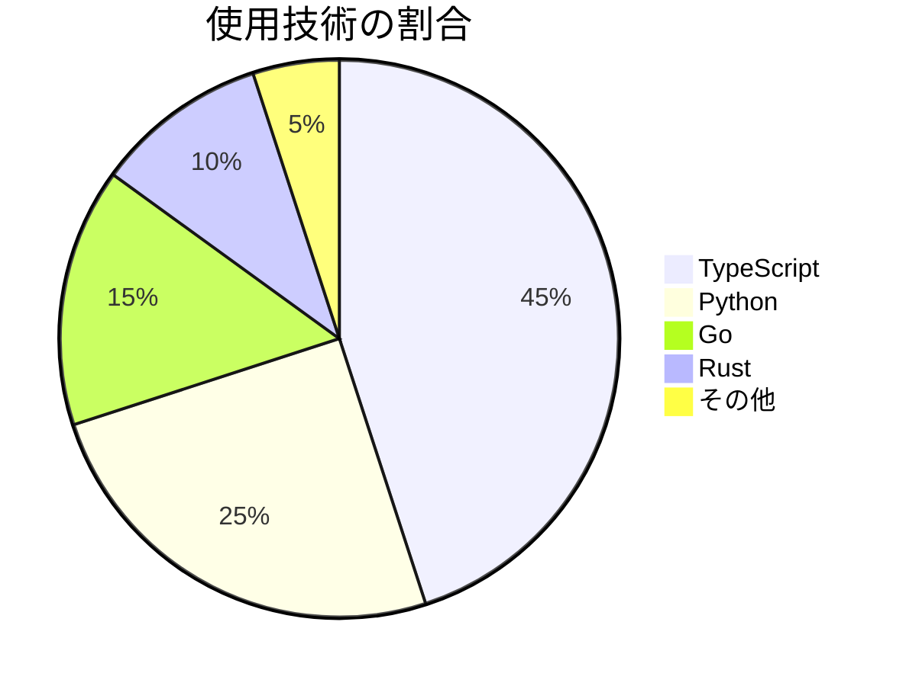

## 実践的な例：タスクステータス

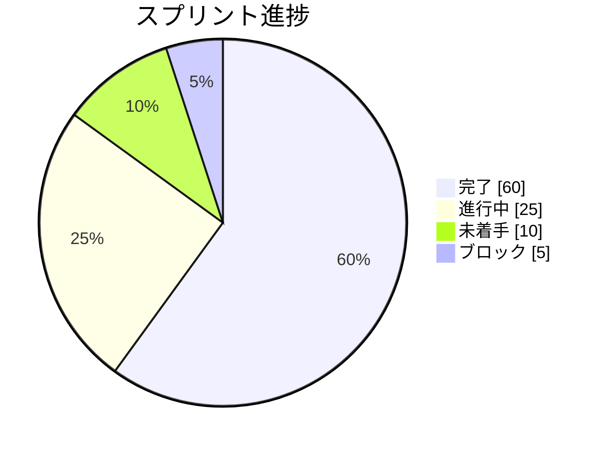

## 実践的な例：顧客セグメント

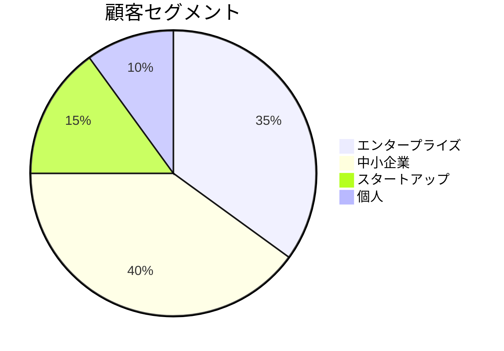

## 実践的な例：コスト内訳

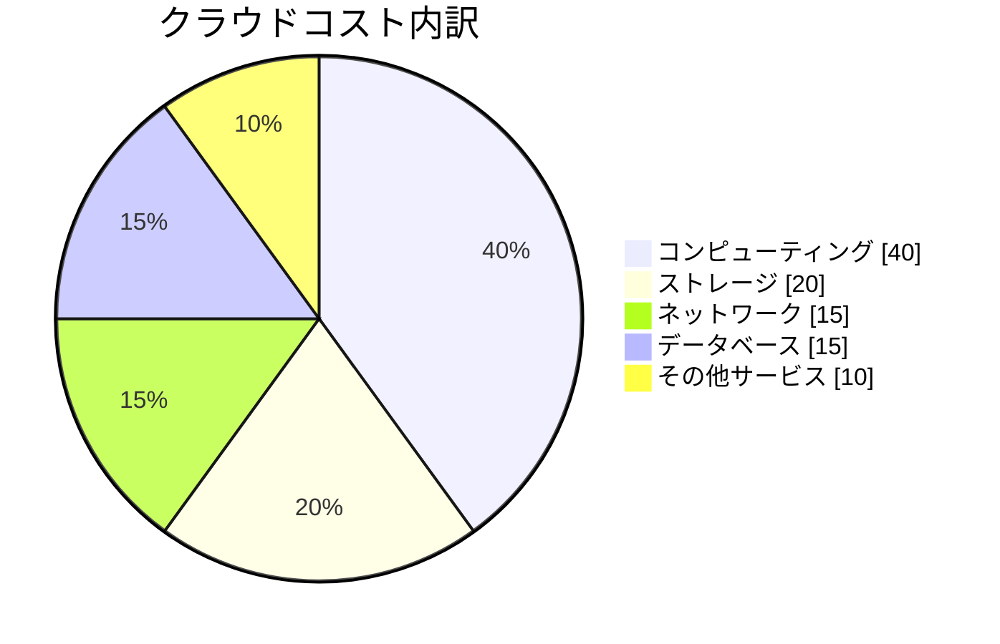

## 実践的な例：コードカバレッジ

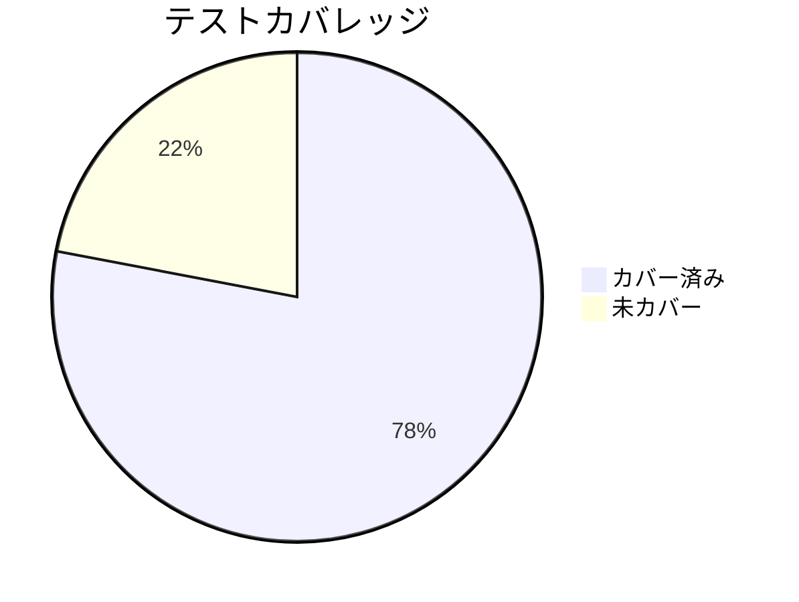

## 実践的な例：チーム構成

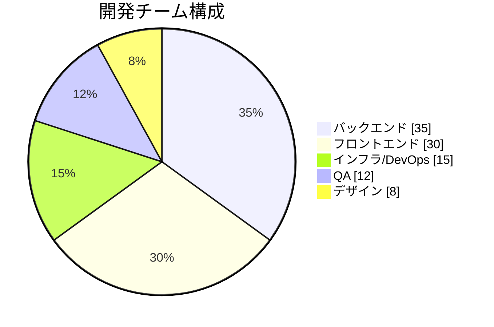

## 実践的な例：エラー種別

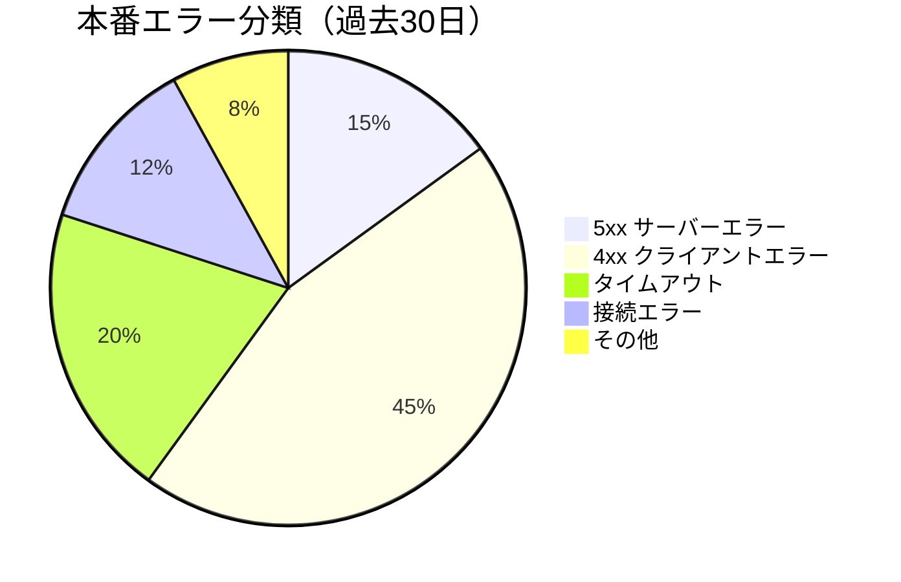

## 実践的な例：リリース種別

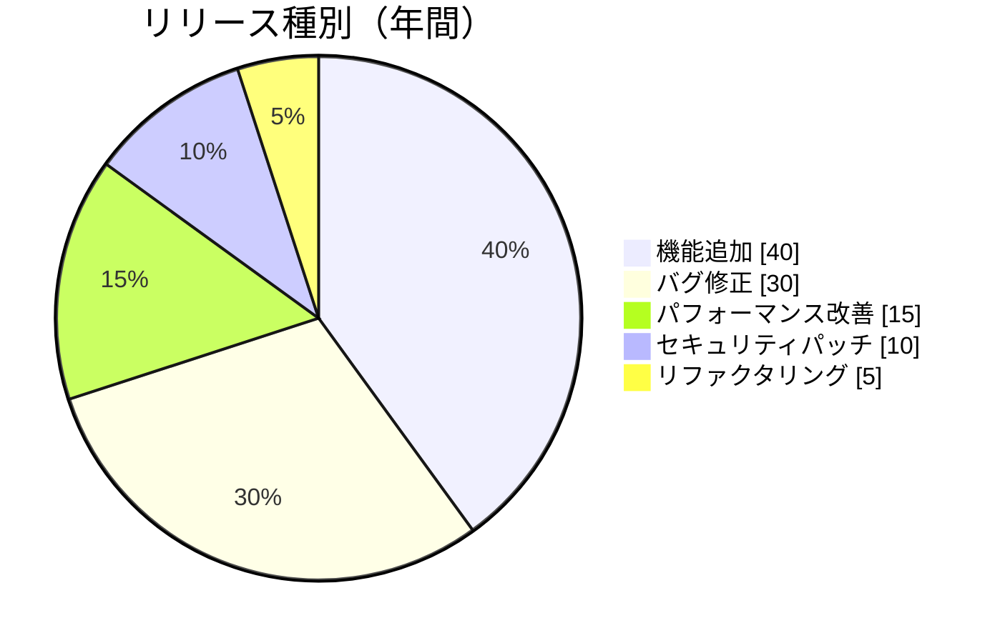
