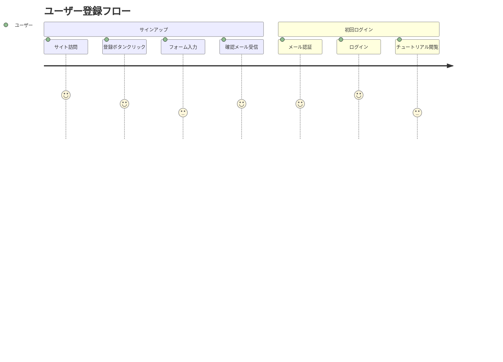
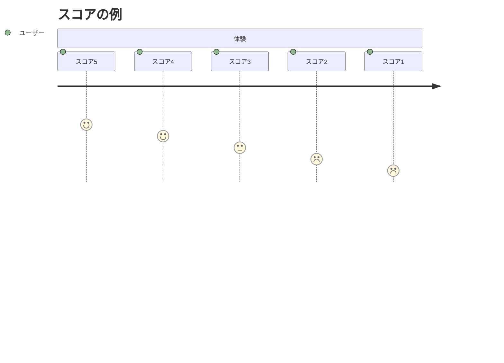
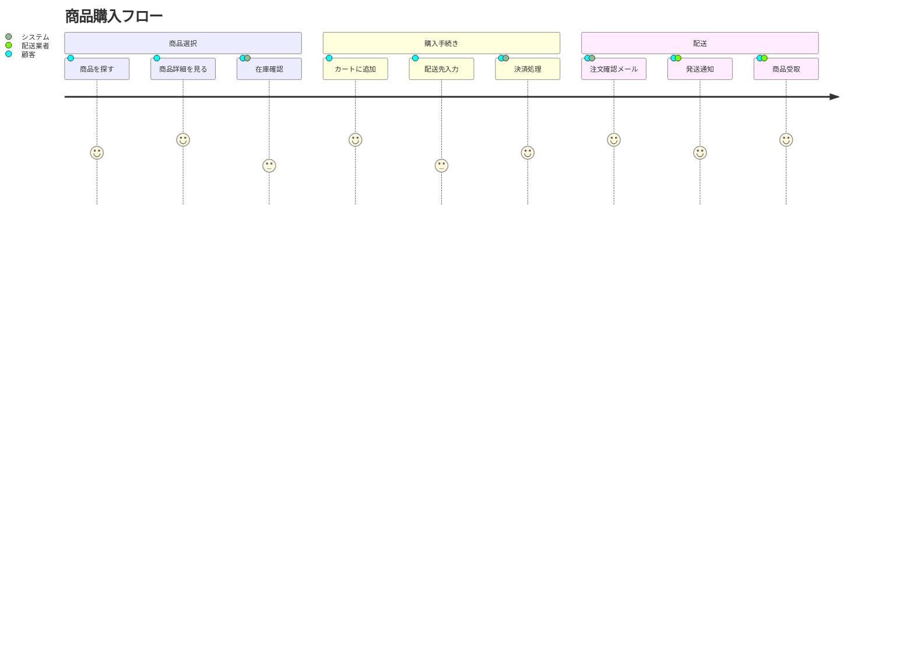
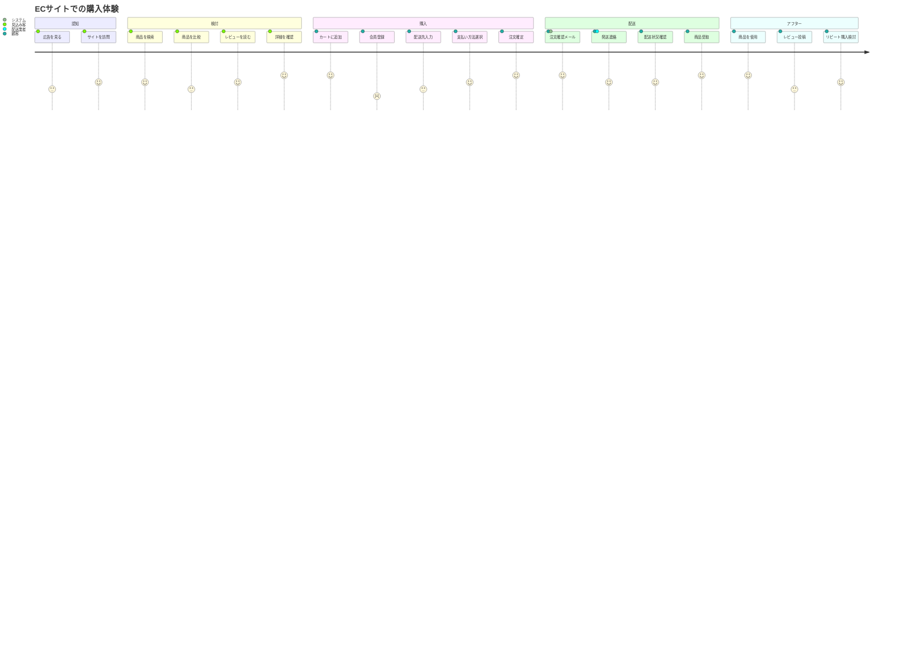
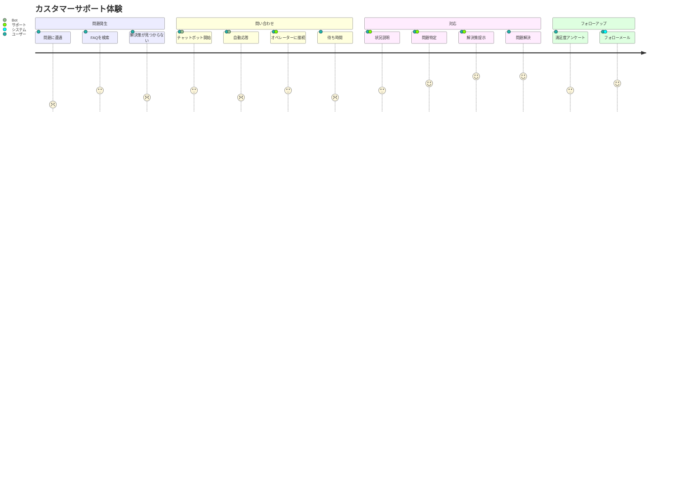
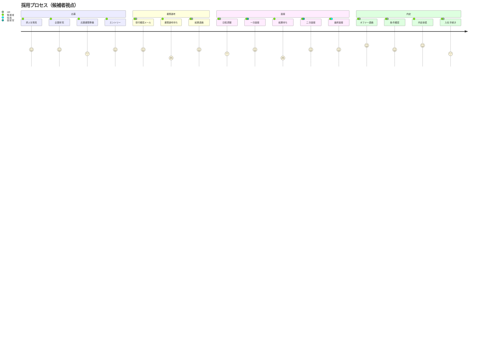
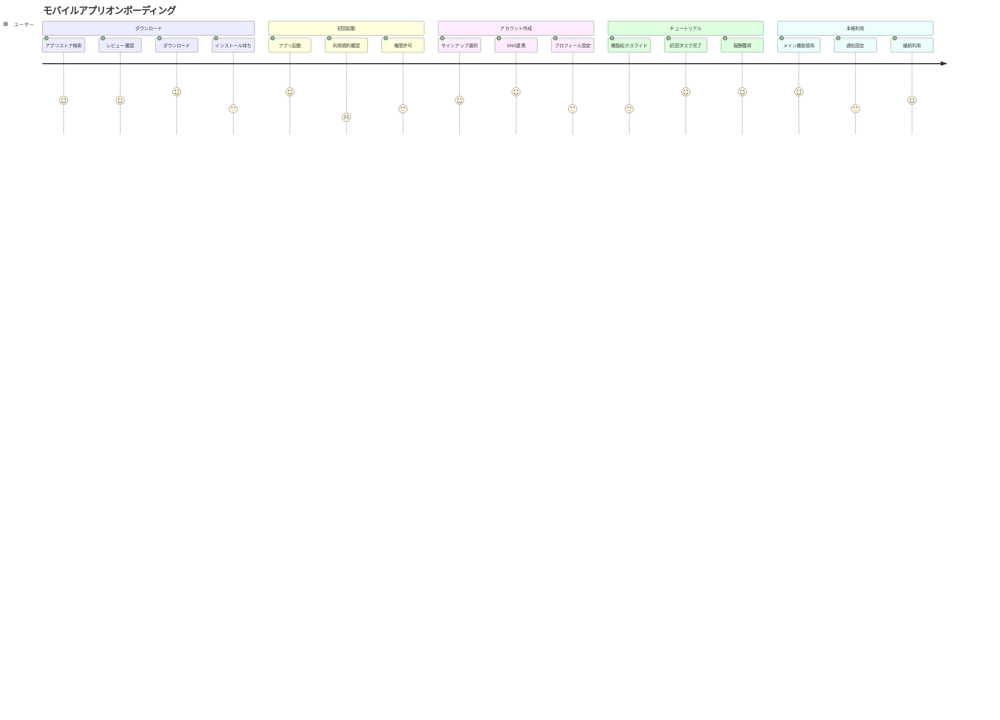
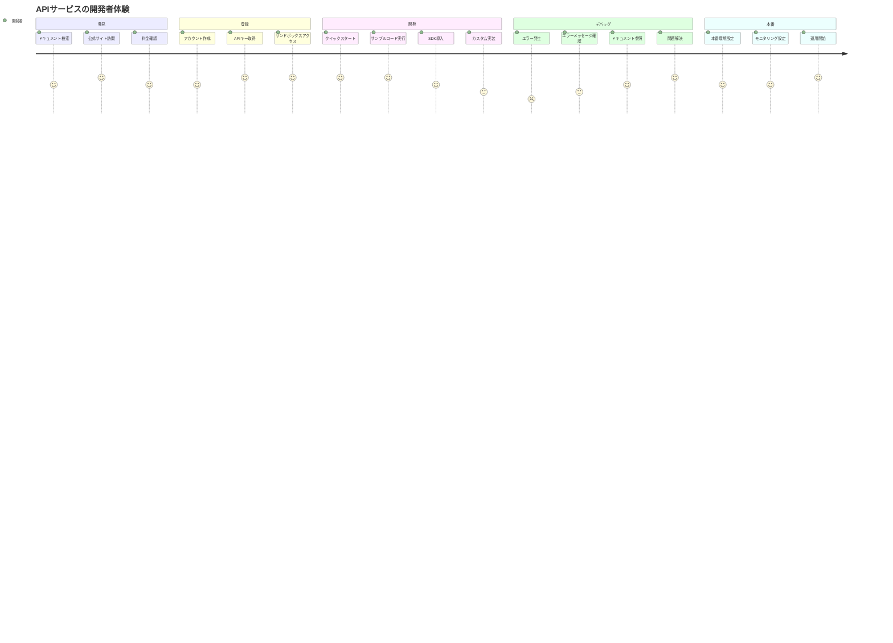
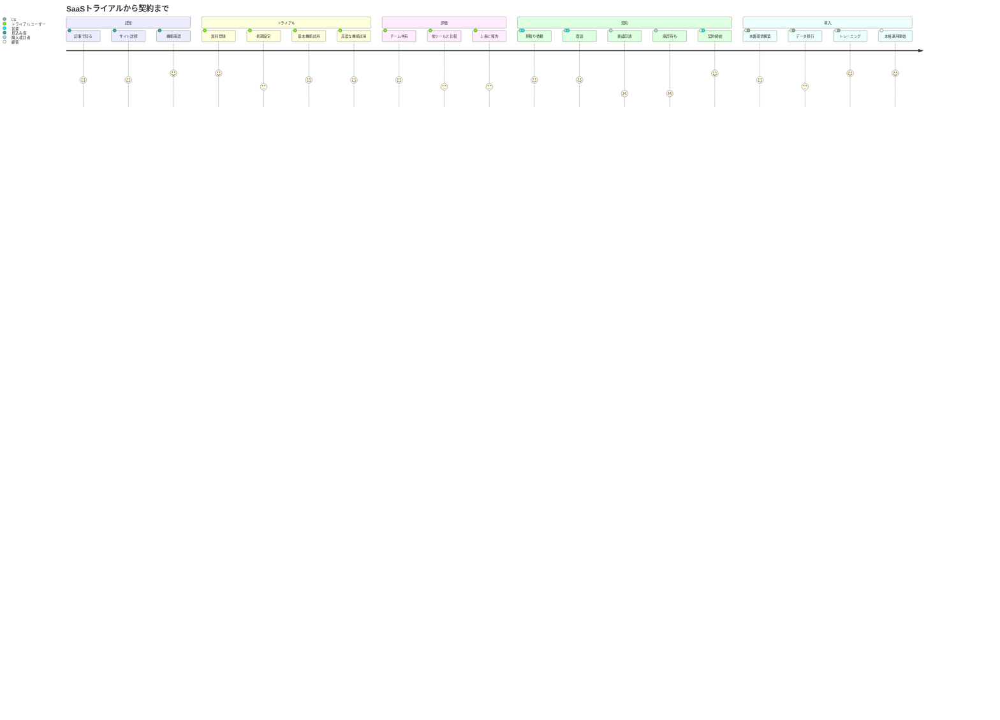

# User Journey（ユーザージャーニー）

ユーザーの体験やプロセスを視覚化する図です。UX設計に便利です。

## 基本構文

## スコア（満足度）

スコアは1〜5で指定します：
- 5: 非常に良い（緑）
- 4: 良い（黄緑）
- 3: 普通（黄）
- 2: 悪い（オレンジ）
- 1: 非常に悪い（赤）

## 複数アクター

## 実践的な例：ECサイト購入体験

## 実践的な例：サポート問い合わせ

## 実践的な例：採用プロセス

## 実践的な例：アプリオンボーディング

## 実践的な例：開発者体験（DX）

## 実践的な例：SaaSトライアル〜契約

