# Git Graph（Gitグラフ）

Gitのブランチとコミット履歴を視覚化する図です。

## 基本構文

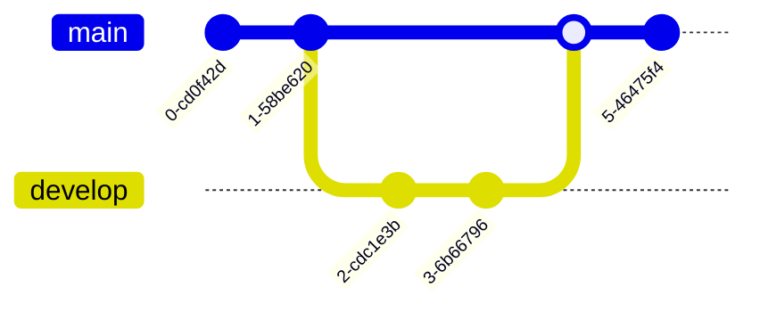

## コミットオプション

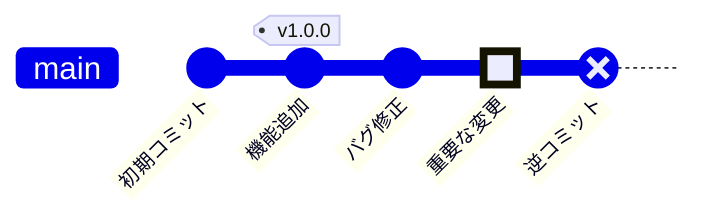

### コミットタイプ

| タイプ | 説明 |
|--------|------|
| `NORMAL` | 通常のコミット |
| `HIGHLIGHT` | ハイライト表示 |
| `REVERSE` | リバース表示 |

## ブランチ操作

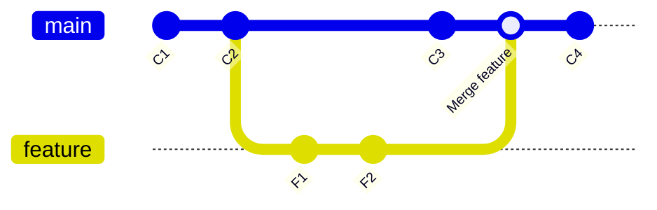

## 複数ブランチ

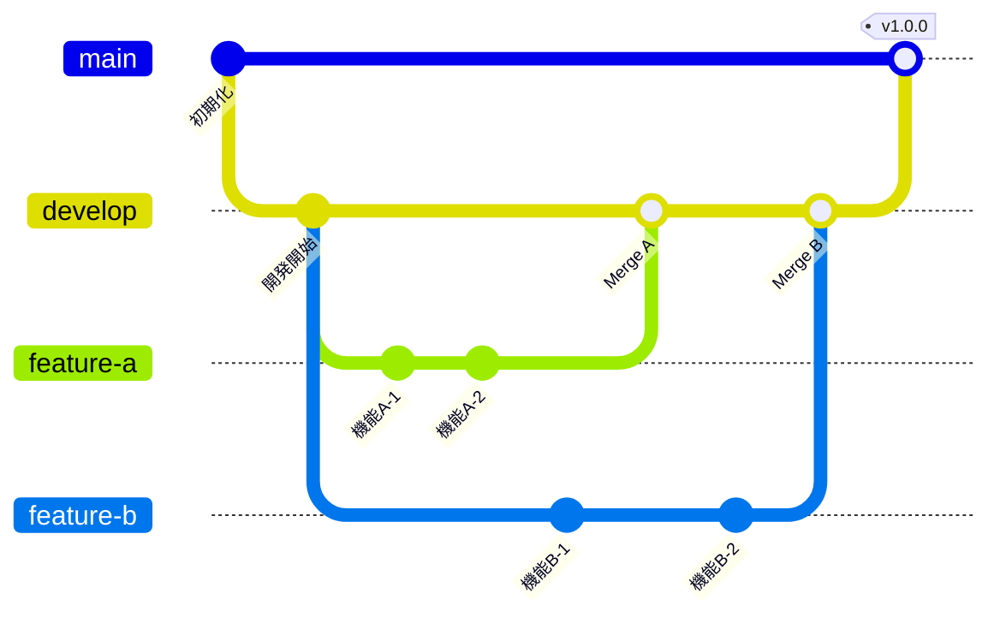

## Git Flow の例

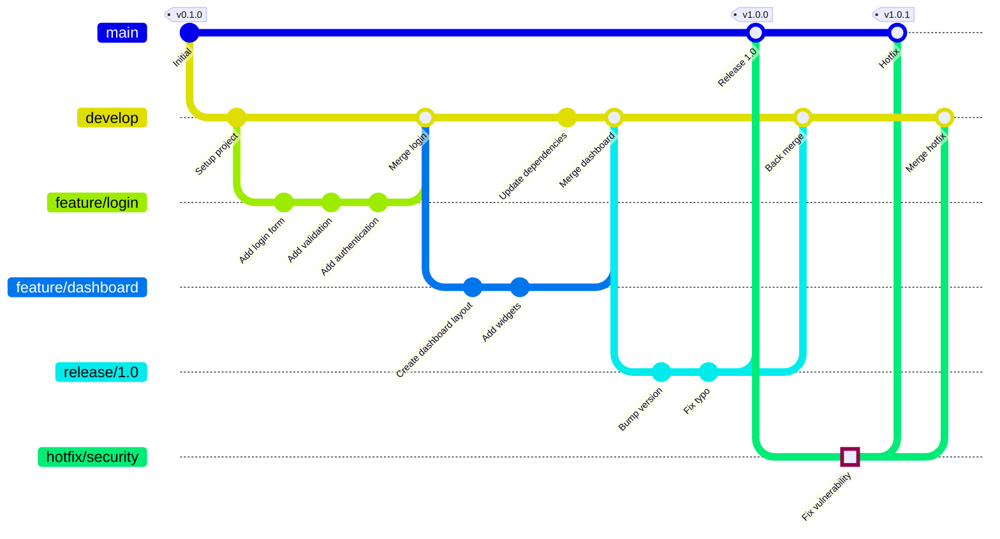

## GitHub Flow の例

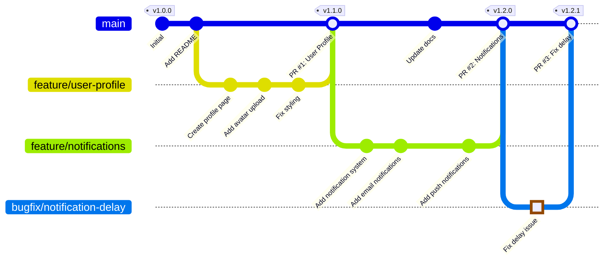

## トランクベース開発の例

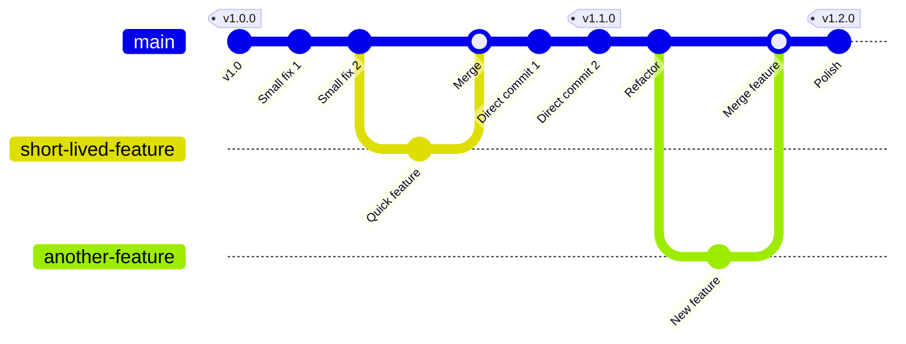

## リベースの視覚化

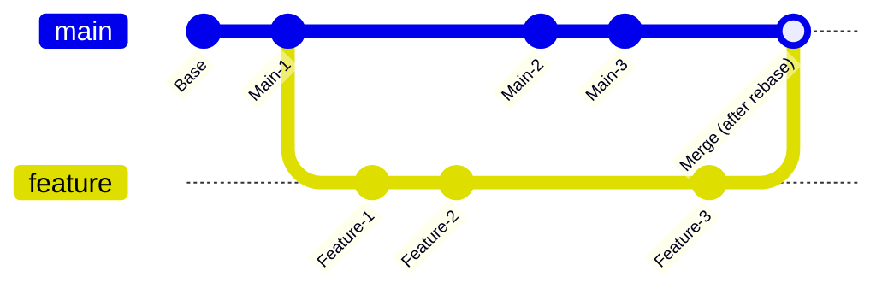

## Cherry-pick の例

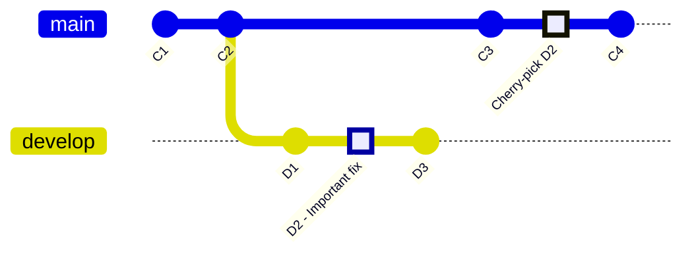

## 方向設定

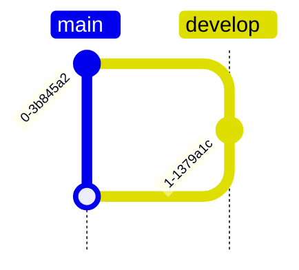

## テーマとスタイル

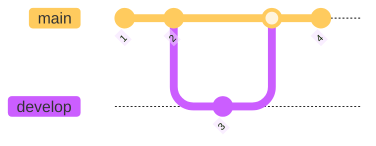

## 実践的な例：リリースサイクル

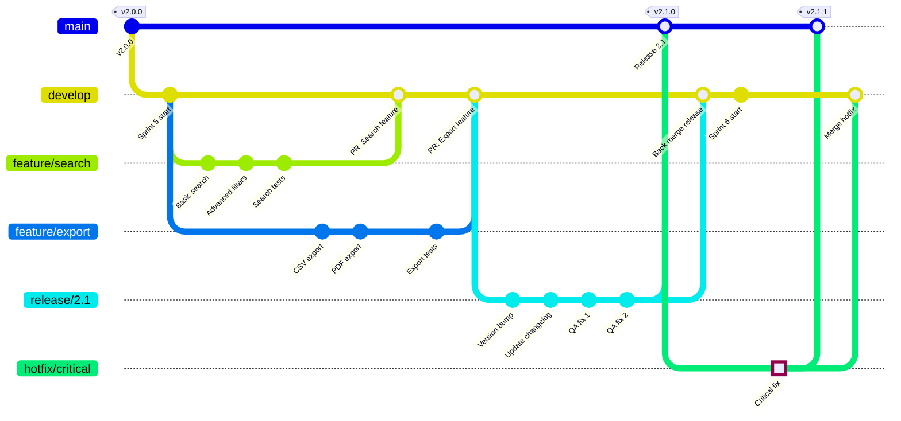

## 設定オプション

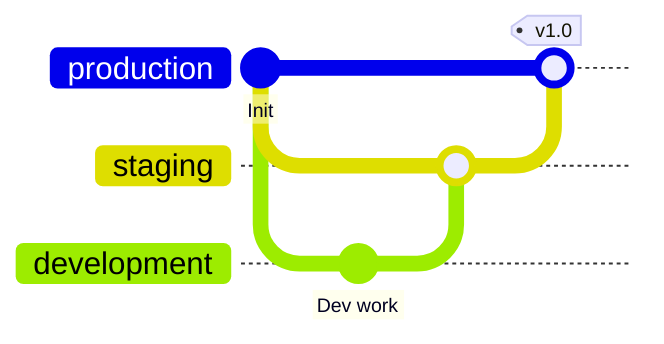
