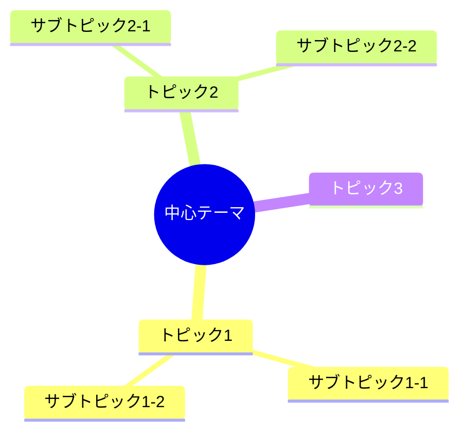
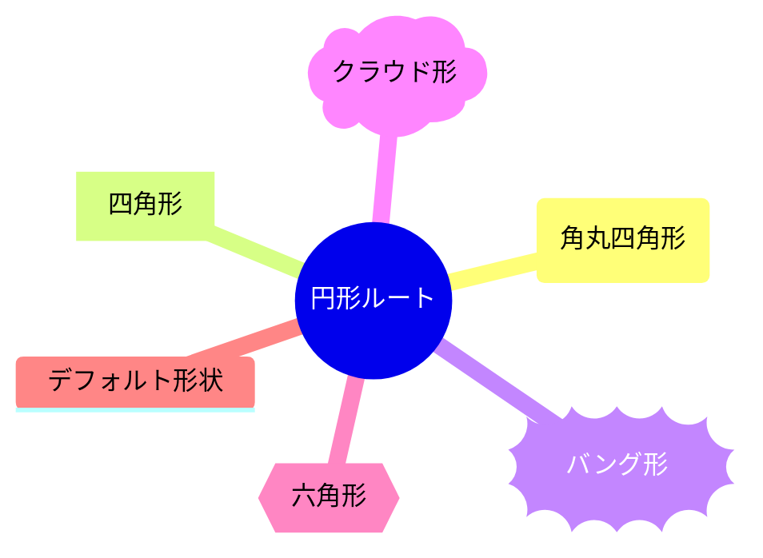
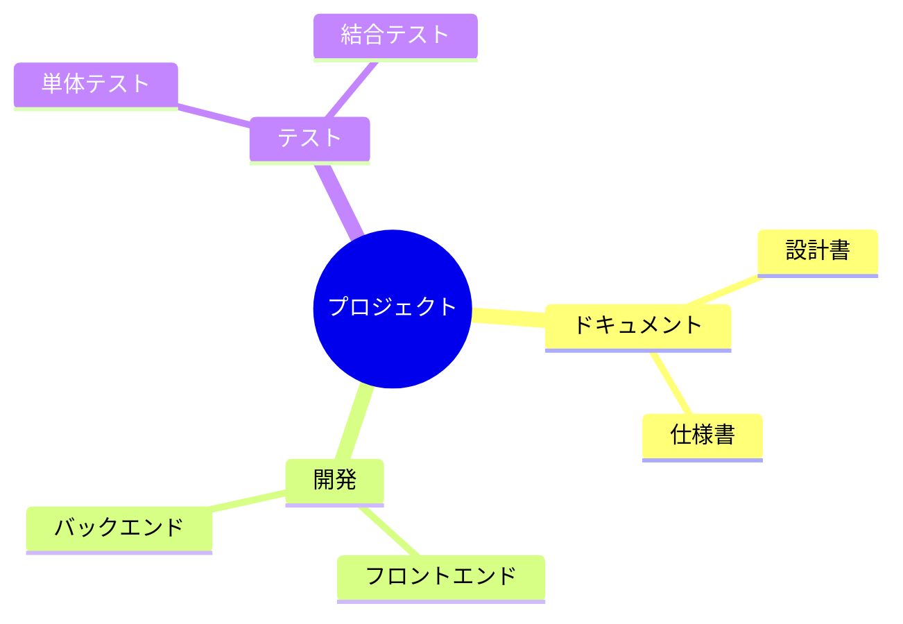
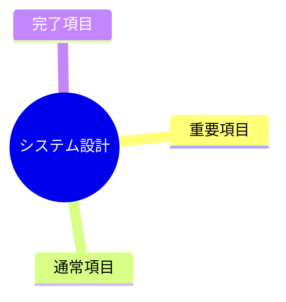
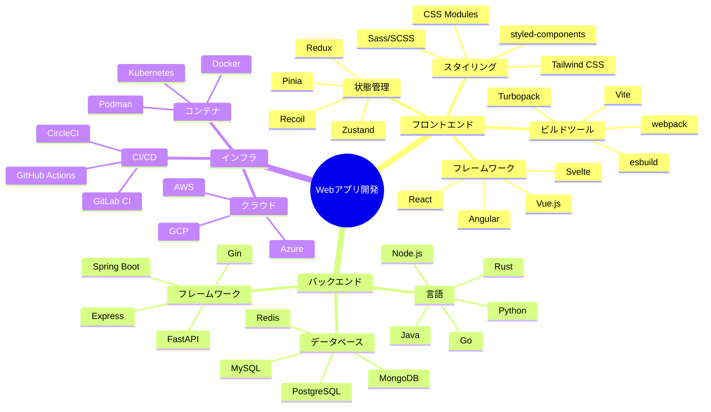
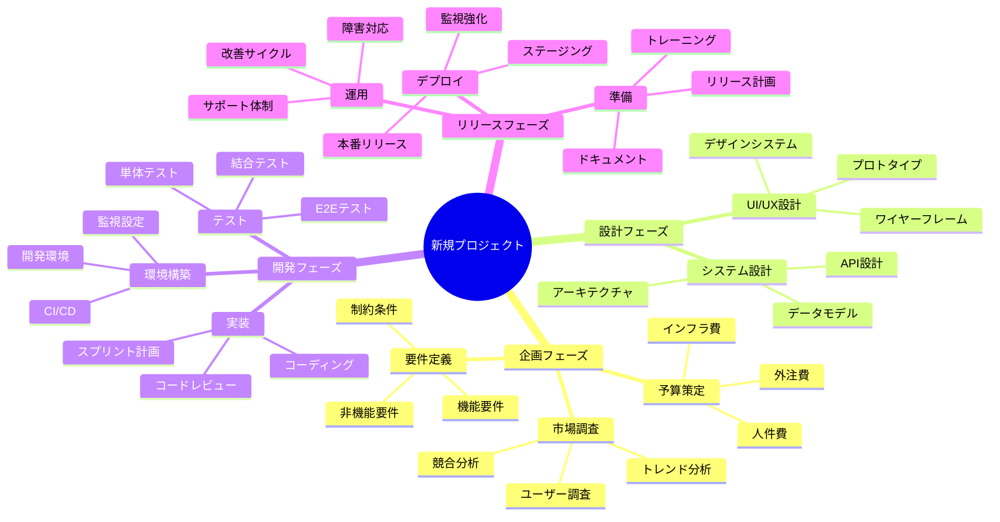
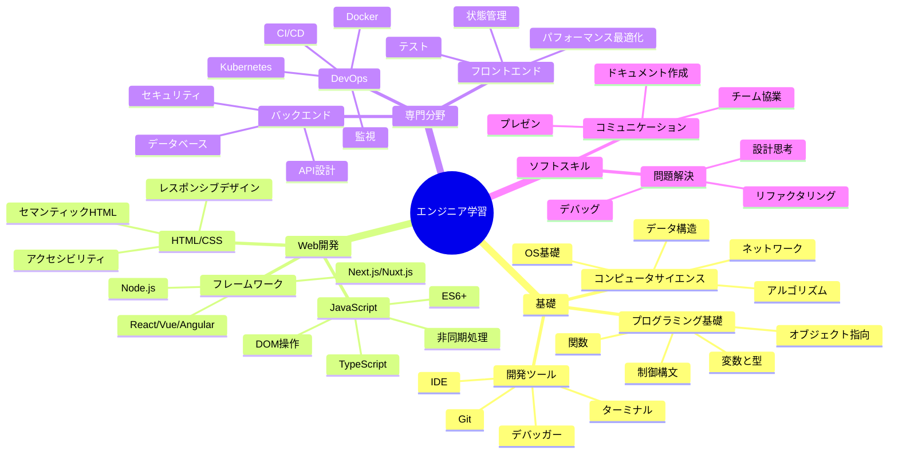
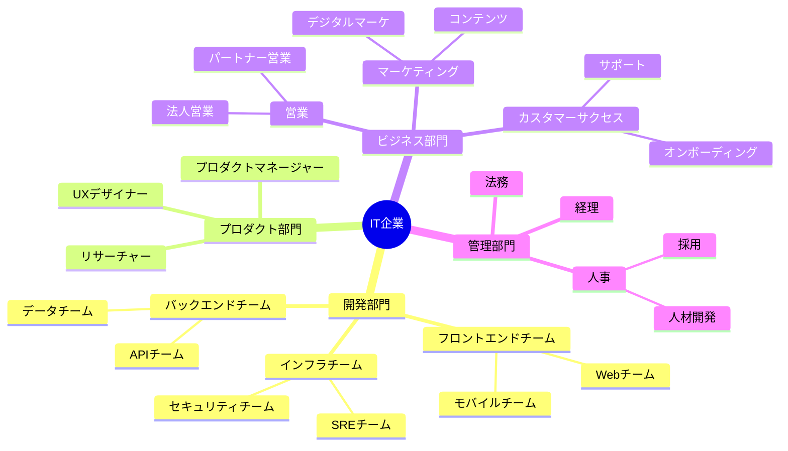
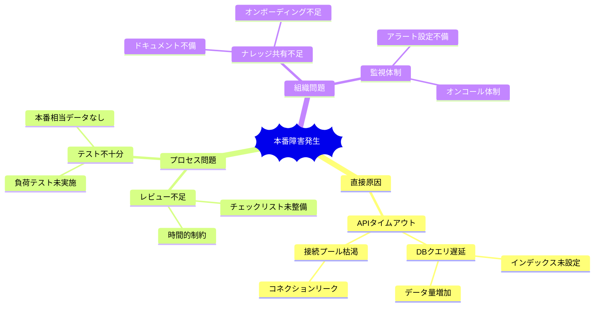
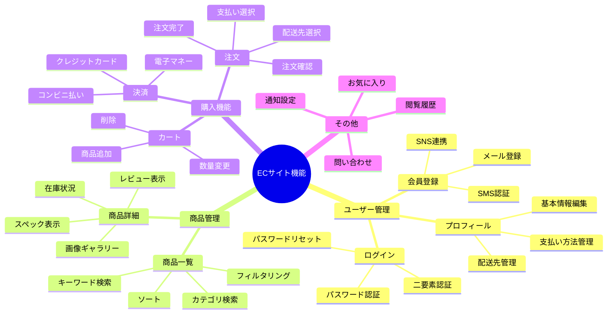

# Mindmap（マインドマップ）

アイデアや概念を階層的に整理するための図です。

> **注意**: `mindmap` はMermaid v9.3.0以降で利用可能です。日本語ラベルがエラーになる場合は英語に変更してください。

## 基本構文

## ノード形状

### 形状一覧

| 記法 | 形状 |
|------|------|
| `((テキスト))` | 円形 |
| `(テキスト)` | 角丸四角形 |
| `[テキスト]` | 四角形 |
| `))テキスト((` | バング形（爆発形） |
| `)テキスト(` | クラウド形 |
| `{{テキスト}}` | 六角形 |
| `テキスト` | デフォルト |

## アイコン

## クラス（スタイル）

## 実践的な例：Webアプリ技術スタック

## 実践的な例：プロジェクト計画

## 実践的な例：学習ロードマップ

## 実践的な例：組織構造

## 実践的な例：問題分析（Why-Why分析）

## 実践的な例：機能要件

