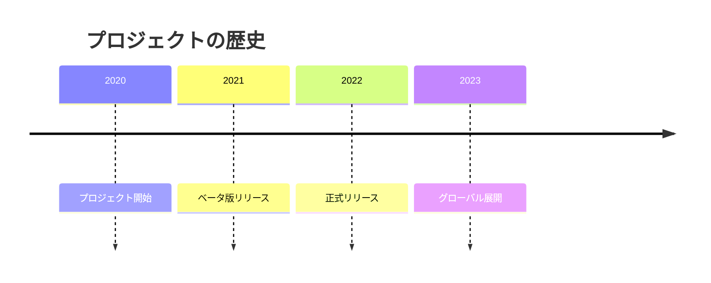
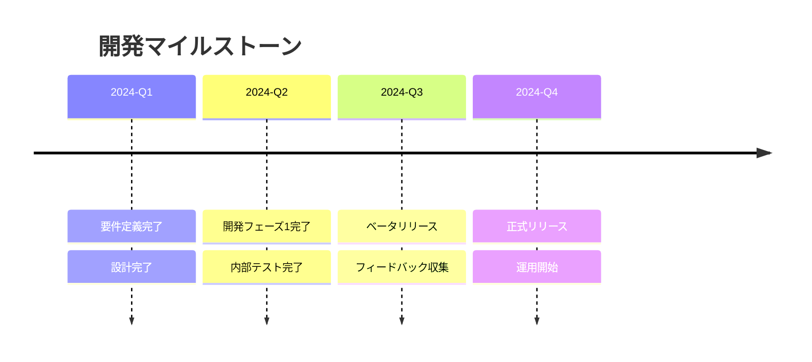
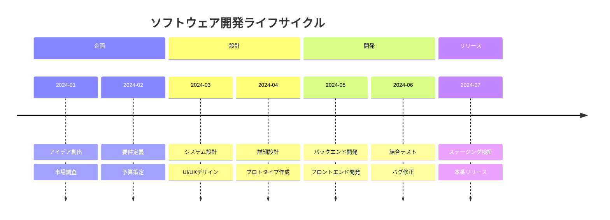
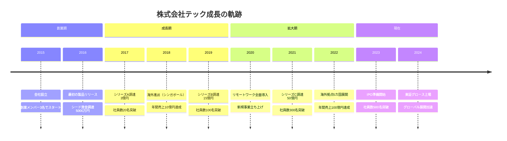
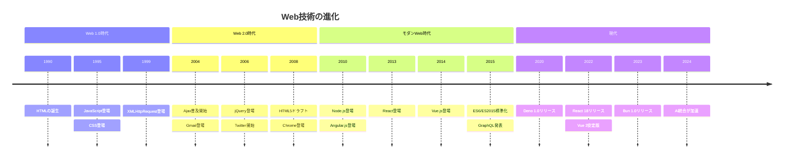
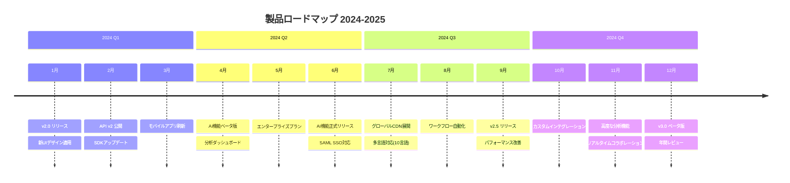
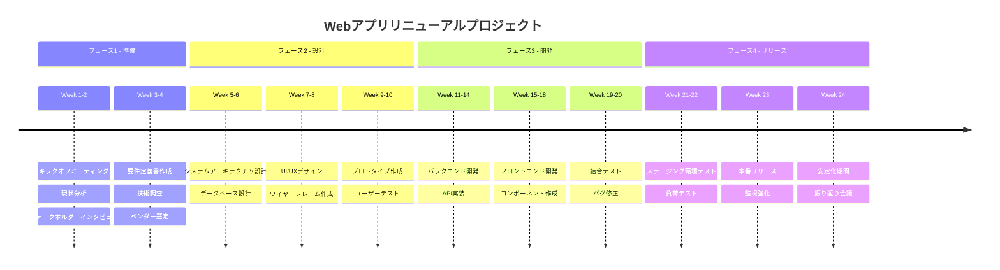
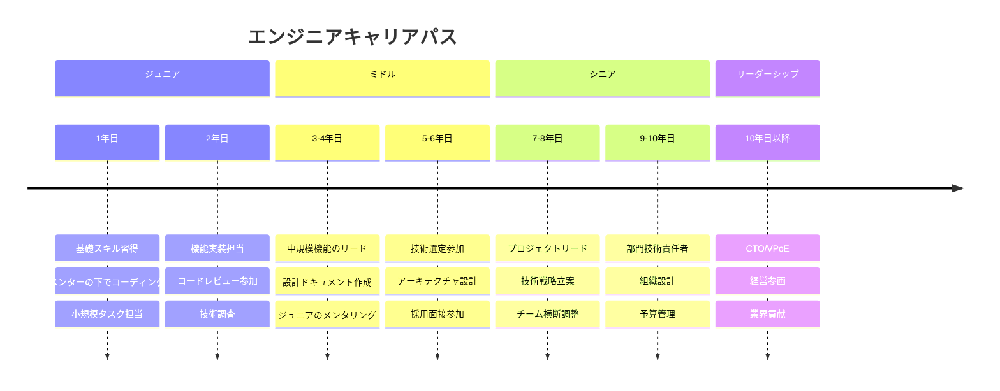

# Timeline（タイムライン）

時系列で出来事を表現する図です。

> **注意**: `timeline` はMermaid v9.3.0以降で利用可能です。日本語ラベルがエラーになる場合は英語に変更してください。

## 基本構文



## 複数イベント



## セクション分け



## 実践的な例：会社の歴史



## 実践的な例：技術の進化



## 実践的な例：製品ロードマップ



## 実践的な例：プロジェクトタイムライン



## 実践的な例：キャリアパス



## 実践的な例：インシデント対応

```mermaid
timeline
    title 本番障害対応タイムライン

    section 検知
        09:00 : 監視アラート発報
              : オンコール担当へ通知
        09:05 : 初期調査開始
              : エラーログ確認

    section 対応
        09:15 : 障害原因特定（DB接続枯渇）
              : チームへエスカレーション
        09:30 : 一時対応実施（再起動）
              : サービス復旧確認
        09:45 : 顧客への第一報
              : 影響範囲の特定

    section 復旧
        10:00 : 恒久対応の検討
              : 接続プール設定変更
        10:30 : 設定変更適用
              : 動作確認
        11:00 : 完全復旧宣言
              : 顧客への復旧報告

    section 振り返り
        翌日 : ポストモーテム作成
            : 再発防止策検討
        1週間後 : 再発防止策実施
               : 監視強化
```
