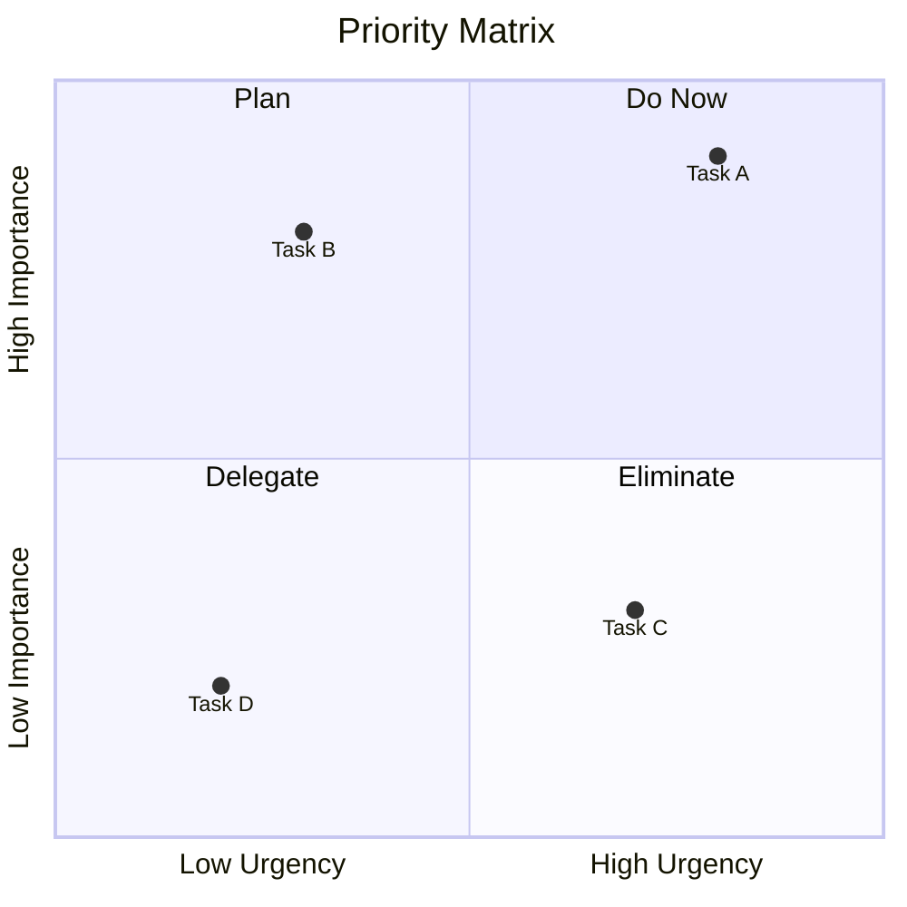
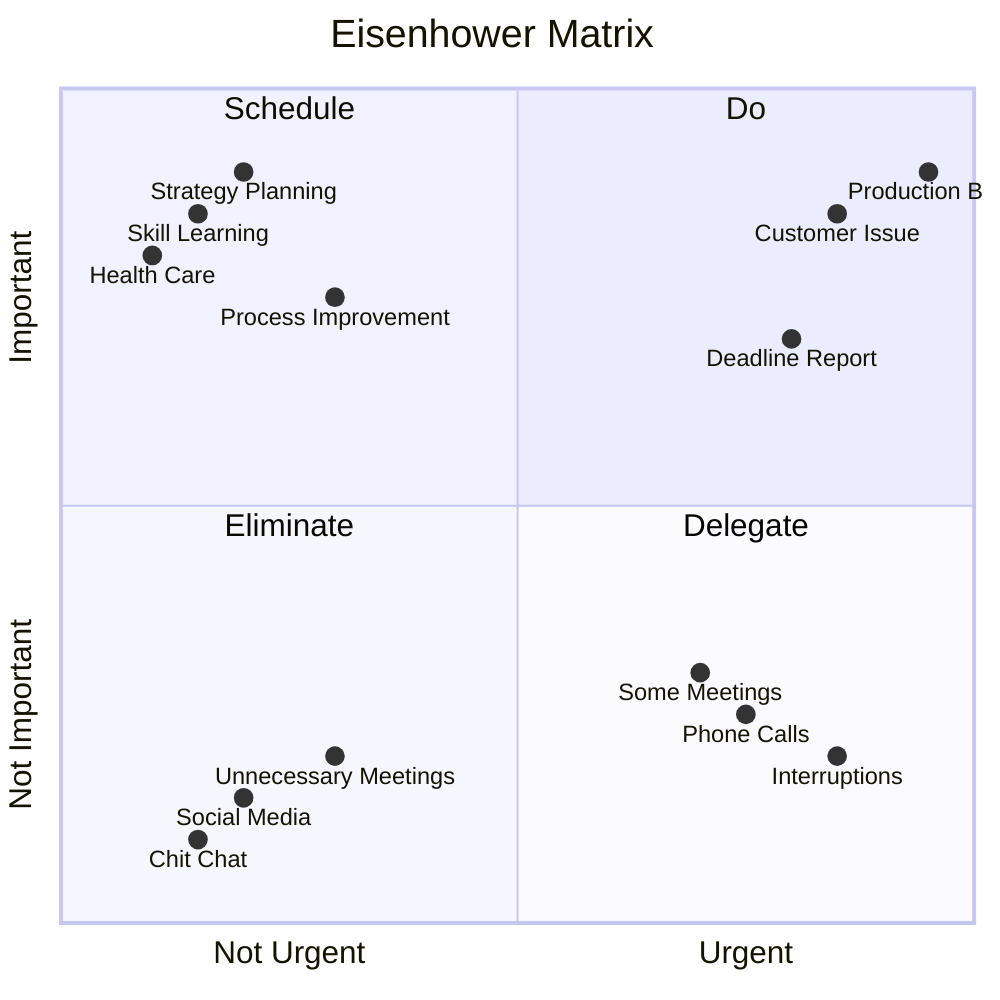
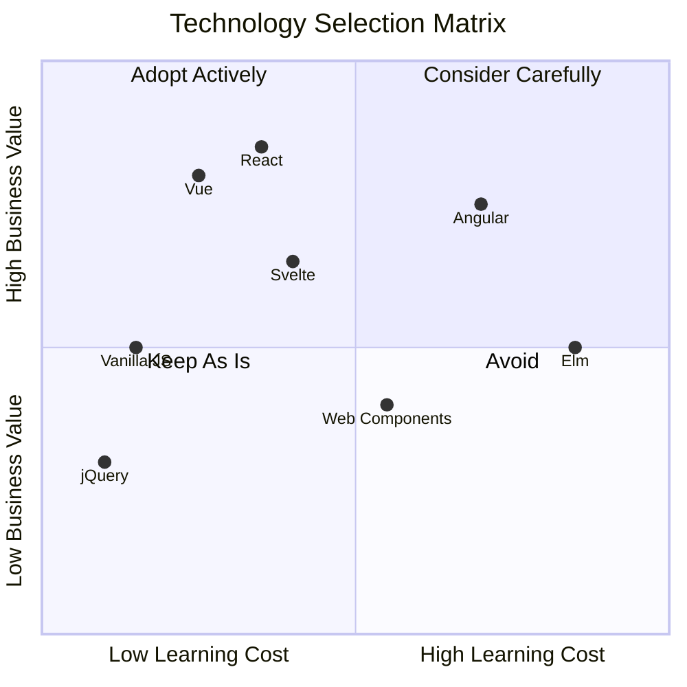
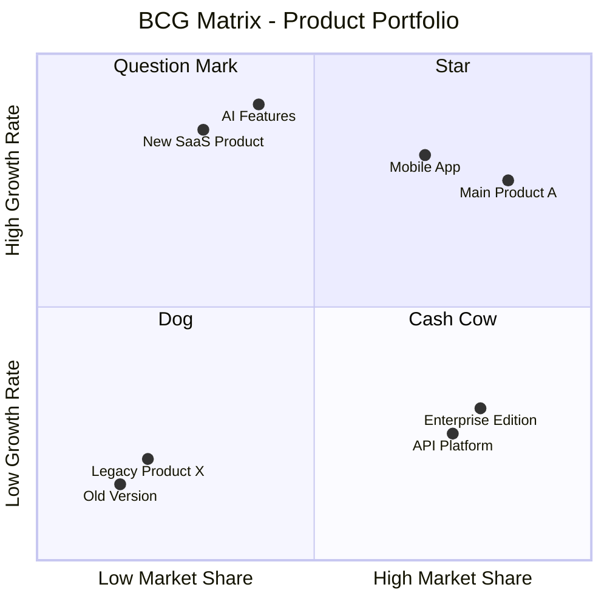
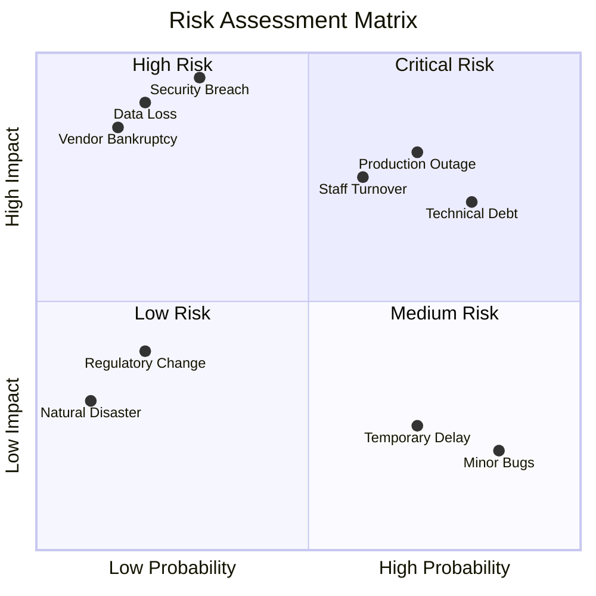
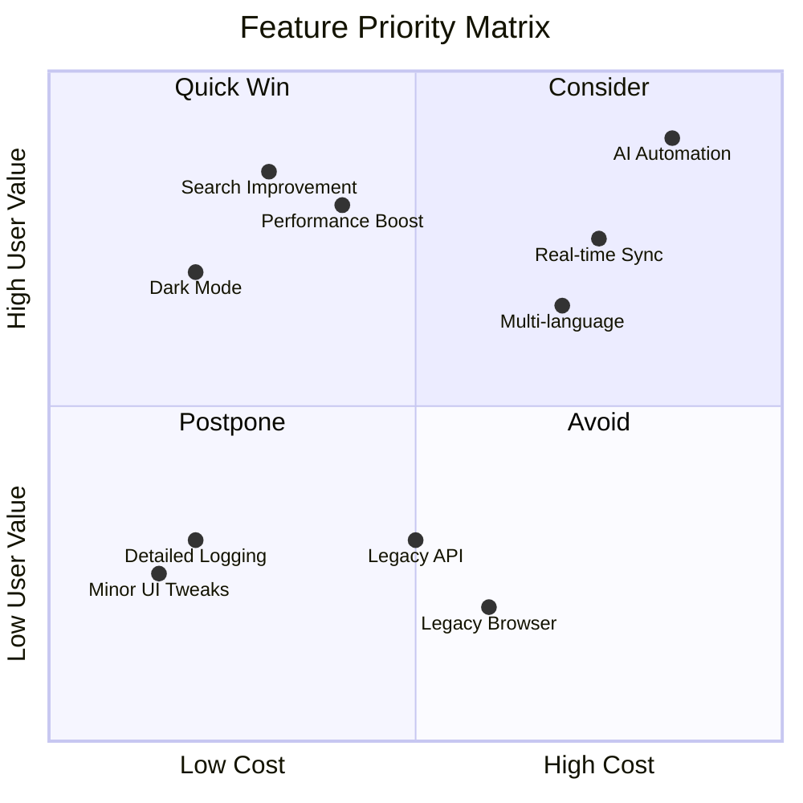
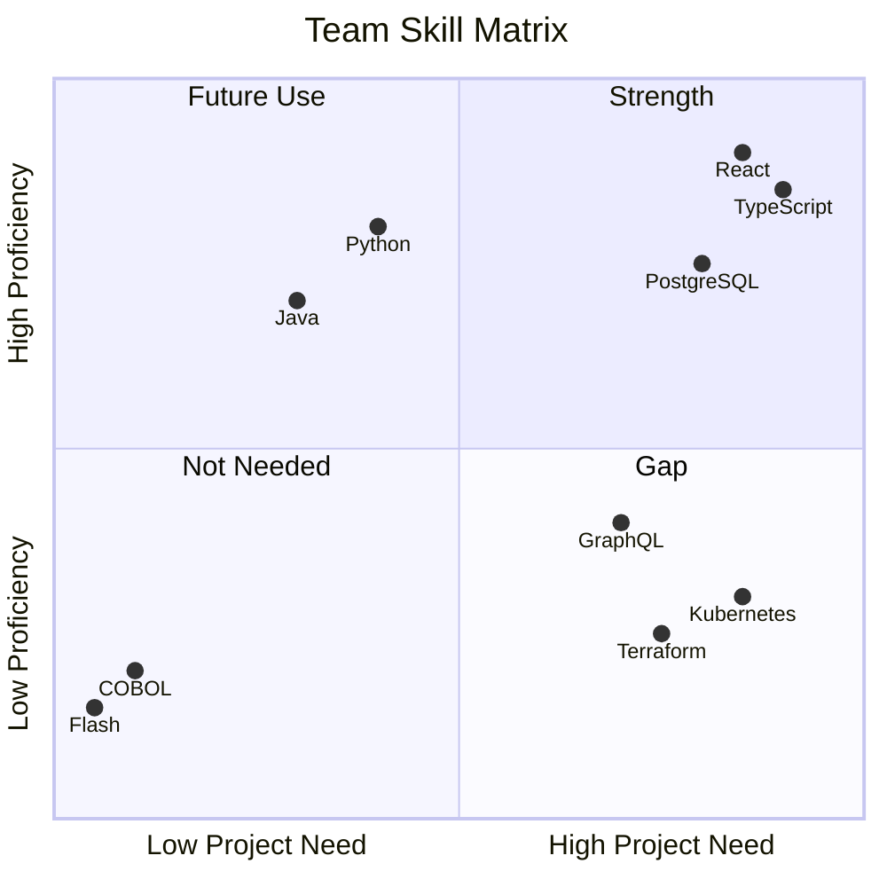
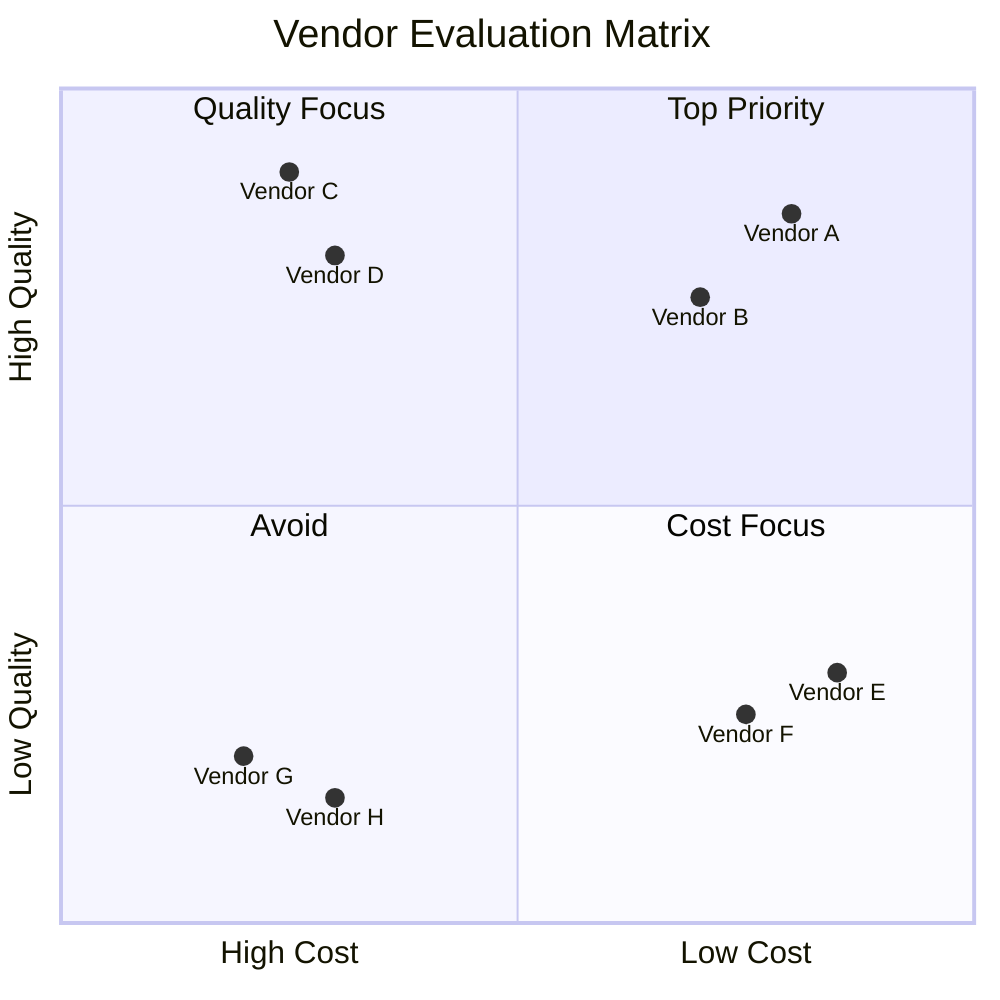
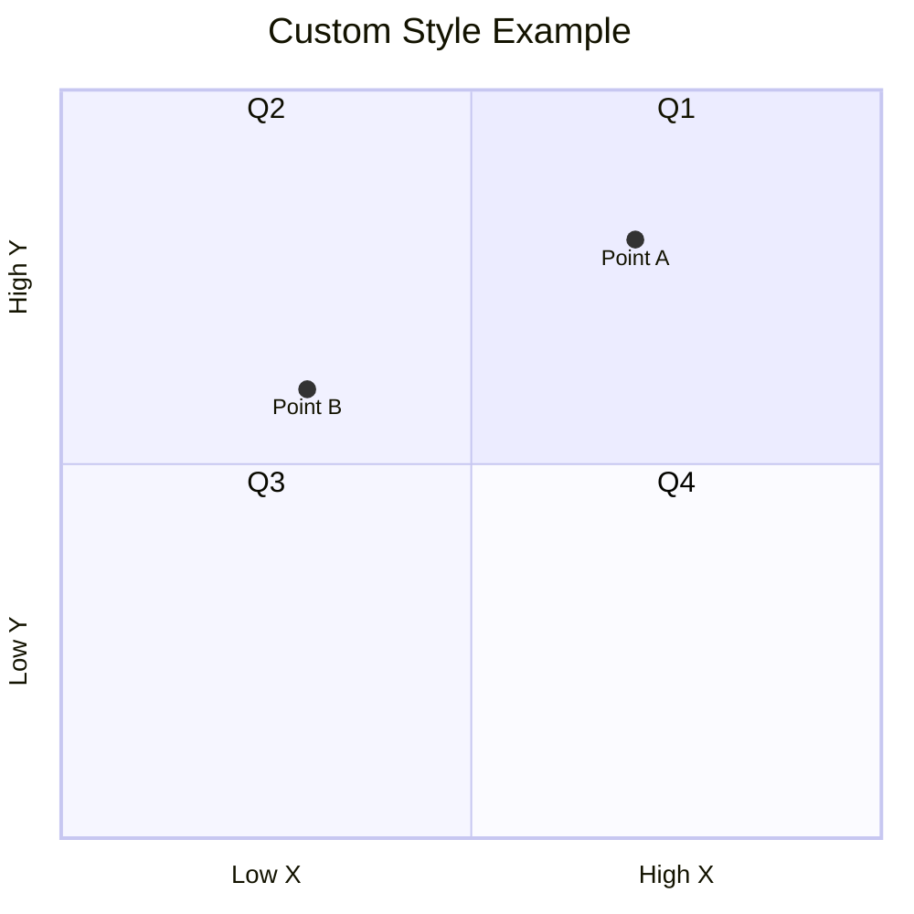

# Quadrant Chart（象限図）

2つの軸で4つの領域に分類する図です。優先度分析などに活用できます。

> **注意**: `quadrantChart` はMermaid v10.2.0以降で利用可能です。日本語ラベルがエラーになる場合は英語に変更してください。

## 基本構文



## 象限の位置

```
     y-axis (上が高)
        │
   Q2   │   Q1
        │
────────┼────────  x-axis (右が高)
        │
   Q3   │   Q4
        │
```

- quadrant-1: 右上（高x, 高y）
- quadrant-2: 左上（低x, 高y）
- quadrant-3: 左下（低x, 低y）
- quadrant-4: 右下（高x, 低y）

## 実践的な例：アイゼンハワーマトリクス



## 実践的な例：技術選定マトリクス



## 実践的な例：製品ポートフォリオ（BCGマトリクス）



## 実践的な例：リスク評価マトリクス



## 実践的な例：機能優先度マトリクス



## 実践的な例：スキルマトリクス



## 実践的な例：ベンダー評価



## スタイルカスタマイズ


