# XY Chart（XYチャート）

棒グラフや折れ線グラフなどのデータ可視化に使用する図です。

> **注意**: `xychart-beta` はMermaid v10.3.0以降で利用可能です。お使いの環境がサポートしているか確認してください。

## 基本構文（棒グラフ）

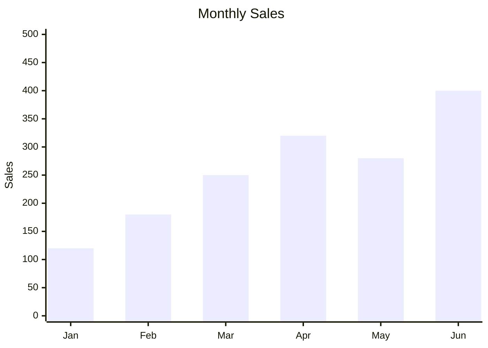
```mermaid
xychart-beta
    title "Monthly Sales"
    x-axis ["Jan", "Feb", "Mar", "Apr", "May", "Jun"]
    y-axis "Sales" 0 --> 500
    bar [120, 180, 250, 320, 280, 400]
```

## 基本構文（折れ線グラフ）

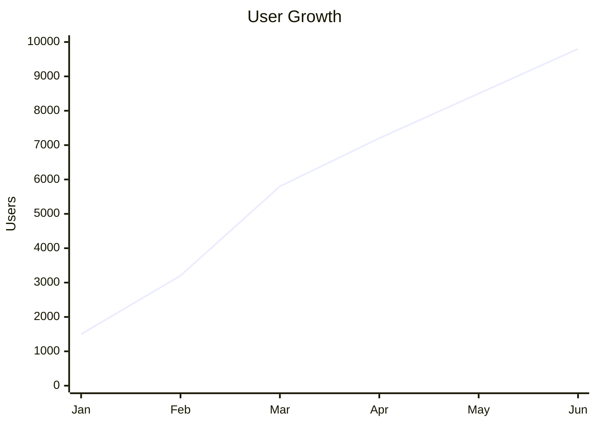
```mermaid
xychart-beta
    title "User Growth"
    x-axis ["Jan", "Feb", "Mar", "Apr", "May", "Jun"]
    y-axis "Users" 0 --> 10000
    line [1500, 3200, 5800, 7200, 8500, 9800]
```

## 複合グラフ（棒グラフ + 折れ線）

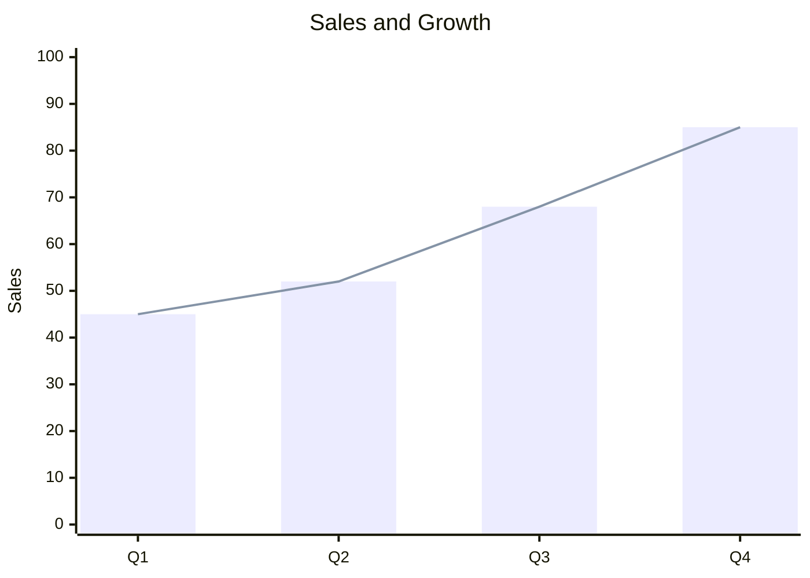
```mermaid
xychart-beta
    title "Sales and Growth"
    x-axis ["Q1", "Q2", "Q3", "Q4"]
    y-axis "Sales" 0 --> 100
    bar [45, 52, 68, 85]
    line [45, 52, 68, 85]
```

## 複数系列

```mermaid
xychart-beta
    title "Product Sales Comparison"
    x-axis ["Jan", "Feb", "Mar", "Apr", "May", "Jun"]
    y-axis "Sales" 0 --> 300
    bar [100, 120, 150, 180, 160, 200]
    bar [80, 100, 130, 150, 140, 180]
    line [90, 110, 140, 165, 150, 190]
```

## 水平表示

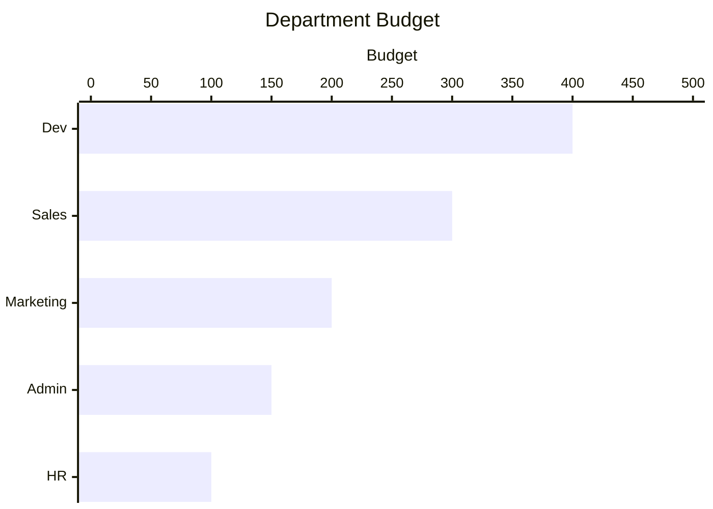
```mermaid
xychart-beta horizontal
    title "Department Budget"
    x-axis ["Dev", "Sales", "Marketing", "Admin", "HR"]
    y-axis "Budget" 0 --> 500
    bar [400, 300, 200, 150, 100]
```

## 実践的な例：Webサイトアクセス分析

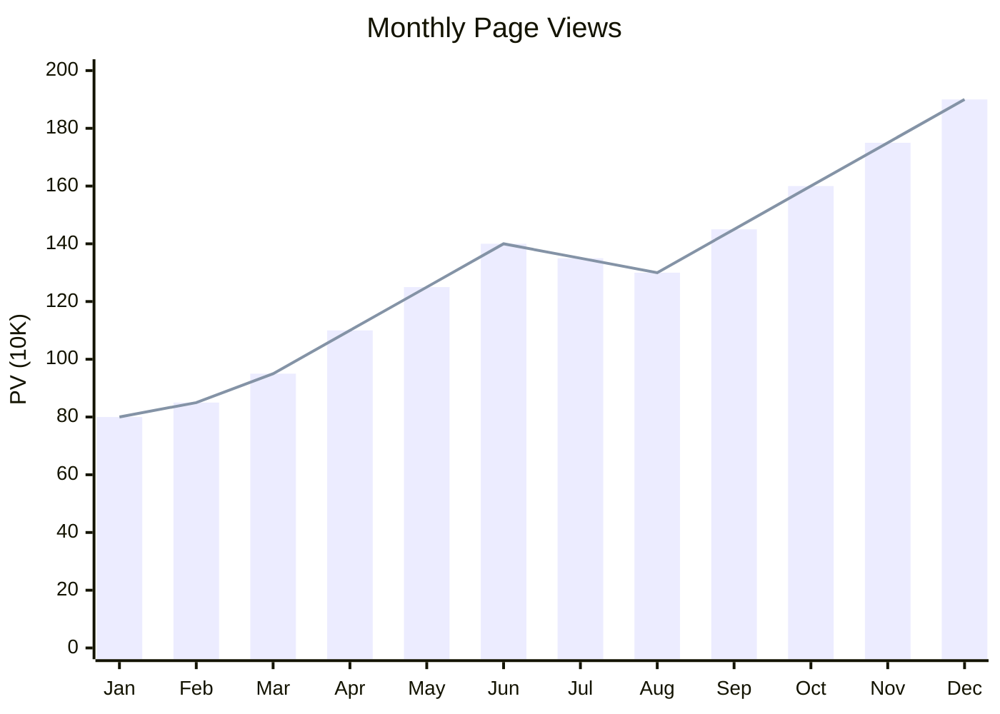
```mermaid
xychart-beta
    title "Monthly Page Views"
    x-axis ["Jan", "Feb", "Mar", "Apr", "May", "Jun", "Jul", "Aug", "Sep", "Oct", "Nov", "Dec"]
    y-axis "PV (10K)" 0 --> 200
    bar [80, 85, 95, 110, 125, 140, 135, 130, 145, 160, 175, 190]
    line [80, 85, 95, 110, 125, 140, 135, 130, 145, 160, 175, 190]
```

## 実践的な例：サービス比較

```mermaid
xychart-beta
    title "Cloud Service Comparison"
    x-axis ["AWS", "GCP", "Azure", "Oracle", "IBM"]
    y-axis "Score" 0 --> 100
    bar [85, 82, 80, 70, 68]
    bar [78, 80, 75, 85, 72]
```

## 実践的な例：四半期業績

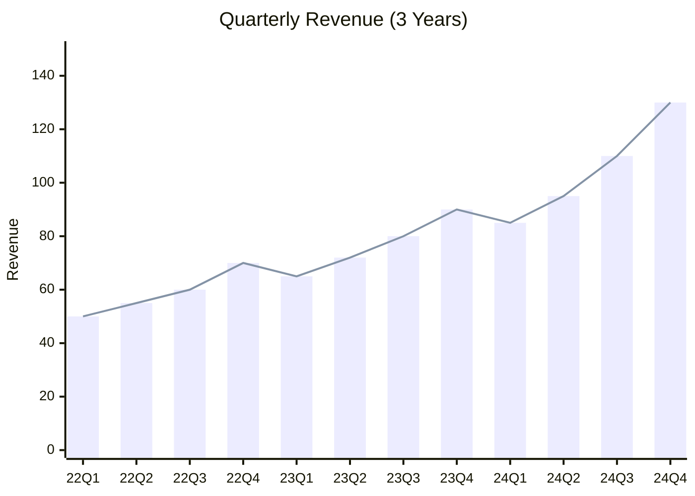
```mermaid
xychart-beta
    title "Quarterly Revenue (3 Years)"
    x-axis ["22Q1", "22Q2", "22Q3", "22Q4", "23Q1", "23Q2", "23Q3", "23Q4", "24Q1", "24Q2", "24Q3", "24Q4"]
    y-axis "Revenue" 0 --> 150
    bar [50, 55, 60, 70, 65, 72, 80, 90, 85, 95, 110, 130]
    line [50, 55, 60, 70, 65, 72, 80, 90, 85, 95, 110, 130]
```

## 実践的な例：パフォーマンス指標

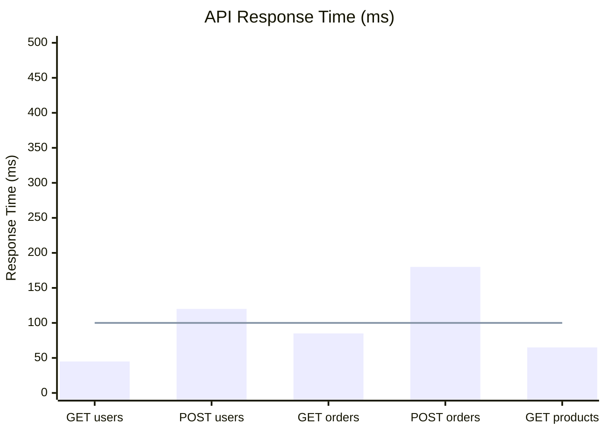
```mermaid
xychart-beta
    title "API Response Time (ms)"
    x-axis ["GET users", "POST users", "GET orders", "POST orders", "GET products"]
    y-axis "Response Time (ms)" 0 --> 500
    bar [45, 120, 85, 180, 65]
    line [100, 100, 100, 100, 100]
```

## 実践的な例：KPI ダッシュボード

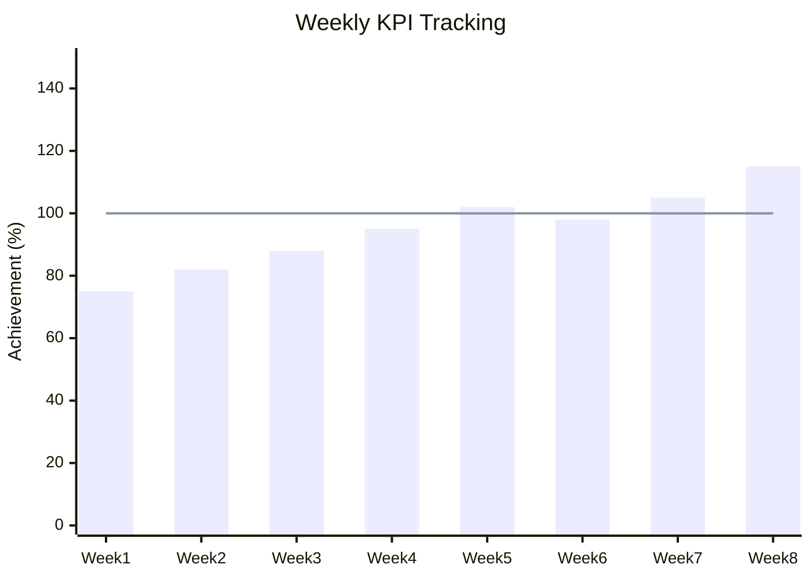
```mermaid
xychart-beta
    title "Weekly KPI Tracking"
    x-axis ["Week1", "Week2", "Week3", "Week4", "Week5", "Week6", "Week7", "Week8"]
    y-axis "Achievement (%)" 0 --> 150
    bar [75, 82, 88, 95, 102, 98, 105, 115]
    line [100, 100, 100, 100, 100, 100, 100, 100]
```

## 実践的な例：コスト分析

```mermaid
xychart-beta
    title "Monthly Infrastructure Cost"
    x-axis ["Jan", "Feb", "Mar", "Apr", "May", "Jun"]
    y-axis "Cost (10K)" 0 --> 300
    bar [150, 165, 180, 195, 210, 250]
    bar [50, 55, 60, 65, 70, 80]
    bar [30, 32, 35, 38, 42, 50]
```

## 実践的な例：チーム生産性

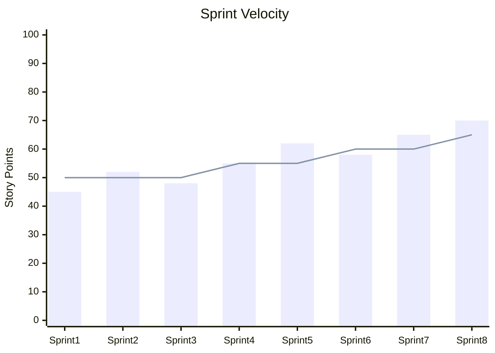
```mermaid
xychart-beta
    title "Sprint Velocity"
    x-axis ["Sprint1", "Sprint2", "Sprint3", "Sprint4", "Sprint5", "Sprint6", "Sprint7", "Sprint8"]
    y-axis "Story Points" 0 --> 100
    bar [45, 52, 48, 55, 62, 58, 65, 70]
    line [50, 50, 50, 55, 55, 60, 60, 65]
```

## 実践的な例：エラー率トラッキング

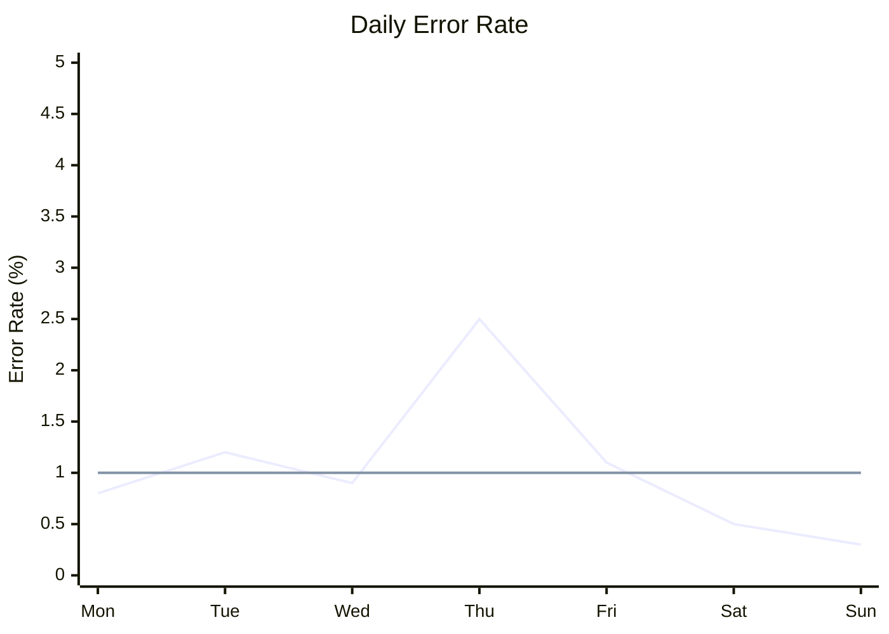
```mermaid
xychart-beta
    title "Daily Error Rate"
    x-axis ["Mon", "Tue", "Wed", "Thu", "Fri", "Sat", "Sun"]
    y-axis "Error Rate (%)" 0 --> 5
    line [0.8, 1.2, 0.9, 2.5, 1.1, 0.5, 0.3]
    line [1.0, 1.0, 1.0, 1.0, 1.0, 1.0, 1.0]
```

## 実践的な例：ユーザーエンゲージメント

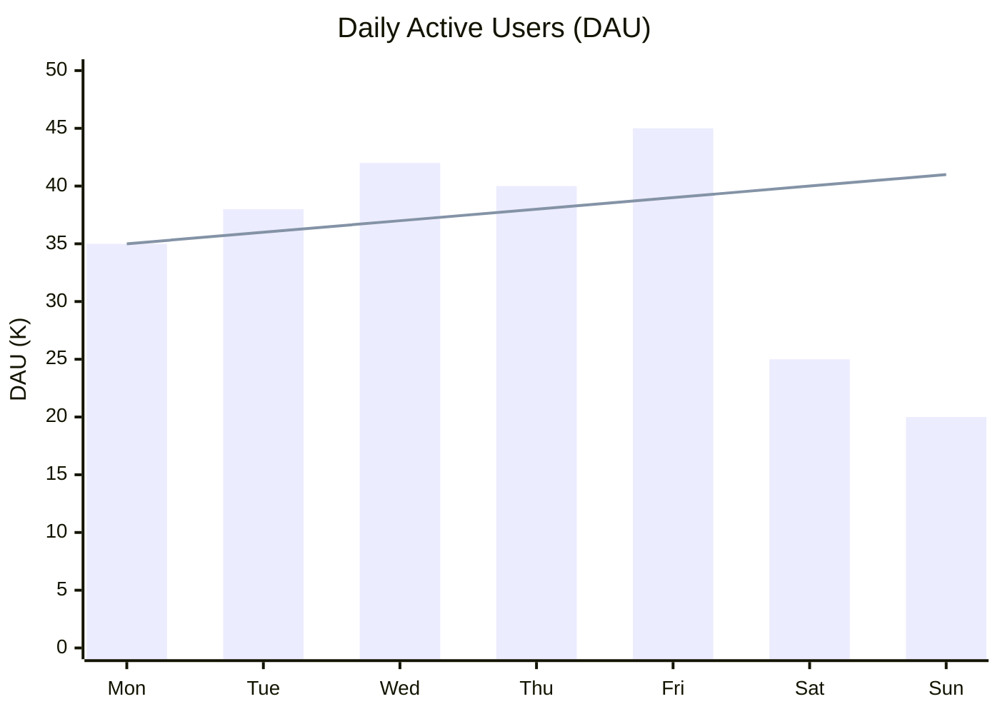
```mermaid
xychart-beta
    title "Daily Active Users (DAU)"
    x-axis ["Mon", "Tue", "Wed", "Thu", "Fri", "Sat", "Sun"]
    y-axis "DAU (K)" 0 --> 50
    bar [35, 38, 42, 40, 45, 25, 20]
    line [35, 36, 37, 38, 39, 40, 41]
```

## スタイルカスタマイズ

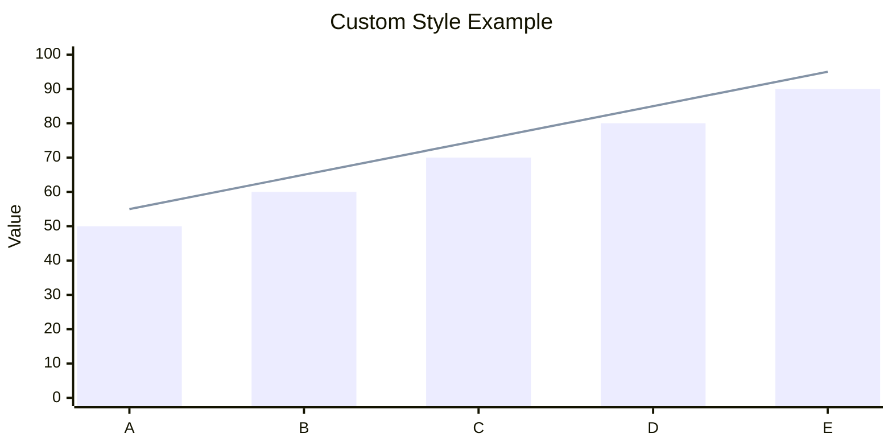
```mermaid
%%{init: {"xyChart": {"width": 800, "height": 400, "titleFontSize": 20, "xAxis": {"labelFontSize": 14}, "yAxis": {"labelFontSize": 14}}}}%%
xychart-beta
    title "Custom Style Example"
    x-axis ["A", "B", "C", "D", "E"]
    y-axis "Value" 0 --> 100
    bar [50, 60, 70, 80, 90]
    line [55, 65, 75, 85, 95]
```

## 実践的な例：A/Bテスト結果

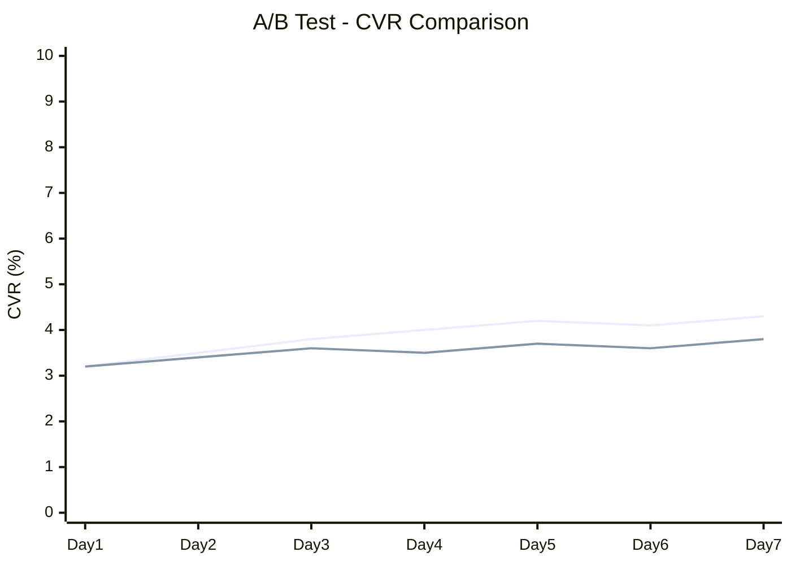
```mermaid
xychart-beta
    title "A/B Test - CVR Comparison"
    x-axis ["Day1", "Day2", "Day3", "Day4", "Day5", "Day6", "Day7"]
    y-axis "CVR (%)" 0 --> 10
    line [3.2, 3.5, 3.8, 4.0, 4.2, 4.1, 4.3]
    line [3.2, 3.4, 3.6, 3.5, 3.7, 3.6, 3.8]
```

## 実践的な例：リリース後の指標変化

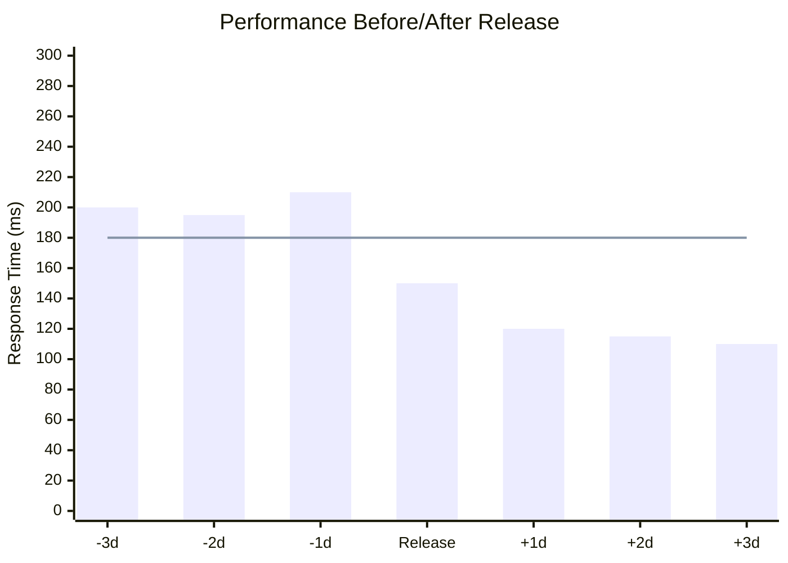
```mermaid
xychart-beta
    title "Performance Before/After Release"
    x-axis ["-3d", "-2d", "-1d", "Release", "+1d", "+2d", "+3d"]
    y-axis "Response Time (ms)" 0 --> 300
    bar [200, 195, 210, 150, 120, 115, 110]
    line [180, 180, 180, 180, 180, 180, 180]
```
