# Block Diagram（ブロック図）

システムやコンポーネントの構造を視覚化するブロック図です。

> **注意**: `block-beta` はMermaid v10.6.0以降で利用可能な実験的機能です。お使いの環境がサポートしているか確認してください。

## 基本構文

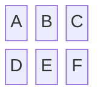

## カラム幅の指定

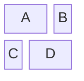

## ブロックの形状

```mermaid
block-beta
    columns 4

    block1["四角形"]
    block2("角丸")
    block3(("円形"))
    block4{{"六角形"}}

    block5[/"平行四辺形"/]
    block6[\\"逆平行四辺形"\\]
    block7[/"台形"\\]
    block8[\\"逆台形"/]

    block9(["スタジアム"])
    block10[["サブルーチン"]]
    block11[("データベース")]
    block12>"非対称形"]
```

## 入れ子構造

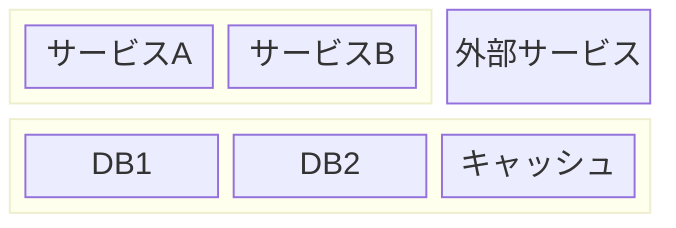

## 矢印/リンク

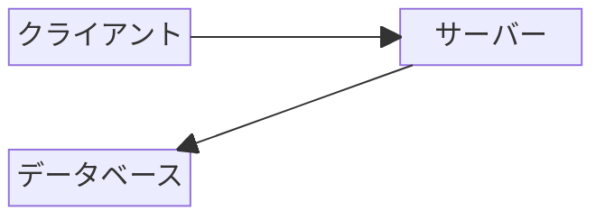

## 矢印の種類

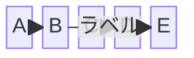

## スペースの活用

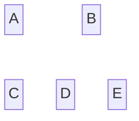

## 実践的な例：Webアプリケーションアーキテクチャ

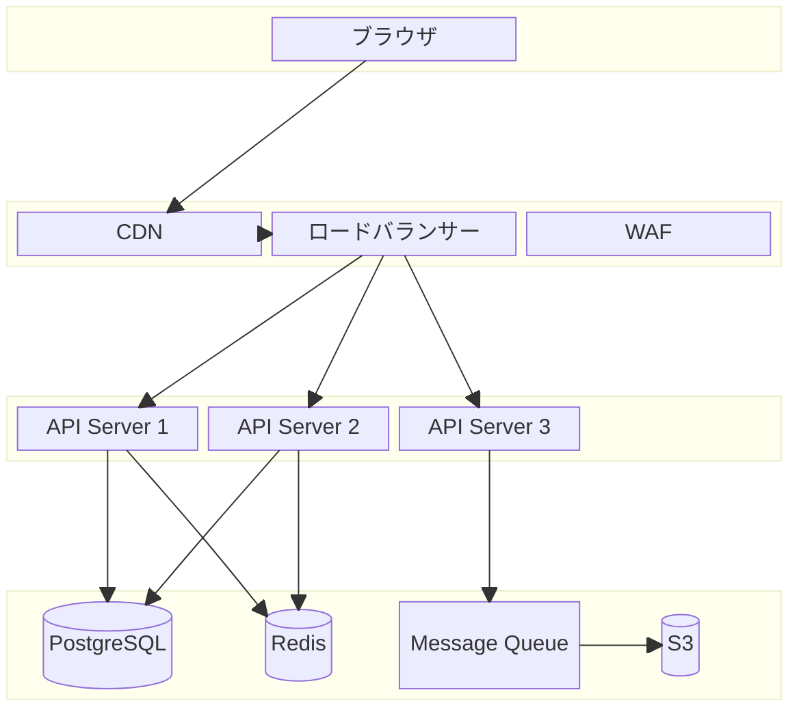

## 実践的な例：マイクロサービスアーキテクチャ

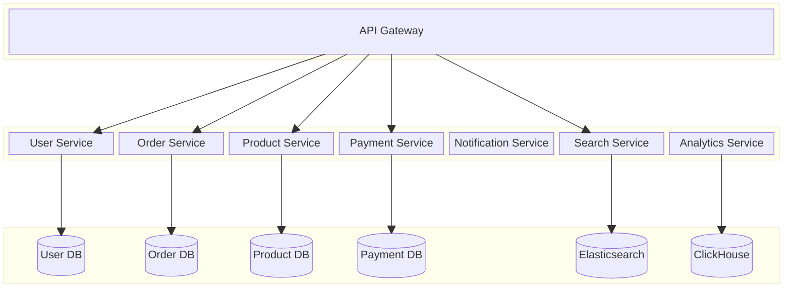

## 実践的な例：CI/CDパイプライン

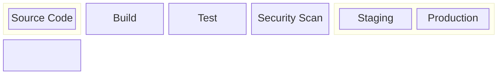

## 実践的な例：ネットワーク構成

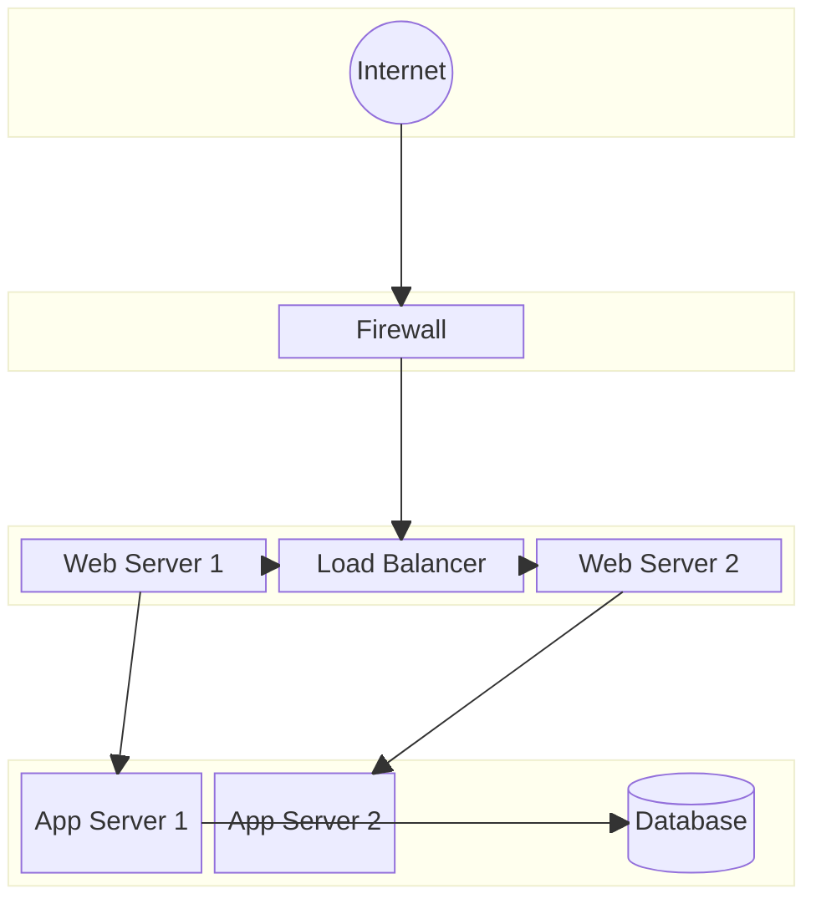

## 実践的な例：データフロー

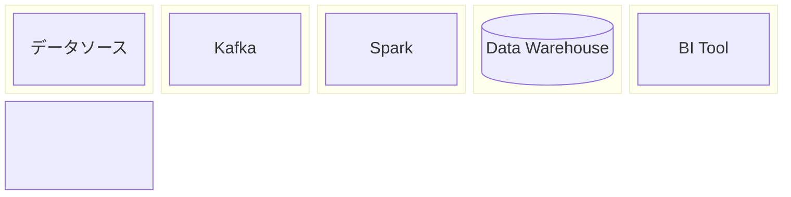

## 実践的な例：モバイルアプリアーキテクチャ

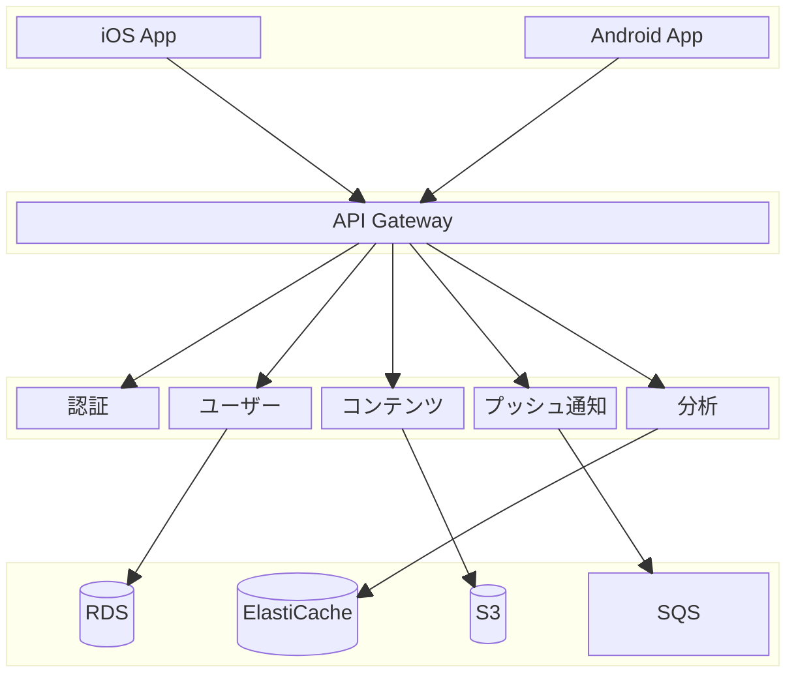

## 実践的な例：Kubernetes クラスター

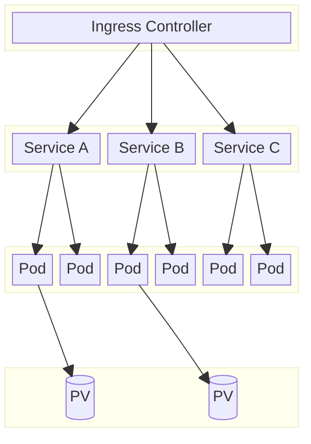
