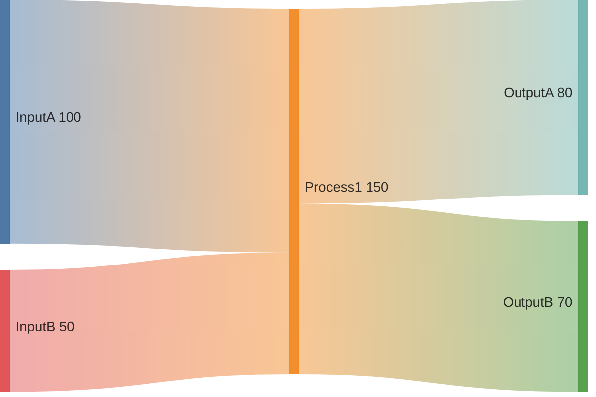
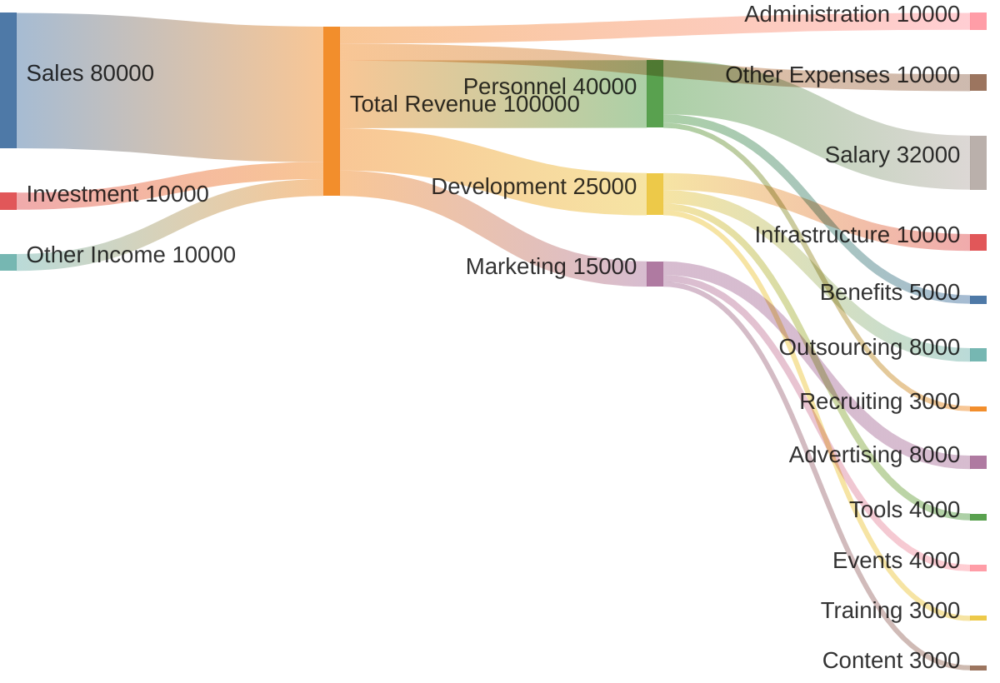
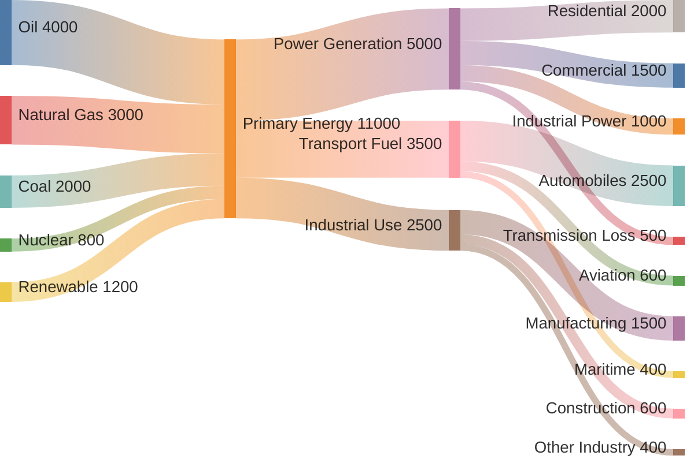
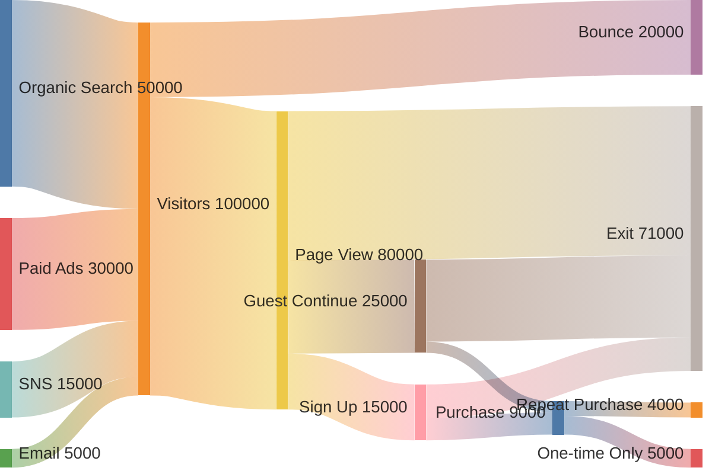
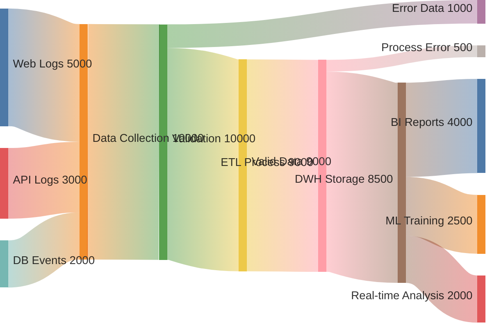
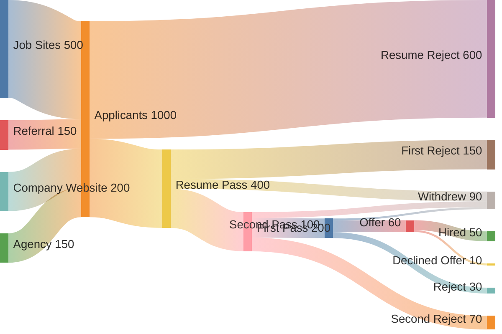
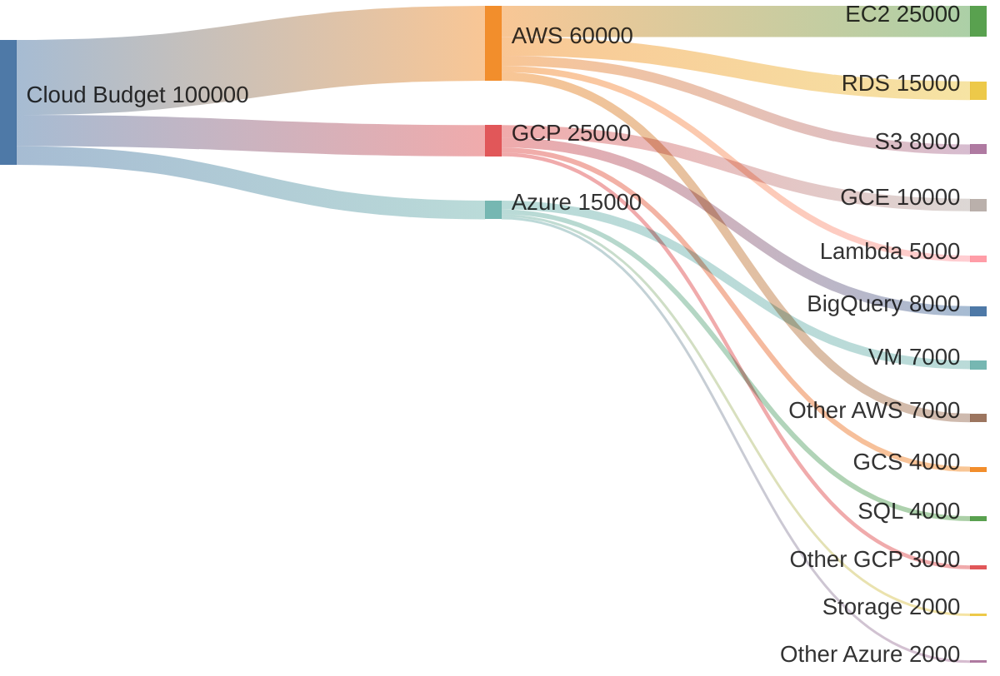
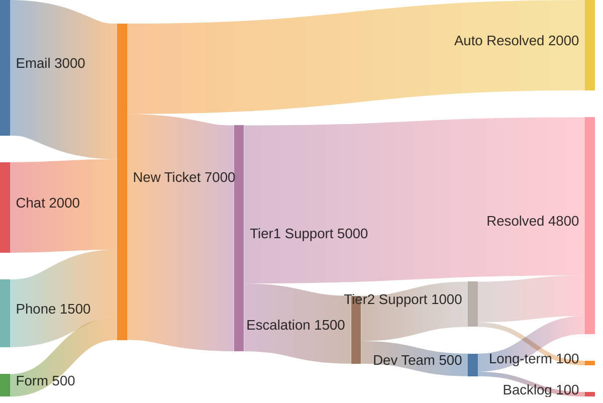
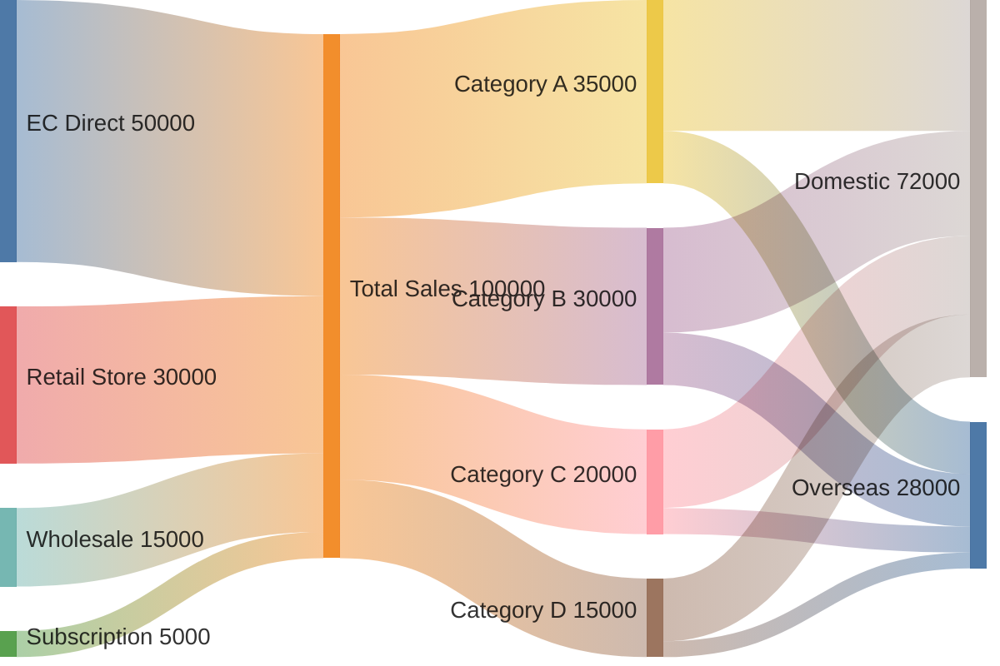

# Sankey Diagram（サンキー図）

フロー量や値の移動を視覚化する図です。エネルギーフロー、予算配分、ユーザーフローなどに活用できます。

> **注意**: `sankey-beta` はMermaid v10.3.0以降で利用可能な実験的機能です。お使いの環境がサポートしているか確認してください。

## 基本構文



## 実践的な例：Webサイトユーザーフロー

```mermaid
sankey-beta

%% Source to Landing
Ads,Landing Page,3000
Search,Landing Page,5000
SNS,Landing Page,2000
Direct,Landing Page,1000

%% Landing to Pages
Landing Page,Product List,6000
Landing Page,Bounce,5000

%% Product List
Product List,Product Detail,4000
Product List,Bounce,2000

%% Product Detail
Product Detail,Cart,2500
Product Detail,Product List,500
Product Detail,Bounce,1000

%% Cart
Cart,Purchase Complete,1800
Cart,Bounce,700
```

## 実践的な例：予算配分



## 実践的な例：エネルギーフロー



## 実践的な例：コンバージョンファネル



## 実践的な例：データパイプライン



## 実践的な例：採用プロセス



## 実践的な例：クラウドコスト



## 実践的な例：カスタマーサポートチケット



## 実践的な例：売上チャネル


