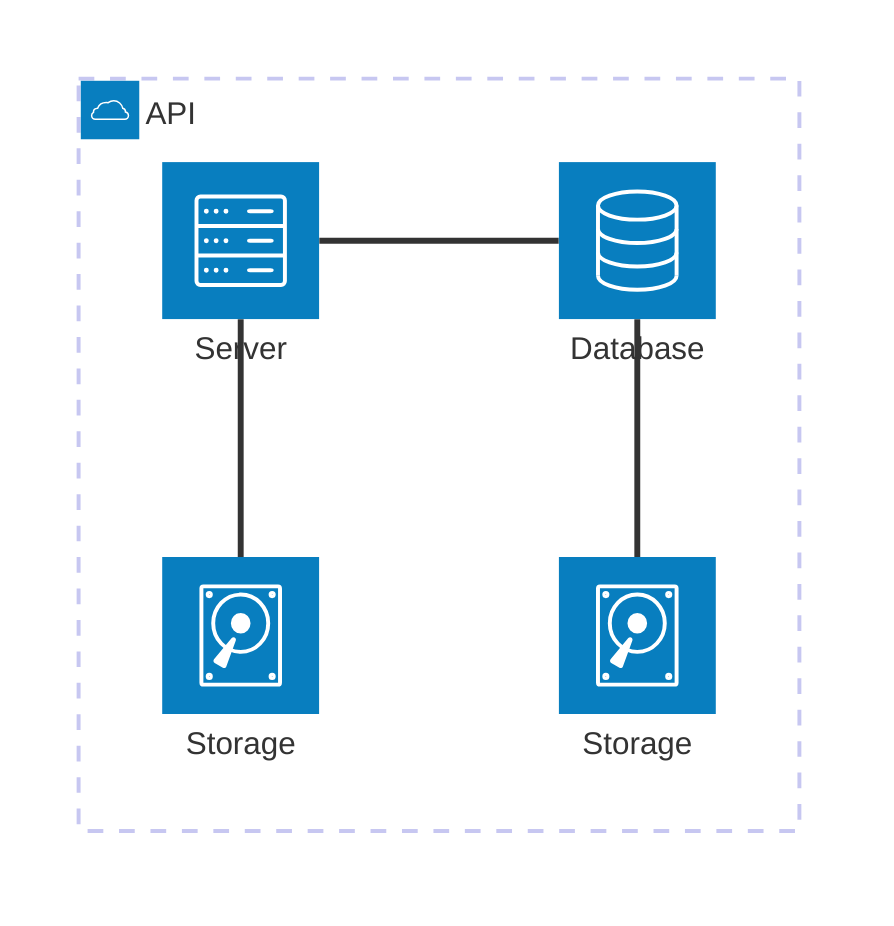
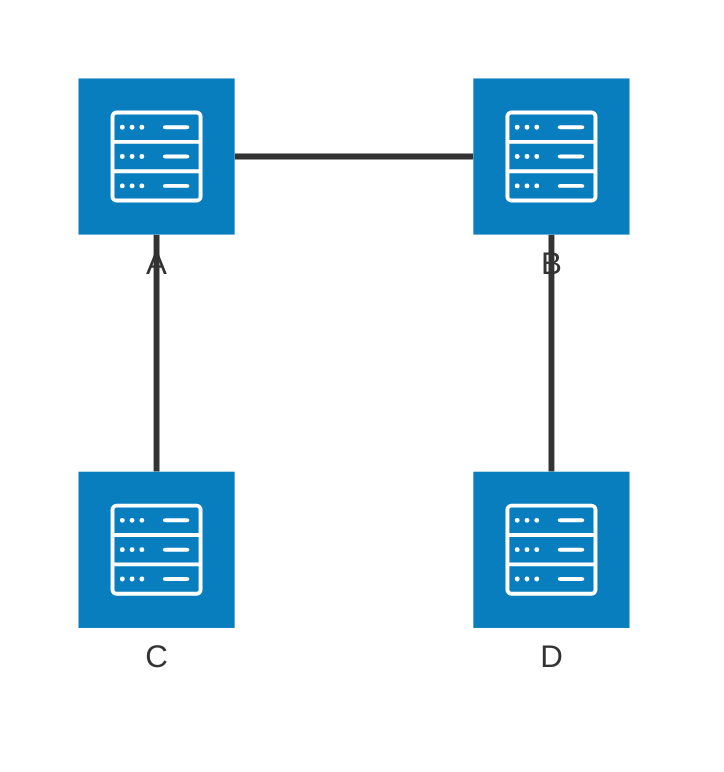

# Architecture Diagram（アーキテクチャ図）

C4モデルなどに基づいたシステムアーキテクチャを視覚化する図です。

> **注意**: `architecture-beta` はMermaid v11.0.0以降で利用可能な実験的機能です。お使いの環境がサポートしているか確認してください。

## 基本構文

## サービスアイコン

### 利用可能なアイコン

| アイコン | 説明 |
|----------|------|
| `server` | サーバー |
| `database` | データベース |
| `disk` | ストレージ |
| `internet` | インターネット |
| `cloud` | クラウド |

## グループ化

## 接続方向

### 接続ポイント

| ポイント | 説明 |
|----------|------|
| `L` | 左（Left） |
| `R` | 右（Right） |
| `T` | 上（Top） |
| `B` | 下（Bottom） |

## 実践的な例：Webアプリケーション

## 実践的な例：マイクロサービス

## 実践的な例：クラウドインフラ

## 実践的な例：データパイプライン

## 実践的な例：Kubernetesクラスター

## 実践的な例：イベント駆動アーキテクチャ

## 実践的な例：ハイブリッドクラウド

