# Packet Diagram（パケット図）

ネットワークパケットやデータ構造を視覚化する図です。

> **注意**: `packet-beta` はMermaid v10.6.0以降で利用可能な実験的機能です。お使いの環境がサポートしているか確認してください。

## 基本構文

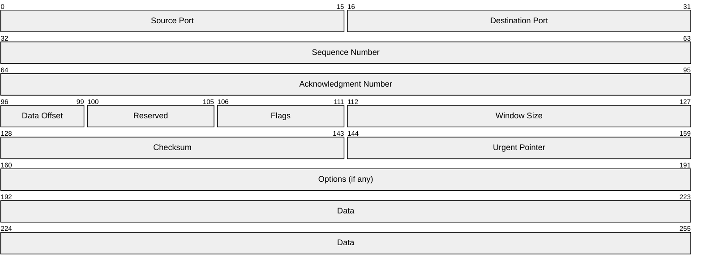

## 基本的なフィールド定義

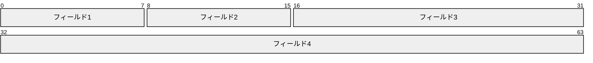

## 実践的な例：TCPヘッダー

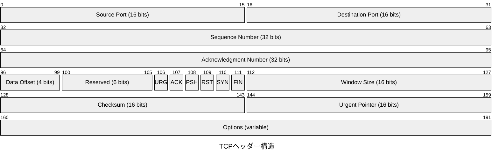

## 実践的な例：UDPヘッダー

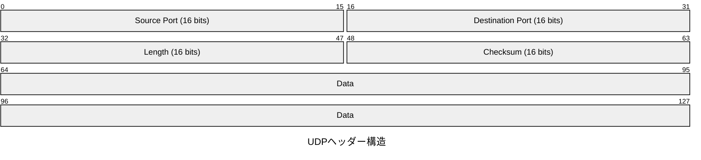

## 実践的な例：IPv4ヘッダー

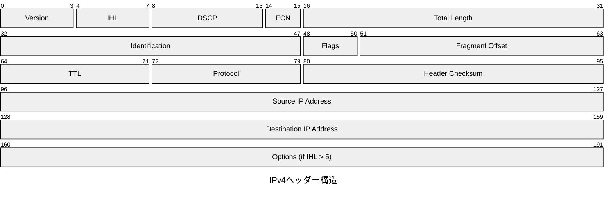

## 実践的な例：Ethernetフレーム

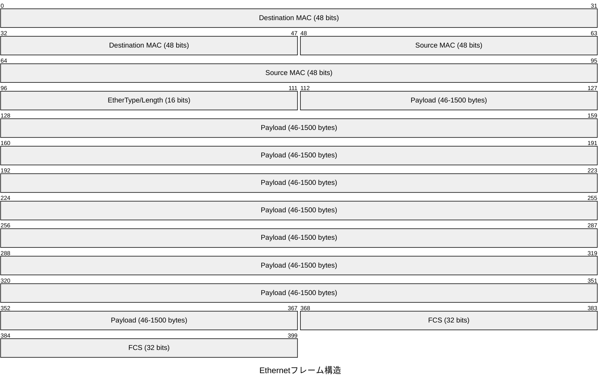

## 実践的な例：HTTPリクエスト構造

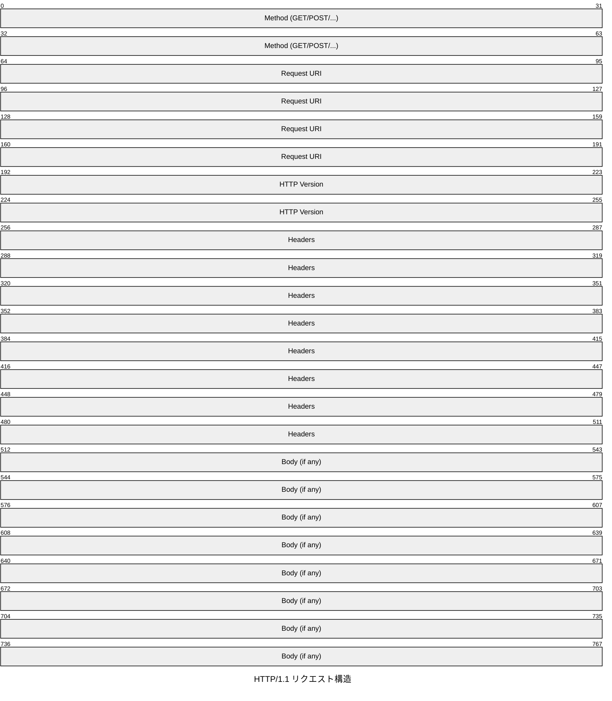

## 実践的な例：DNS クエリ

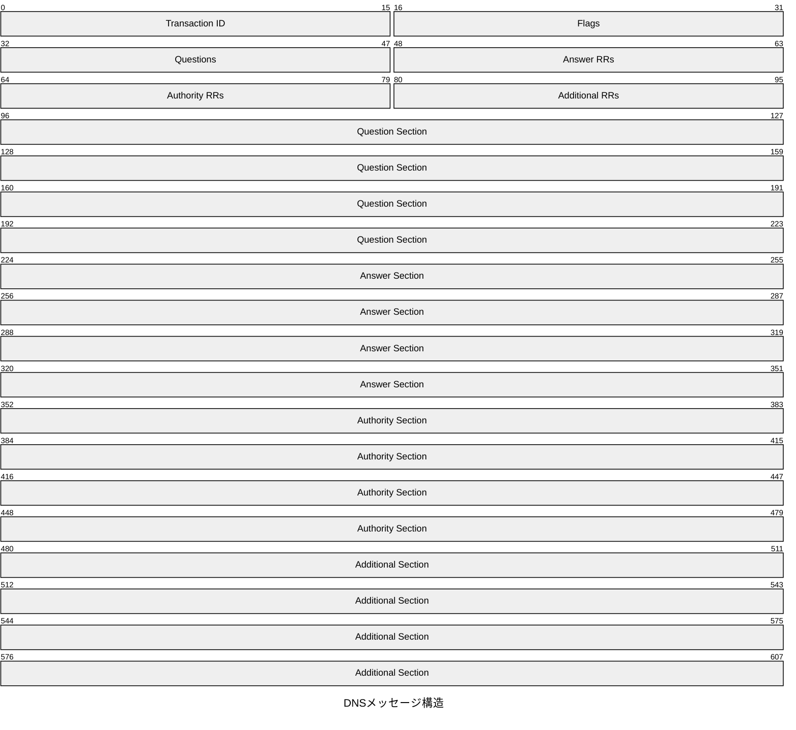

## 実践的な例：TLS レコード

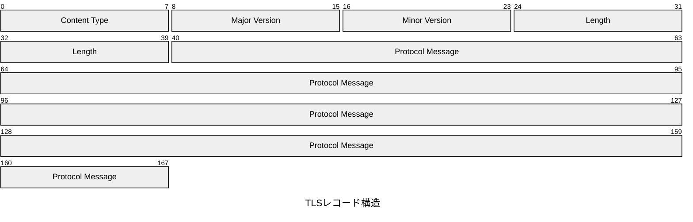

## 実践的な例：WebSocket フレーム

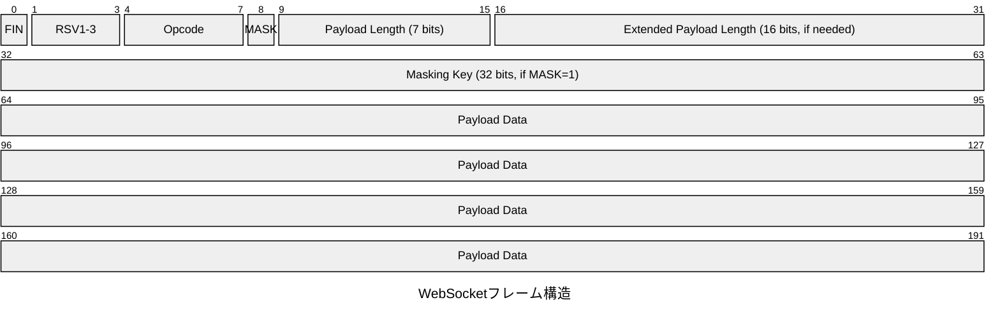

## 実践的な例：カスタムプロトコル

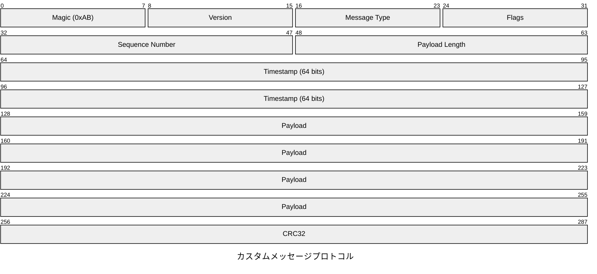

## 実践的な例：JWT構造

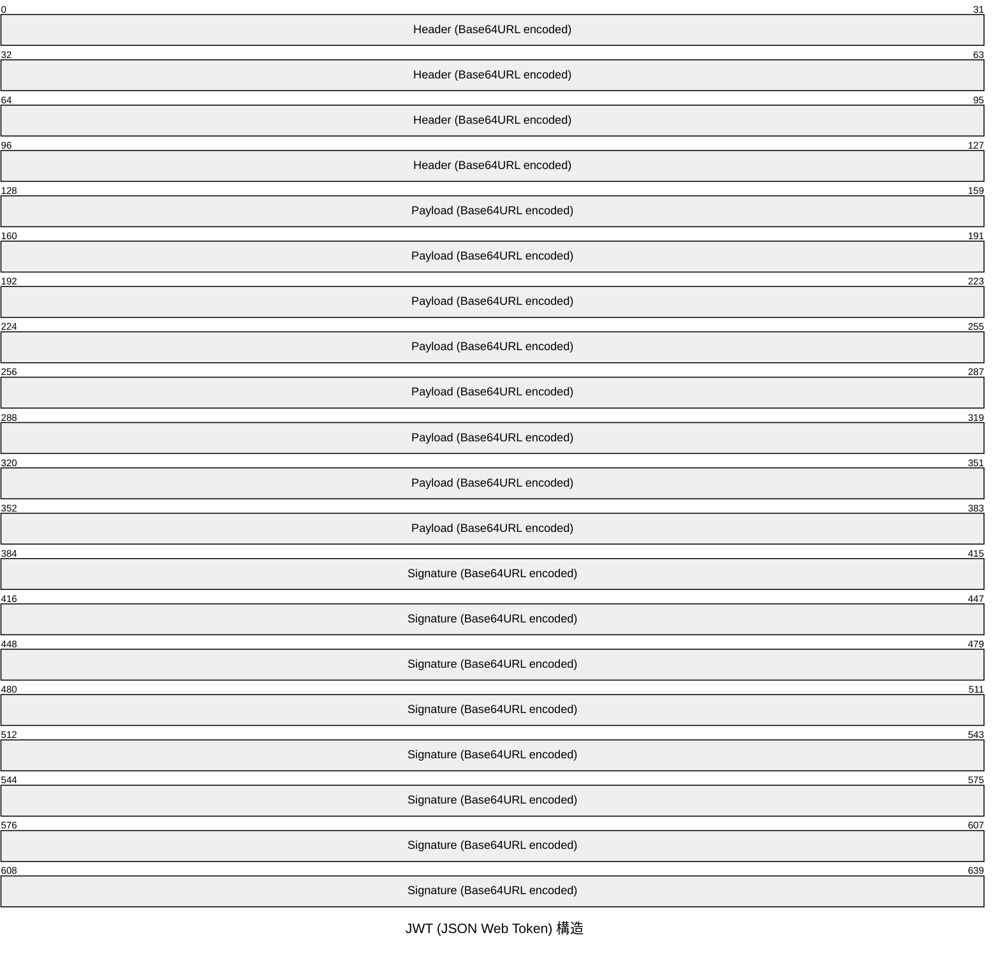

## 実践的な例：ICMPパケット

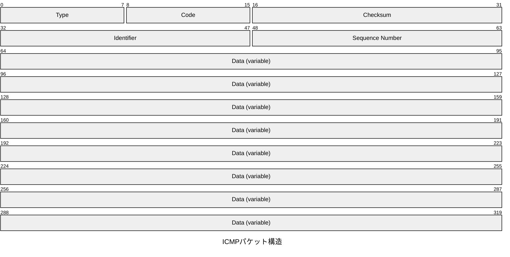

## 実践的な例：ARPパケット

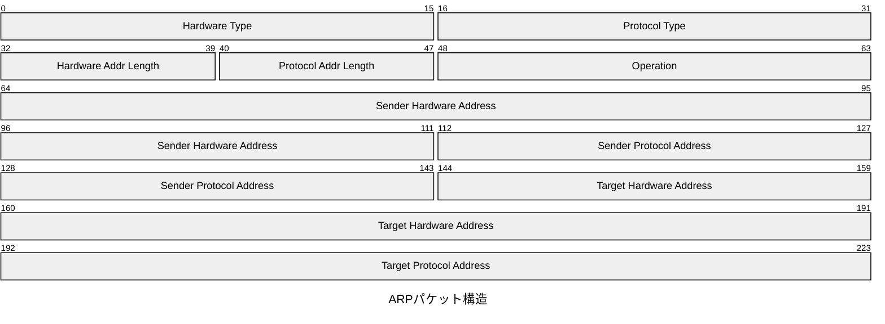

## 実践的な例：データベースレコード

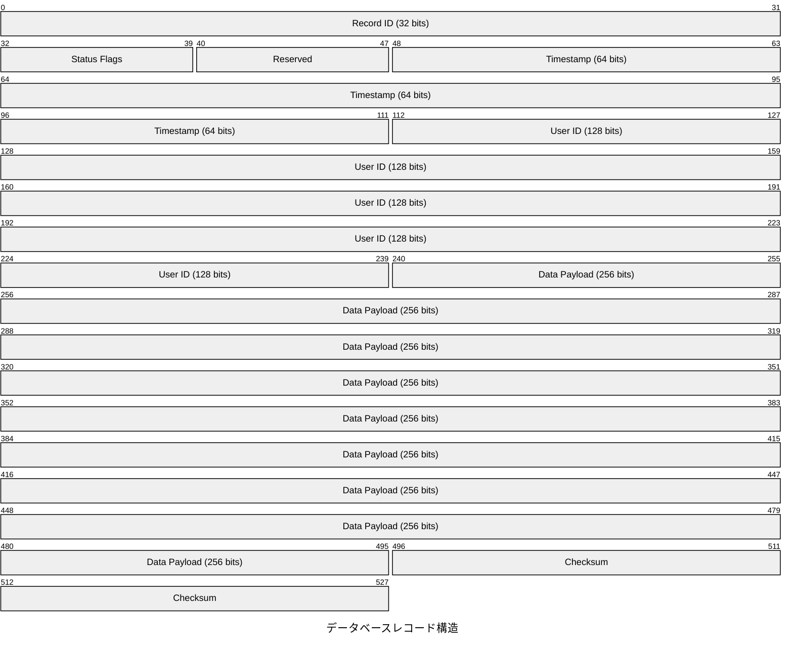

## 実践的な例：ファイルフォーマット

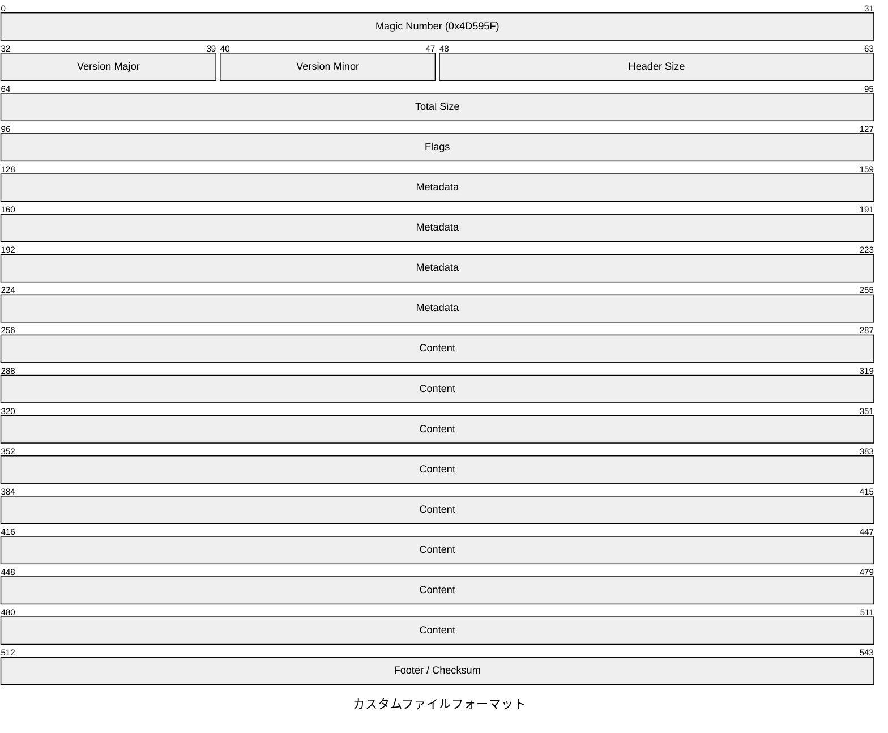
