# Kanban（カンバンボード）

タスク管理やワークフローを視覚化するカンバンボードです。

> **注意**: `kanban` はMermaid v10.9.0以降で利用可能な機能です。お使いの環境がサポートしているか確認してください。

## 基本構文

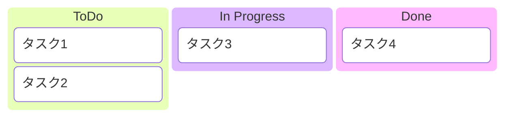

## タスクの詳細

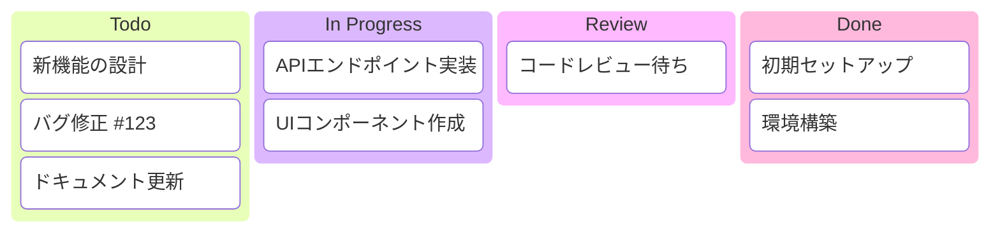

## 実践的な例：スプリントボード

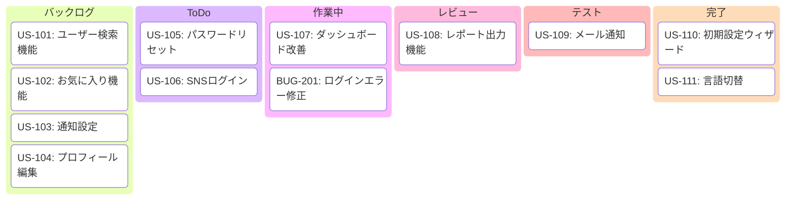

## 実践的な例：開発ワークフロー

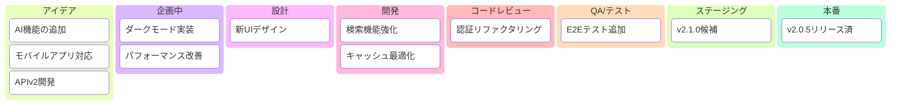

## 実践的な例：バグトラッキング

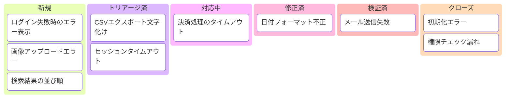

## 実践的な例：リリース管理

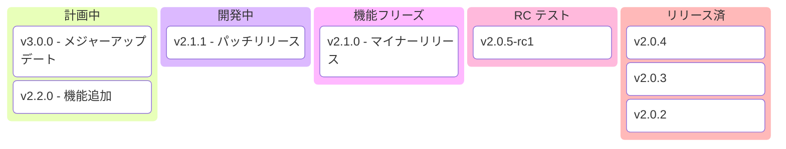

## 実践的な例：個人タスク管理

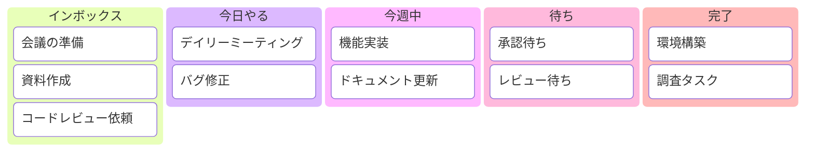

## 実践的な例：採用プロセス

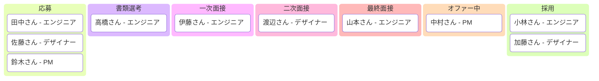

## 実践的な例：コンテンツ制作

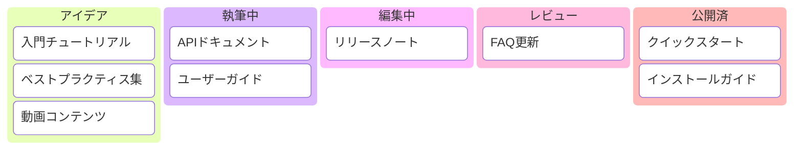

## 実践的な例：サポートチケット

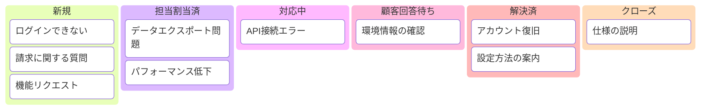

## 実践的な例：インシデント管理

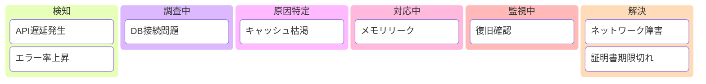
