# ZenUML

Mermaid内で使用できるZenUML形式のシーケンス図です。より自然な構文でシーケンス図を記述できます。

> **注意**: `zenuml` はMermaid v10.0.0以降で利用可能です。ZenUMLはMermaidに統合されていますが、一部の環境ではサポートされていない場合があります。

## 基本構文

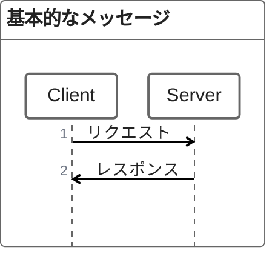
```mermaid
zenuml
    title 基本的なメッセージ
    Client->Server: リクエスト
    Server->Client: レスポンス
```

## 同期メッセージ

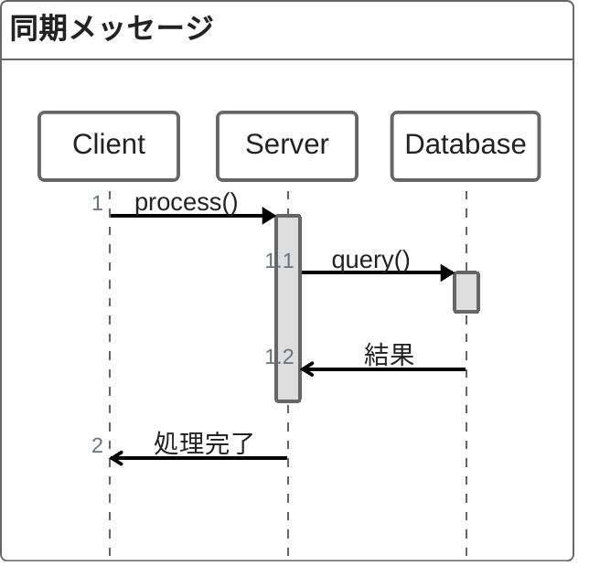
```mermaid
zenuml
    title 同期メッセージ
    Client->Server.process() {
        Server->Database.query()
        Database->Server: 結果
    }
    Server->Client: 処理完了
```

## 非同期メッセージ

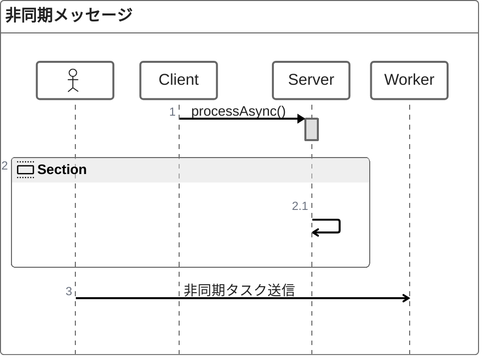
```mermaid
zenuml
    title 非同期メッセージ
    Client->Server.processAsync() {
        Server->>Worker: 非同期タスク送信
    }
    Server->Client: 受付完了
```

## 戻り値

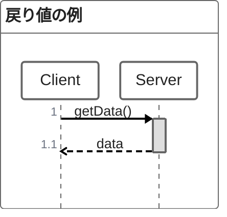
```mermaid
zenuml
    title 戻り値の例
    Client->Server.getData() {
        return data
    }
```

## 自己呼び出し

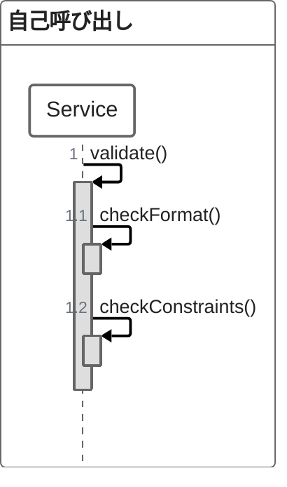
```mermaid
zenuml
    title 自己呼び出し
    Service->Service.validate() {
        Service->Service.checkFormat()
        Service->Service.checkConstraints()
    }
```

## 条件分岐（if/else）

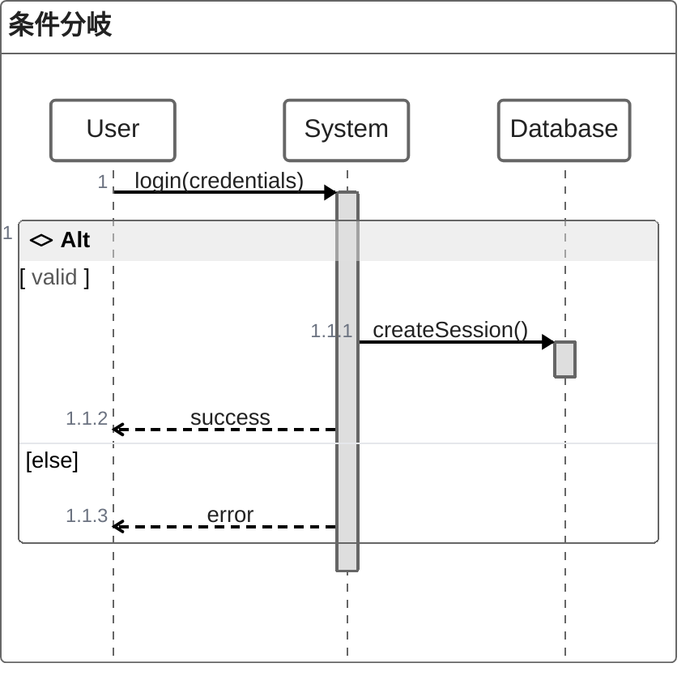
```mermaid
zenuml
    title 条件分岐
    User->System.login(credentials) {
        if (valid) {
            System->Database.createSession()
            return success
        } else {
            return error
        }
    }
```

## 繰り返し（loop）

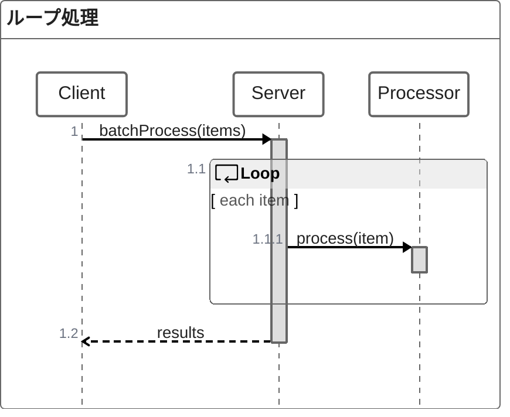
```mermaid
zenuml
    title ループ処理
    Client->Server.batchProcess(items) {
        loop (each item) {
            Server->Processor.process(item)
        }
        return results
    }
```

## 並列処理（par）

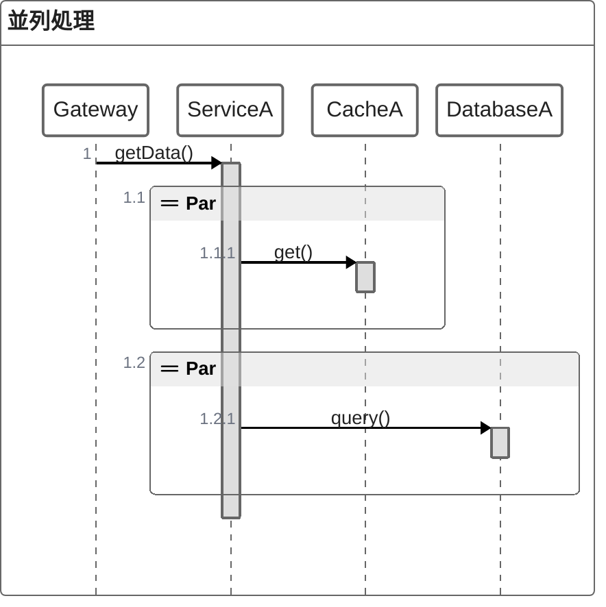
```mermaid
zenuml
    title 並列処理
    Gateway->ServiceA.getData() {
        par {
            ServiceA->CacheA.get()
        }
        par {
            ServiceA->DatabaseA.query()
        }
    }
```

## オプション（opt）

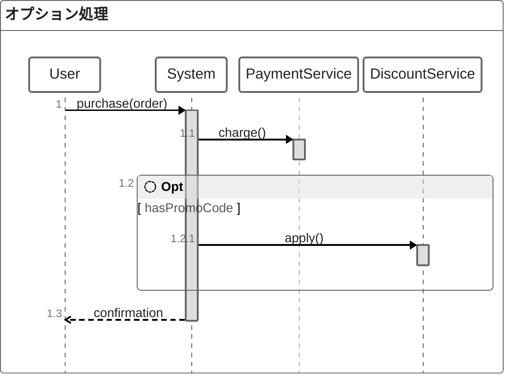
```mermaid
zenuml
    title オプション処理
    User->System.purchase(order) {
        System->PaymentService.charge()
        opt (hasPromoCode) {
            System->DiscountService.apply()
        }
        return confirmation
    }
```

## 例外処理（try/catch）

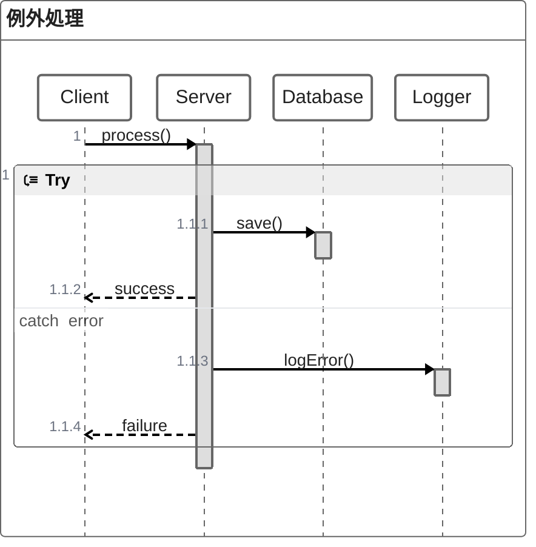
```mermaid
zenuml
    title 例外処理
    Client->Server.process() {
        try {
            Server->Database.save()
            return success
        } catch (error) {
            Server->Logger.logError()
            return failure
        }
    }
```

## 実践的な例：ユーザー認証フロー

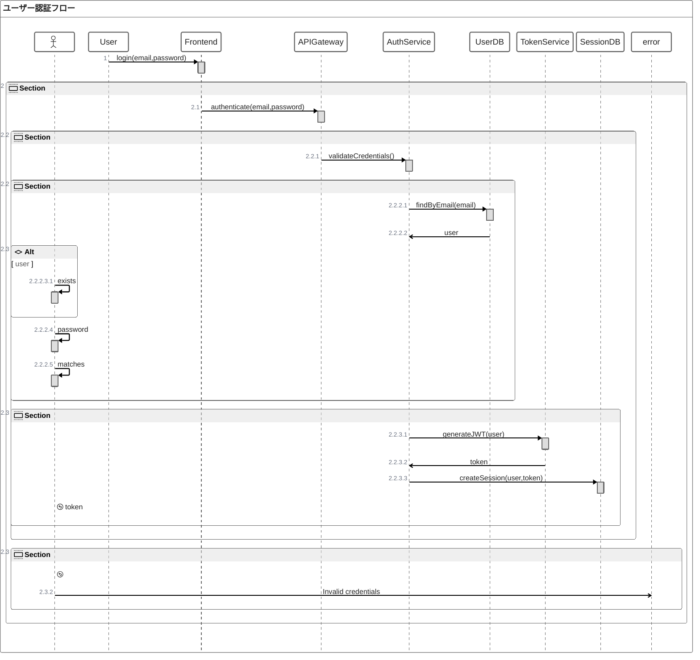
```mermaid
zenuml
    title ユーザー認証フロー

    User->Frontend.login(email, password) {
        Frontend->APIGateway.authenticate(email, password) {
            APIGateway->AuthService.validateCredentials() {
                AuthService->UserDB.findByEmail(email)
                UserDB->AuthService: user

                if (user exists && password matches) {
                    AuthService->TokenService.generateJWT(user)
                    TokenService->AuthService: token
                    AuthService->SessionDB.createSession(user, token)
                    return token
                } else {
                    return error: Invalid credentials
                }
            }
        }
        if (success) {
            Frontend->Frontend.storeToken()
            Frontend->Frontend.redirectToDashboard()
        } else {
            Frontend->Frontend.showError()
        }
    }
```

## 実践的な例：注文処理

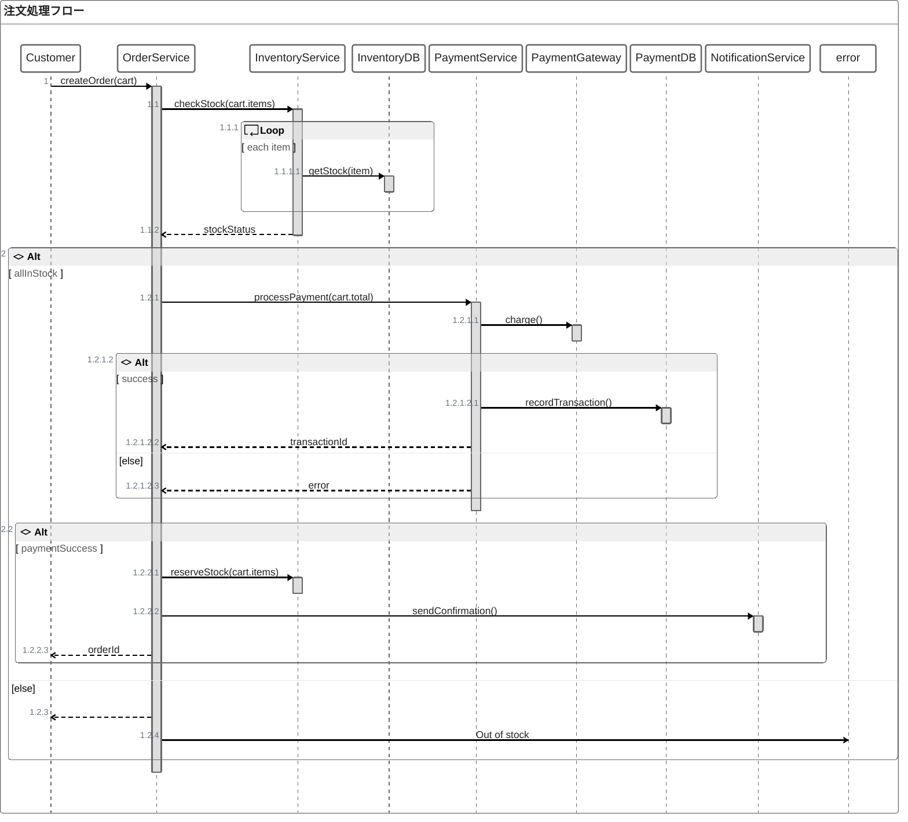
```mermaid
zenuml
    title 注文処理フロー

    Customer->OrderService.createOrder(cart) {
        OrderService->InventoryService.checkStock(cart.items) {
            loop (each item) {
                InventoryService->InventoryDB.getStock(item)
            }
            return stockStatus
        }

        if (allInStock) {
            OrderService->PaymentService.processPayment(cart.total) {
                PaymentService->PaymentGateway.charge()
                if (success) {
                    PaymentService->PaymentDB.recordTransaction()
                    return transactionId
                } else {
                    return error
                }
            }

            if (paymentSuccess) {
                OrderService->InventoryService.reserveStock(cart.items)
                OrderService->NotificationService.sendConfirmation()
                return orderId
            }
        } else {
            return error: Out of stock
        }
    }
```

## 実践的な例：マイクロサービス間通信

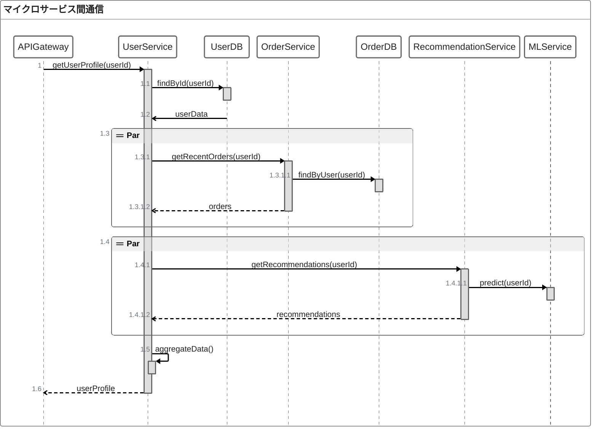
```mermaid
zenuml
    title マイクロサービス間通信

    APIGateway->UserService.getUserProfile(userId) {
        UserService->UserDB.findById(userId)
        UserDB->UserService: userData

        par {
            UserService->OrderService.getRecentOrders(userId) {
                OrderService->OrderDB.findByUser(userId)
                return orders
            }
        }
        par {
            UserService->RecommendationService.getRecommendations(userId) {
                RecommendationService->MLService.predict(userId)
                return recommendations
            }
        }

        UserService->UserService.aggregateData()
        return userProfile
    }
```

## 実践的な例：イベント駆動処理

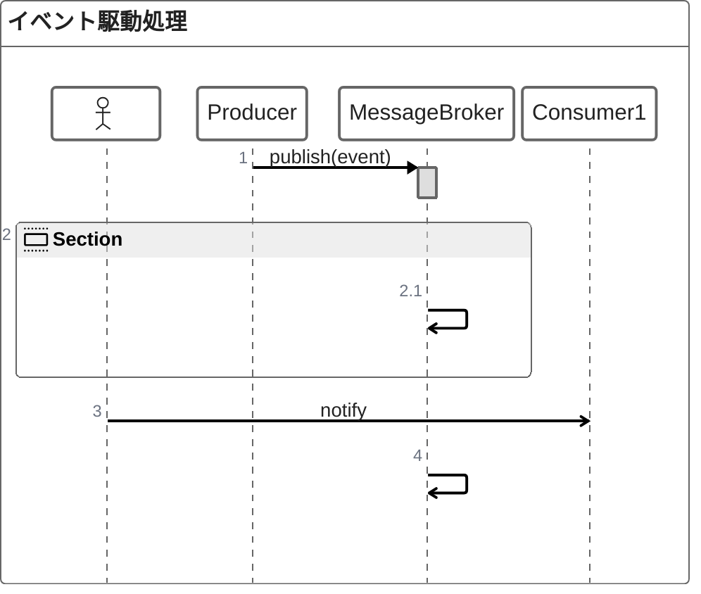
```mermaid
zenuml
    title イベント駆動処理

    Producer->MessageBroker.publish(event) {
        MessageBroker->>Consumer1: notify
        MessageBroker->>Consumer2: notify
        MessageBroker->>Consumer3: notify
    }

    Consumer1->Consumer1.processEvent() {
        Consumer1->Database1.save()
    }

    Consumer2->Consumer2.processEvent() {
        Consumer2->ExternalAPI.send()
    }

    Consumer3->Consumer3.processEvent() {
        Consumer3->NotificationService.notify()
    }
```

## 実践的な例：キャッシュ戦略

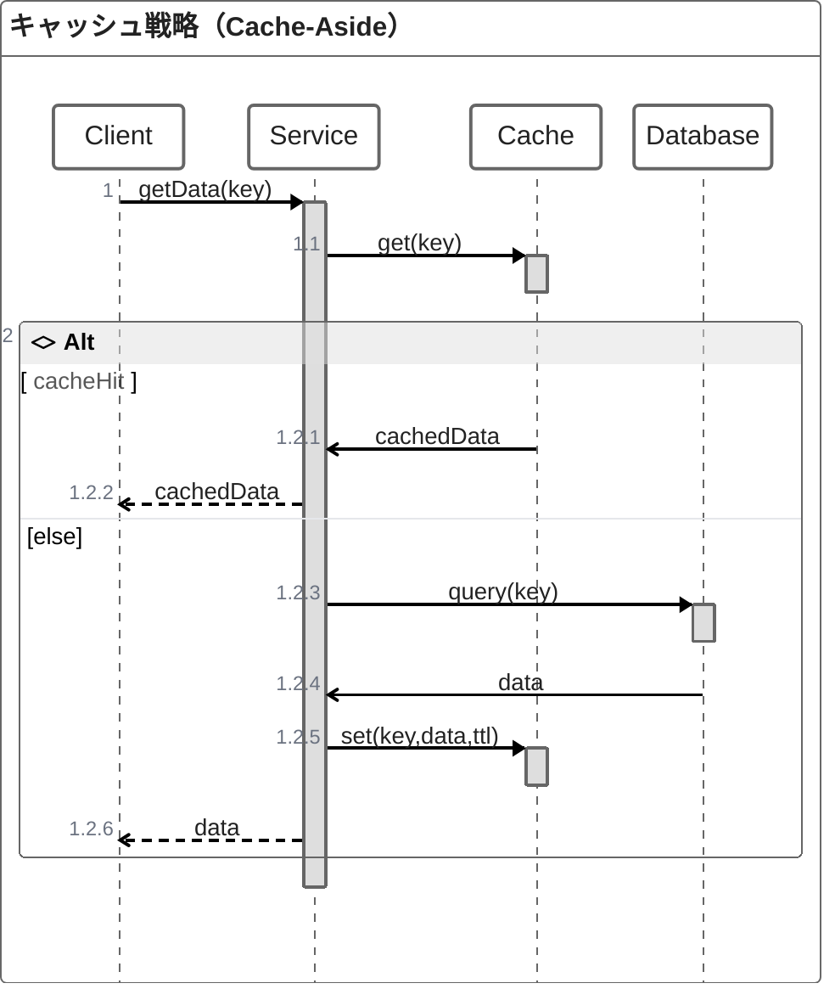
```mermaid
zenuml
    title キャッシュ戦略（Cache-Aside）

    Client->Service.getData(key) {
        Service->Cache.get(key)

        if (cacheHit) {
            Cache->Service: cachedData
            return cachedData
        } else {
            Service->Database.query(key)
            Database->Service: data

            Service->Cache.set(key, data, ttl)
            return data
        }
    }
```

## 実践的な例：サーキットブレーカー

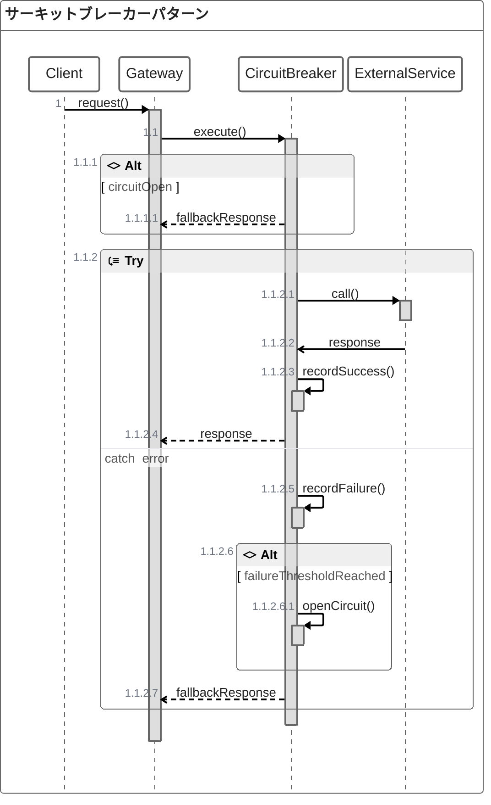
```mermaid
zenuml
    title サーキットブレーカーパターン

    Client->Gateway.request() {
        Gateway->CircuitBreaker.execute() {
            if (circuitOpen) {
                return fallbackResponse
            }

            try {
                CircuitBreaker->ExternalService.call()
                ExternalService->CircuitBreaker: response
                CircuitBreaker->CircuitBreaker.recordSuccess()
                return response
            } catch (error) {
                CircuitBreaker->CircuitBreaker.recordFailure()
                if (failureThresholdReached) {
                    CircuitBreaker->CircuitBreaker.openCircuit()
                }
                return fallbackResponse
            }
        }
    }
```

## 実践的な例：Sagaパターン

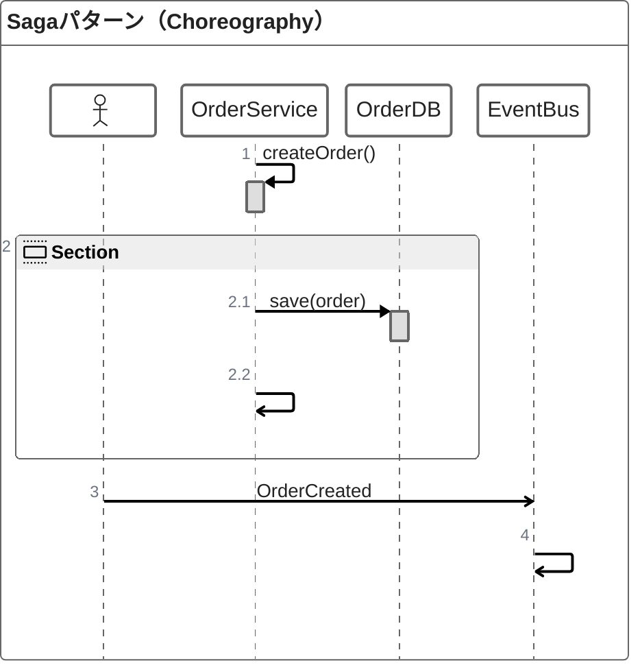
```mermaid
zenuml
    title Sagaパターン（Choreography）

    OrderService->OrderService.createOrder() {
        OrderService->OrderDB.save(order)
        OrderService->>EventBus: OrderCreated

        EventBus->>PaymentService: OrderCreated
        PaymentService->PaymentService.processPayment() {
            if (success) {
                PaymentService->>EventBus: PaymentCompleted
            } else {
                PaymentService->>EventBus: PaymentFailed
            }
        }

        EventBus->>InventoryService: PaymentCompleted
        InventoryService->InventoryService.reserveStock() {
            if (success) {
                InventoryService->>EventBus: StockReserved
            } else {
                InventoryService->>EventBus: StockReservationFailed
            }
        }

        EventBus->>ShippingService: StockReserved
        ShippingService->ShippingService.createShipment()
    }
```

## 参加者の定義

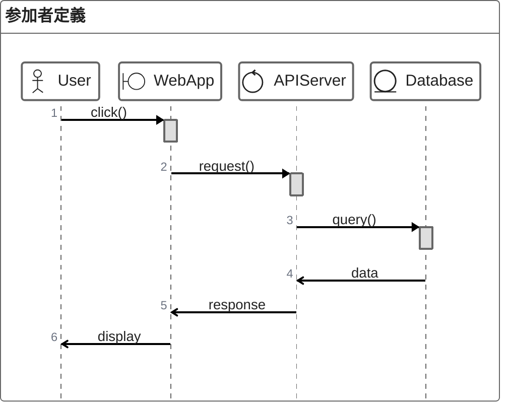
```mermaid
zenuml
    title 参加者定義
    @Actor User
    @Boundary WebApp
    @Control APIServer
    @Entity Database

    User->WebApp.click()
    WebApp->APIServer.request()
    APIServer->Database.query()
    Database->APIServer: data
    APIServer->WebApp: response
    WebApp->User: display
```

## コメント

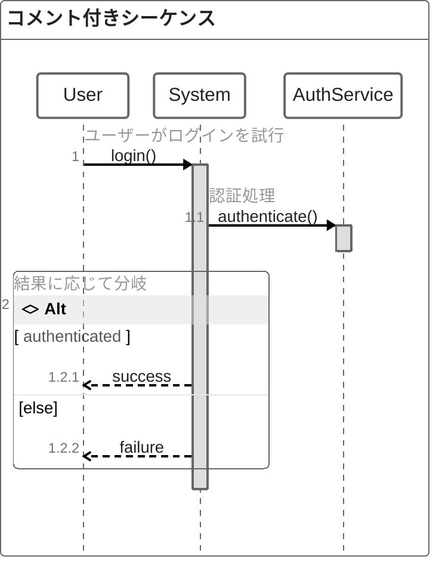
```mermaid
zenuml
    title コメント付きシーケンス

    // ユーザーがログインを試行
    User->System.login() {
        // 認証処理
        System->AuthService.authenticate()

        // 結果に応じて分岐
        if (authenticated) {
            return success
        } else {
            return failure
        }
    }
```
