# Mermaid 玄人風テンプレート全集（コピペ即戦力）

> 使い方：各セクションをそのままコピーして、必要なラベルだけ差し替えてください。`%%` はコメントです。まずは一番上の「共通テーマ初期化」から始めると見栄えが安定します。

---

## 0) 共通テーマ初期化（まず最初に）

```mermaid
%% テーマや日本語フォント、曲線などを一括指定
%% これを各図の先頭に付けると反映されます
%% セキュリティ設定が厳しい環境では click/hyperlink が無効の場合あり
%% { 'securityLevel': 'loose' } にすると外部リンクが有効になる環境もあります
%%{init: {
  'theme': 'neutral',
  'logLevel': 'error',
  'fontFamily': 'Meiryo, "Yu Gothic UI", "Noto Sans JP", sans-serif',
  'themeVariables': {
    'primaryColor': '#E6F7FF',
    'primaryTextColor': '#003A8C',
    'primaryBorderColor': '#91D5FF',
    'lineColor': '#8C8C8C',
    'tertiaryColor': '#F6FFED'
  },
  'flowchart': { 'curve': 'basis' }
}}%%
```

---

## 1) Flowchart（矢印・サブグラフ・クラス定義・クリック）

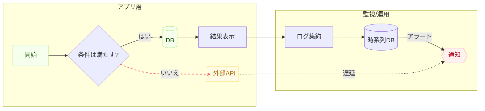

---

## 2) Sequence Diagram（autonumber/alt/opt/par/rect/activation）

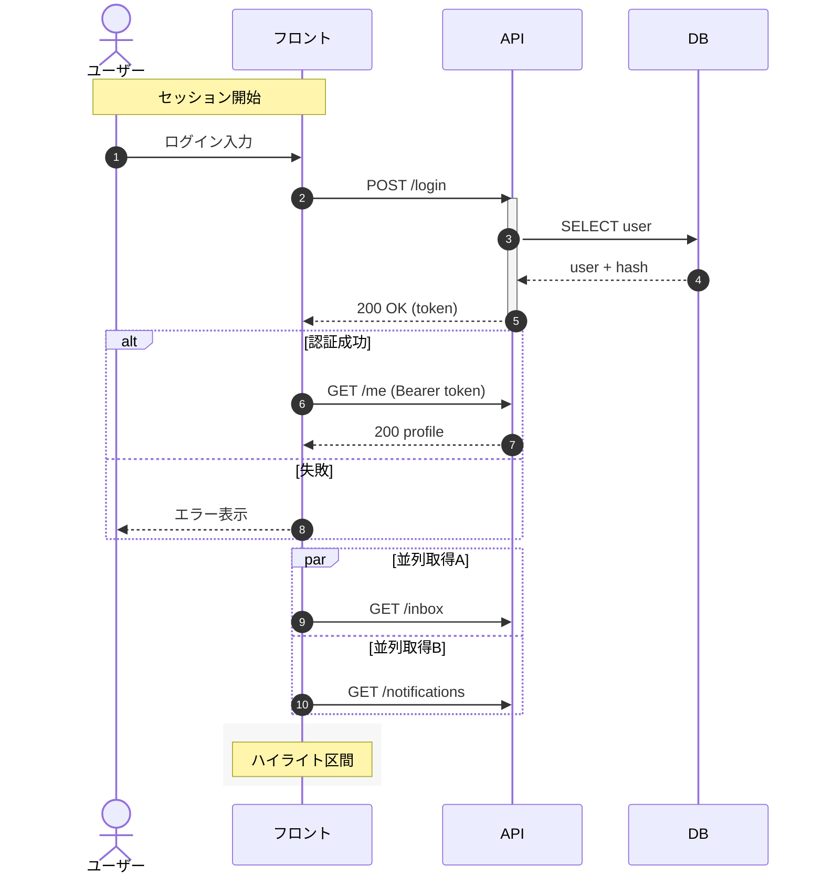

---

## 3) Class Diagram（継承/集約/合成/依存/多重度）

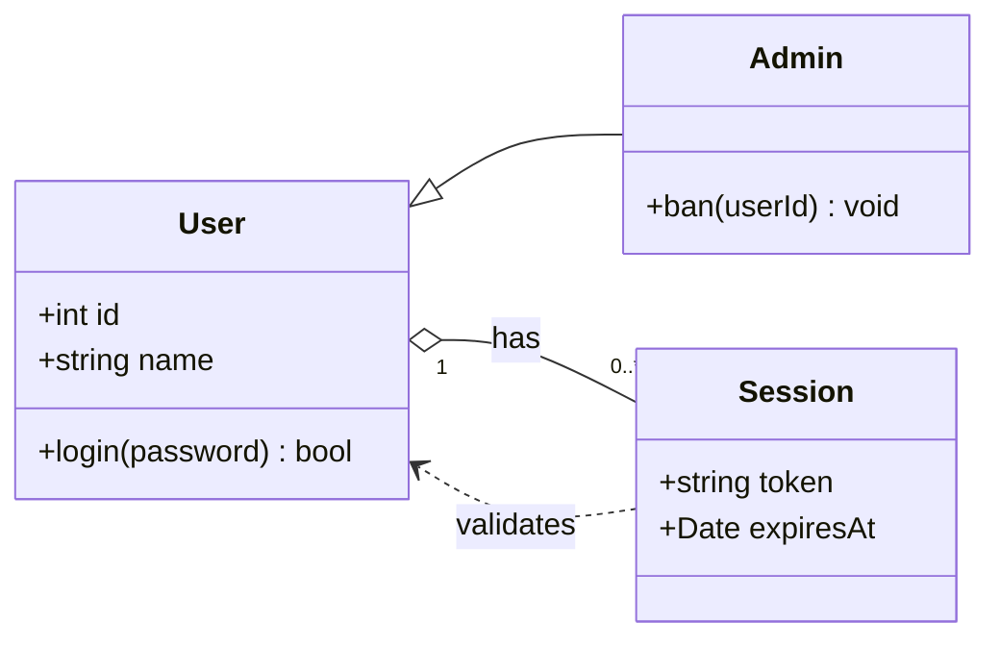

---

## 4) State Diagram（入出・choice・入れ子状態）

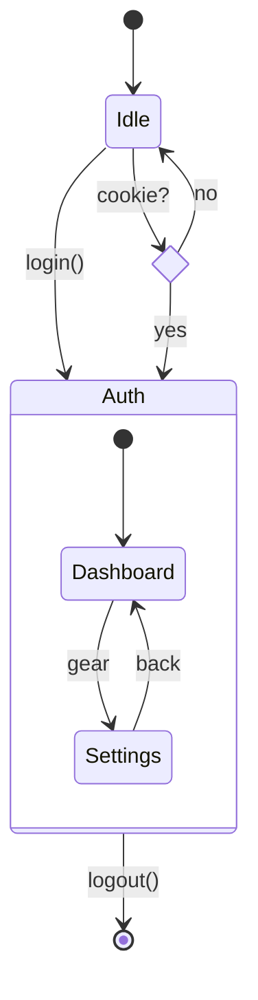

---

## 5) ER Diagram（エンティティ属性+リレーション）

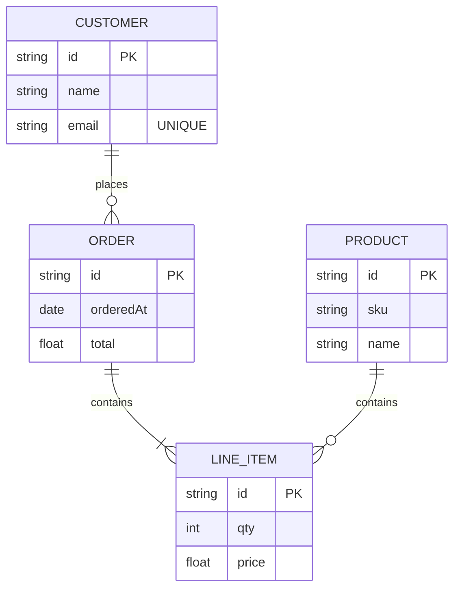

---

## 6) Gantt（exclude週末/クリティカル/マイルストーン/依存）

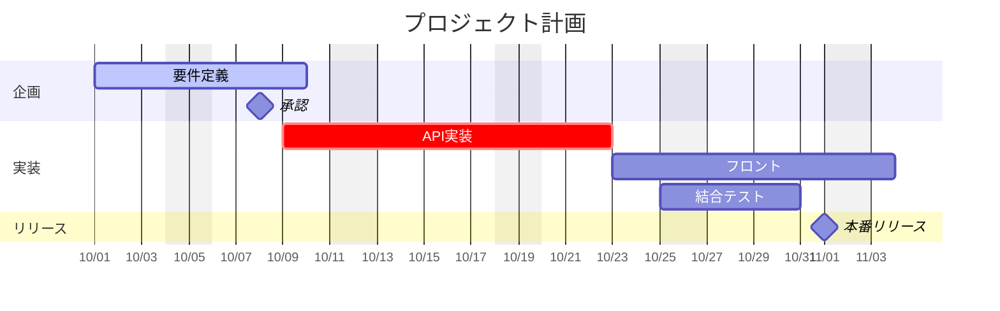

---

## 7) User Journey（共感図やNPS可視化に）

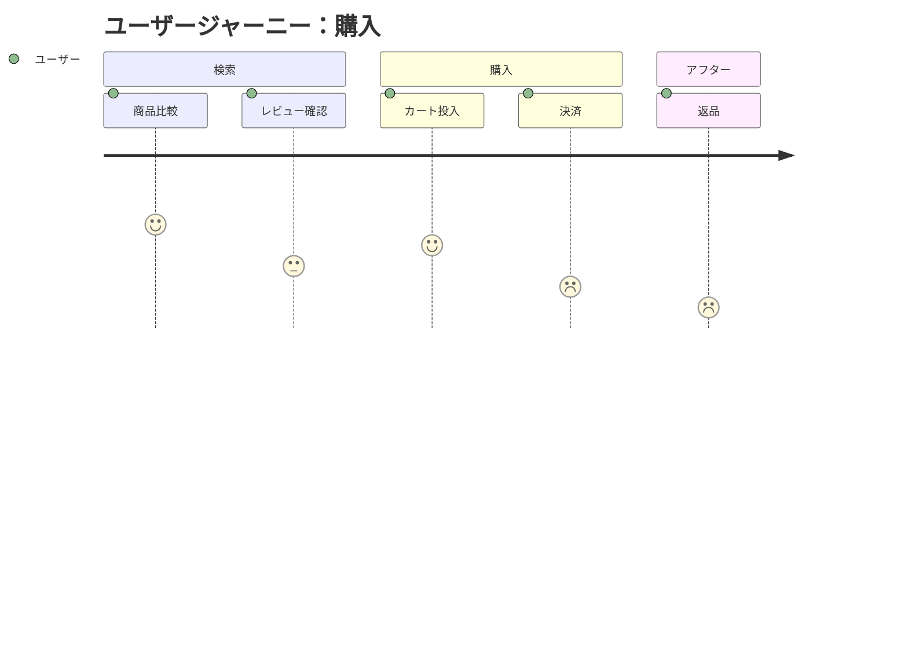

---

## 8) Pie（showData で値表示）

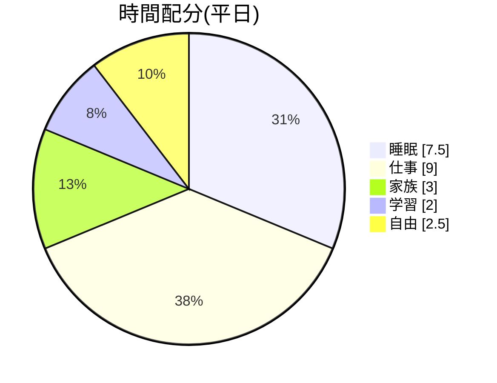

---

## 9) Mindmap（インデント階層）

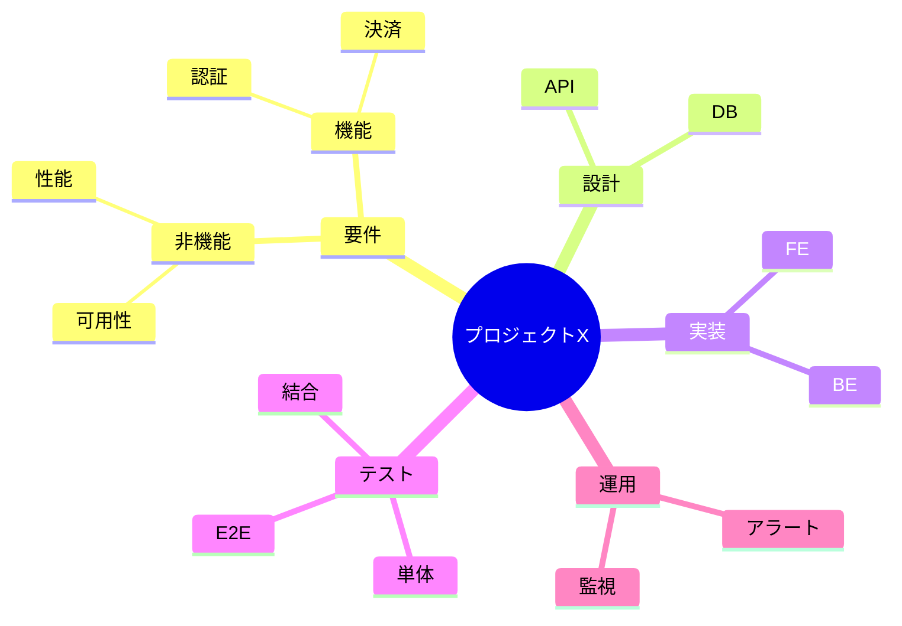

---

## 10) Timeline（シンプルで強力）

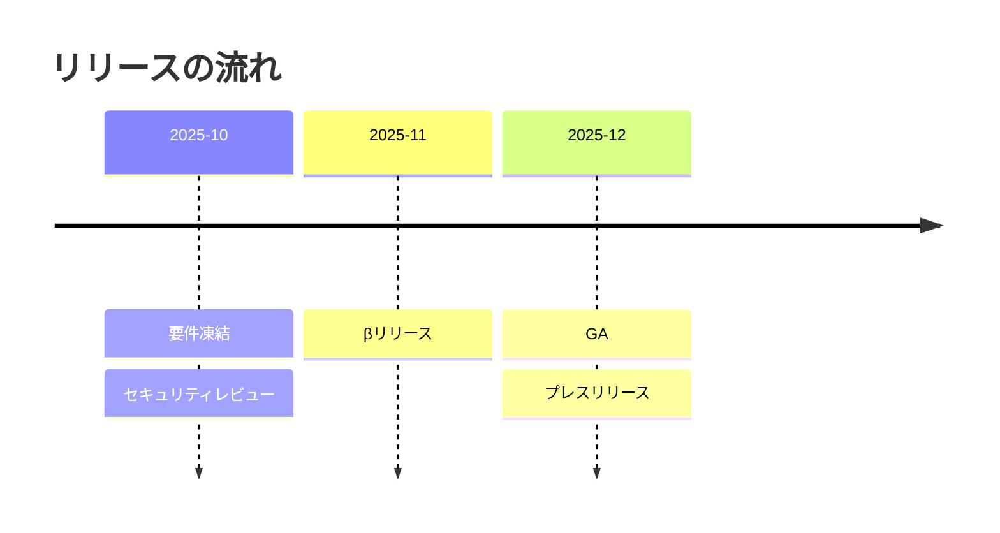

---

## 11) Git Graph（branch/checkout/merge/tag）

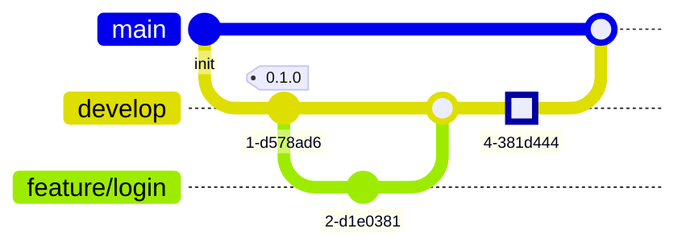

---

## 12) Requirement Diagram（SysML風 トレーサビリティ）

```mermaid
requirementDiagram
  requirement R1 {
    id: R1
    text: "ユーザーはメールでログインできること"
    risk: high
    verifymethod: test
  }
  element AuthModule {
    type: component
  }
  test T1 {
    id: T1
    text: "メール+パスワードで200が返る"
  }
  R1 - satisfies -> AuthModule
  T1 - verifies  -> R1
```

---

## 13) Quadrant Chart（意思決定マトリクス）

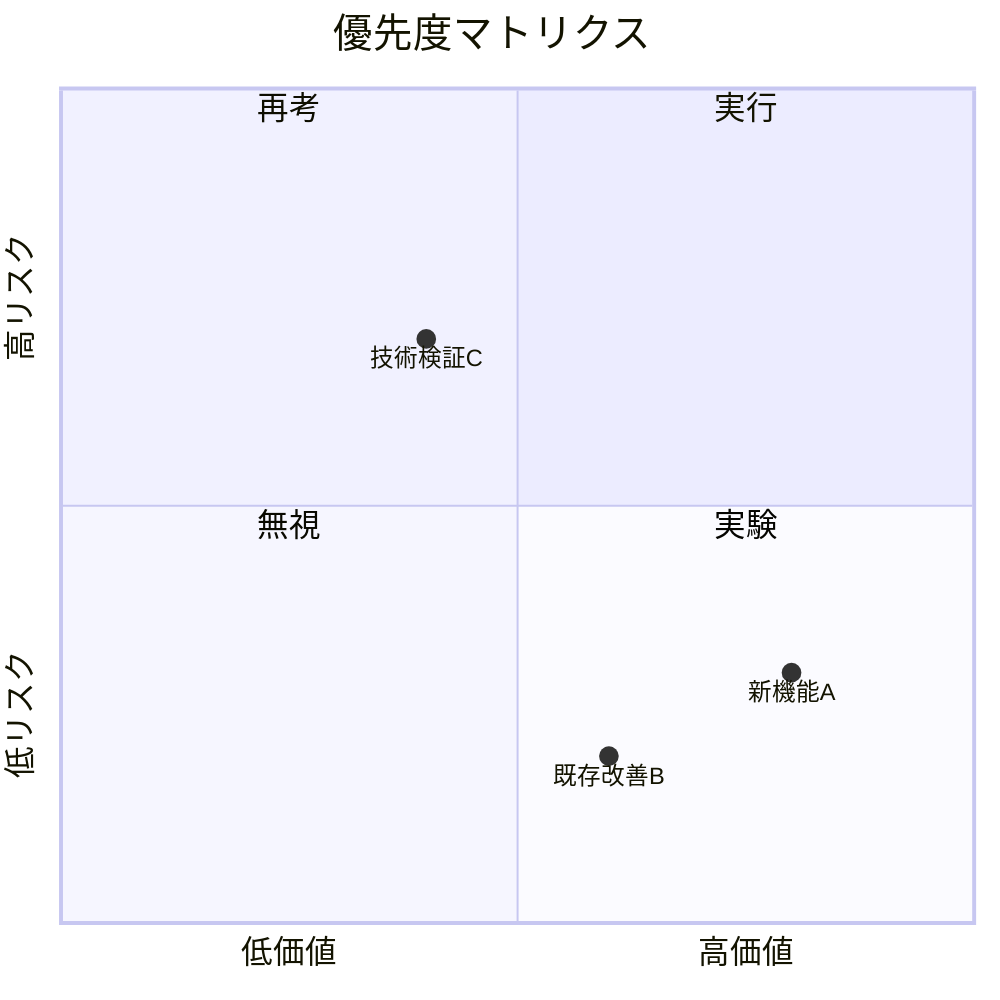

---

## 14) Sankey（フロー可視化／CSV3列）

```mermaid
%% Renderer により `sankey` か `sankey-beta` を使用
sankey
  Source,Target,Value
  トラフィック, 検索, 1200
  トラフィック, 直帰, 300
  検索, ランディング, 900
  ランディング, カート, 400
  カート, 成約, 250
```

---

## 15) XY Chart（折れ線/棒の素早い可視化）

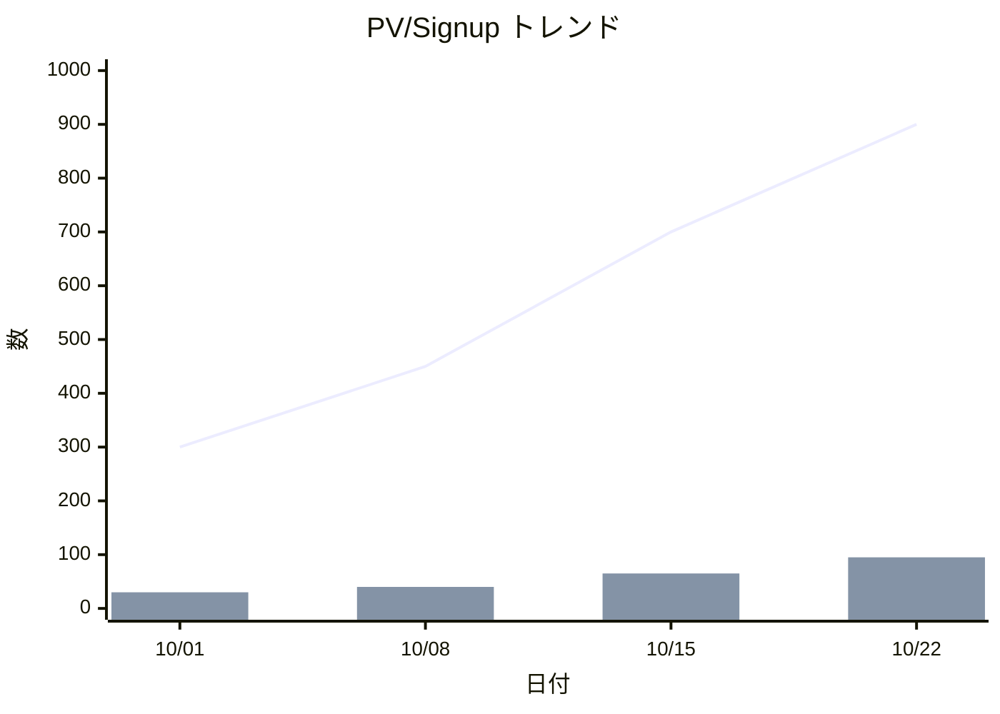

---

### 付録：小ワザ集

* **Unicode改行**：ラベル内で `\n` を使うと改行。
* **アイコン/絵文字**：環境依存。テキストに直接入れて試す（🛠️など）。
* **大きさ調整**：埋め込み側の width/zoom を調整。Mermaid側はノードごとの厳密サイズ指定は限定的。
* **レイアウト暴れ対策**：

  * Flowchart は `subgraph` でグルーピングし、矢印の向き（`LR`/`TB`）を固定。
  * Sequence は `autonumber` と `rect`/`par`/`alt` を使い、段落ごとに区切る。
* **バージョン差異**：Sankey は `sankey`/`sankey-beta`、XY は `xychart-beta` など、レンダラの Mermaid バージョン差に注意。
* **リンク**：Flowchart は `click id "URL" "tooltip"` が便利。Sequence では現状リンクは限定的。

```
```
